# Database Documentation

## Overview

This document describes the YoKart e-commerce database schema, containing **327 tables** organized into the following functional areas:

- **User Management**: 39 tables
- **Product Management**: 85 tables
- **Order Management**: 39 tables
- **Seller/Vendor Management**: 16 tables
- **Tax Management**: 8 tables
- **Product Discovery & Search**: 16 tables
- **Shopping Cart & User Activity**: 3 tables
- **Content Management**: 29 tables
- **Content & Media Management**: 10 tables
- **Marketing & Promotions**: 22 tables
- **Polling & Questionnaires**: 14 tables
- **Configuration & Settings**: 15 tables
- **SEO & URL Management**: 3 tables
- **Ratings & Reviews**: 3 tables
- **Notifications & Communications**: 7 tables
- **Security & Moderation**: 3 tables
- **Reports & Logging**: 7 tables
- **System Utilities**: 8 tables

## Database Schema Diagram

The following diagram shows the major entity relationships grouped by functional area:

```mermaid
flowchart TD

    subgraph usermanagement["User Management"]
        Users["users"]
        Admin["admin"]
        Addresses["addresses"]
        UserAuthToken["user auth token"]
        AdminAuthToken["admin auth token"]
    end

    subgraph productmanagement["Product Management"]
        Products["products"]
        ProductCategories["product categories"]
        Brands["brands"]
        SellerProducts["seller products"]
        ProductToCategory["product to category"]
    end

    subgraph ordermanagement["Order Management"]
        Orders["orders"]
        OrderProducts["order products"]
        OrderPayments["order payments"]
        OrdersStatus["orders status"]
    end

    subgraph sellervendormanagement["Seller/Vendor Management"]
        Shops["shops"]
        SellerPackages["seller packages"]
        CommissionSettings["commission settings"]
    end

    subgraph taxmanagement["Tax Management"]
        TaxCategories["tax categories"]
        TaxRules["tax rules"]
        TaxStructure["tax structure"]
    end

    subgraph productdiscoveryandsearch["Product Discovery & Search"]
        Filters["filters"]
        Tags["tags"]
        Collections["collections"]
        SearchItems["search items"]
    end

    subgraph shoppingcartanduseractivity["Shopping Cart & User Activity"]
        AbandonedCart["abandoned cart"]
        EmptyCartItems["empty cart items"]
    end

    subgraph contentmanagement["Content Management"]
        BlogPost["blog post"]
        ContentPages["content pages"]
        Banners["banners"]
        Navigations["navigations"]
    end

    subgraph contentandmediamanagement["Content & Media Management"]
        AttachedFiles["attached files"]
        Slides["slides"]
        Testimonials["testimonials"]
    end

    subgraph marketingandpromotions["Marketing & Promotions"]
        Coupons["coupons"]
        Promotions["promotions"]
        Badges["badges"]
    end

    subgraph pollingandquestionnaires["Polling & Questionnaires"]
        Polling["polling"]
        Questionnaires["questionnaires"]
        Questions["questions"]
    end

    subgraph configurationandsettings["Configuration & Settings"]
        Configurations["configurations"]
        Languages["languages"]
        Currency["currency"]
        Plugins["plugins"]
        Countries["countries"]
        States["states"]
    end

    subgraph seoandurlmanagement["SEO & URL Management"]
        MetaTags["meta tags"]
        UrlRewrite["url rewrite"]
    end

    subgraph ratingsandreviews["Ratings & Reviews"]
        SellerProductReviews["seller product reviews"]
        RatingTypes["rating types"]
    end

    subgraph notificationsandcommunications["Notifications & Communications"]
        Notifications["notifications"]
        EmailTemplates["email templates"]
        SmsTemplates["sms templates"]
    end

    subgraph securityandmoderation["Security & Moderation"]
        AbusiveWords["abusive words"]
        FailedLoginAttempts["failed login attempts"]
    end

    subgraph reportsandlogging["Reports & Logging"]
        SystemLogs["system logs"]
        CronLog["cron log"]
    end

    subgraph systemutilities["System Utilities"]
        CalculativeData["calculative data"]
        LayoutTemplates["layout templates"]
        TimeSlots["time slots"]
    end

    Addresses -->|references| Users
    Addresses -->|references| States
    Addresses -->|references| Countries
    Products -->|references| ProductCategories
    Products -->|references| Brands
    SellerProducts -->|references| Products
    SellerProducts -->|references| ProductCategories
    SellerProducts -->|references| Shops
    Orders -->|references| Addresses
    Orders -->|references| Users
    OrderProducts -->|references| Orders
    OrderProducts -->|references| SellerProducts
    OrderPayments -->|references| Orders
    Coupons -->|references| Users
    SellerProductReviews -->|references| Users
    SellerProductReviews -->|references| SellerProducts
```

## Table Reference

Complete listing of all tables with their structure and relationships:

## User Management

### `tbl_addresses`

**Purpose:** Stores addresses information.

**Columns:**

| Column Name | Data Type | Primary Key | Not Null | Description |
|------------|-----------|-------------|----------|-------------|
| `addr_id` | `bigint` | ✓ | ✓ |  |
| `addr_type` | `int` |  | ✓ |  |
| `addr_record_id` | `int` |  | ✓ |  |
| `addr_added_by` | `int` |  | ✓ |  |
| `addr_lang_id` | `int` |  | ✓ |  |
| `addr_title` | `varchar(255)` |  | ✓ |  |
| `addr_name` | `varchar(255)` |  | ✓ |  |
| `addr_address1` | `varchar(255)` |  | ✓ |  |
| `addr_address2` | `varchar(255)` |  | ✓ |  |
| `addr_city` | `varchar(255)` |  | ✓ |  |
| `addr_state_id` | `int` |  | ✓ |  |
| `addr_country_id` | `int` |  | ✓ |  |
| `addr_phone_dcode` | `varchar(50)` |  | ✓ |  |
| `addr_phone` | `bigint` |  | ✓ |  |
| `addr_zip` | `varchar(20)` |  | ✓ |  |
| `addr_lat` | `varchar(150)` |  | ✓ |  |
| `addr_lng` | `varchar(150)` |  | ✓ |  |
| `addr_is_default` | `tinyint(1)` |  | ✓ |  |
| `addr_deleted` | `tinyint(1)` |  | ✓ |  |
| `addr_updated_on` | `datetime` |  | ✓ |  |

**Relationships:**

- Related to `tbl_countries`
- Related to `tbl_states`
- Related to `tbl_users`

**Foreign Keys:**

- `addr_lang_id` → `tbl_languages`
- `addr_state_id` → `tbl_states`
- `addr_country_id` → `tbl_countries`

---

### `tbl_admin`

**Purpose:** Stores admin information.

**Columns:**

| Column Name | Data Type | Primary Key | Not Null | Description |
|------------|-----------|-------------|----------|-------------|
| `admin_id` | `int` | ✓ | ✓ |  |
| `admin_username` | `varchar(100)` |  | ✓ |  |
| `admin_password_old` | `varchar(100)` |  | ✓ |  |
| `admin_password` | `varchar(100)` |  | ✓ |  |
| `admin_email` | `varchar(150)` |  | ✓ |  |
| `admin_name` | `varchar(100)` |  | ✓ |  |
| `admin_active` | `tinyint` |  | ✓ |  |
| `admin_email_notification` | `tinyint(1)` |  | ✓ |  |
| `admin_admperm_updated_on` | `datetime` |  | ✓ |  |

---

### `tbl_admin_auth_token`

**Purpose:** Stores admin auth token information.

**Columns:**

| Column Name | Data Type | Primary Key | Not Null | Description |
|------------|-----------|-------------|----------|-------------|
| `admauth_admin_id` | `int` |  | ✓ |  |
| `admauth_token` | `varchar(32)` | ✓ | ✓ |  |
| `admauth_expiry` | `datetime` |  | ✓ |  |
| `admauth_browser` | `mediumtext` |  | ✓ |  |
| `admauth_last_access` | `datetime` |  | ✓ |  |
| `admauth_last_ip` | `varchar(16)` |  | ✓ |  |

**Foreign Keys:**

- `admauth_admin_id` → `tbl_admin`

---

### `tbl_admin_password_reset_requests`

**Purpose:** Stores admin password reset requests information.

**Columns:**

| Column Name | Data Type | Primary Key | Not Null | Description |
|------------|-----------|-------------|----------|-------------|
| `aprr_admin_id` | `int` |  | ✓ |  |
| `aprr_token` | `varchar(50)` |  | ✓ |  |
| `aprr_expiry` | `datetime` |  | ✓ |  |

**Foreign Keys:**

- `aprr_admin_id` → `tbl_admin`

---

### `tbl_admin_permissions`

**Purpose:** Stores admin permissions information.

**Columns:**

| Column Name | Data Type | Primary Key | Not Null | Description |
|------------|-----------|-------------|----------|-------------|
| `admperm_admin_id` | `int` | ✓ | ✓ |  |
| `admperm_section_id` | `int` |  | ✓ |  |
| `admperm_value` | `int` |  | ✓ |  |

**Foreign Keys:**

---

### `tbl_coupon_to_users`

**Purpose:** Stores coupon to users information.

**Columns:**

| Column Name | Data Type | Primary Key | Not Null | Description |
|------------|-----------|-------------|----------|-------------|
| `ctu_user_id` | `int` | ✓ | ✓ |  |
| `ctu_coupon_id` | `int` |  | ✓ |  |

**Foreign Keys:**

---

### `tbl_plugin_to_user`

**Purpose:** Stores plugin to user information.

**Columns:**

| Column Name | Data Type | Primary Key | Not Null | Description |
|------------|-----------|-------------|----------|-------------|
| `pu_plugin_id` | `int` | ✓ | ✓ |  |
| `pu_user_id` | `int` |  | ✓ |  |
| `pu_active` | `tinyint` |  | ✓ |  |
| `pu_created_at` | `datetime` |  | ✓ |  |

**Foreign Keys:**

---

### `tbl_push_notification_to_users`

**Purpose:** Stores push notification to users information.

**Columns:**

| Column Name | Data Type | Primary Key | Not Null | Description |
|------------|-----------|-------------|----------|-------------|
| `pntu_pnotification_id` | `int` | ✓ | ✓ |  |
| `pntu_user_id` | `int` |  | ✓ |  |

**Foreign Keys:**

---

### `tbl_smart_user_activity_browsing`

**Purpose:** Stores smart user activity browsing information.

**Columns:**

| Column Name | Data Type | Primary Key | Not Null | Description |
|------------|-----------|-------------|----------|-------------|
| `uab_id` | `int` | ✓ | ✓ |  |
| `uab_session_id` | `varchar(50)` |  | ✓ |  |
| `uab_user_id` | `int` |  | ✓ |  |
| `uab_record_id` | `int` |  | ✓ |  |
| `uab_record_type` | `int` |  | ✓ |  |
| `uab_sub_record_code` | `varchar(255)` |  | ✓ |  |
| `uab_last_action_datetime` | `datetime` |  | ✓ |  |

**Foreign Keys:**

---

### `tbl_user_auth_token`

**Purpose:** Stores user auth token information.

**Columns:**

| Column Name | Data Type | Primary Key | Not Null | Description |
|------------|-----------|-------------|----------|-------------|
| `uauth_user_id` | `int` |  | ✓ |  |
| `uauth_token` | `varchar(32)` | ✓ | ✓ |  |
| `uauth_fcm_id` | `varchar(300)` |  | ✓ |  |
| `uauth_device_os` | `tinyint(1)` |  | ✓ | Defined In User Model |
| `uauth_user_type` | `tinyint(1)` |  | ✓ |  |
| `uauth_expiry` | `datetime` |  | ✓ |  |
| `uauth_browser` | `mediumtext` |  | ✓ |  |
| `uauth_last_access` | `datetime` |  | ✓ |  |
| `uauth_last_ip` | `varchar(16)` |  | ✓ |  |

**Foreign Keys:**

---

### `tbl_user_bank_details`

**Purpose:** Stores user bank details information.

**Columns:**

| Column Name | Data Type | Primary Key | Not Null | Description |
|------------|-----------|-------------|----------|-------------|
| `ub_user_id` | `int` | ✓ | ✓ |  |
| `ub_bank_name` | `varchar(255)` |  | ✓ |  |
| `ub_account_holder_name` | `varchar(255)` |  | ✓ |  |
| `ub_account_number` | `varchar(100)` |  | ✓ |  |
| `ub_ifsc_swift_code` | `varchar(100)` |  | ✓ |  |
| `ub_bank_address` | `mediumtext` |  | ✓ |  |

---

### `tbl_user_cart`

**Purpose:** Stores user cart information.

**Columns:**

| Column Name | Data Type | Primary Key | Not Null | Description |
|------------|-----------|-------------|----------|-------------|
| `usercart_user_id` | `varchar(100)` |  | ✓ |  |
| `usercart_type` | `int` |  | ✓ |  |
| `usercart_details` | `mediumtext` |  | ✓ |  |
| `usercart_added_date` | `datetime` |  | ✓ |  |
| `usercart_sent_reminder` | `int` |  | ✓ |  |
| `usercart_reminder_date` | `datetime` |  | ✓ |  |
| `usercart_last_used_date` | `datetime` |  | ✓ |  |
| `usercart_last_session_id` | `varchar(200)` |  | ✓ |  |

**Relationships:**

- Related to `tbl_seller_products`
- Related to `tbl_users`

**Foreign Keys:**

---

### `tbl_user_collections`

**Purpose:** Stores user collections information.

**Columns:**

| Column Name | Data Type | Primary Key | Not Null | Description |
|------------|-----------|-------------|----------|-------------|
| `uc_user_id` | `int` | ✓ | ✓ |  |
| `uc_type` | `int` |  | ✓ |  |
| `uc_record_id` | `int` |  | ✓ |  |

**Foreign Keys:**

---

### `tbl_user_cookies_preferences`

**Purpose:** Stores user cookies preferences information.

**Columns:**

| Column Name | Data Type | Primary Key | Not Null | Description |
|------------|-----------|-------------|----------|-------------|
| `ucp_user_id` | `int` | ✓ | ✓ |  |
| `ucp_statistical` | `tinyint(1)` |  | ✓ |  |
| `ucp_personalized` | `tinyint(1)` |  | ✓ |  |

---

### `tbl_user_credentials`

**Purpose:** Stores user credentials information.

**Columns:**

| Column Name | Data Type | Primary Key | Not Null | Description |
|------------|-----------|-------------|----------|-------------|
| `credential_user_id` | `int` | ✓ | ✓ |  |
| `credential_username` | `varchar(255)` |  | ✓ |  |
| `credential_email` | `varchar(150)` |  |  |  |
| `credential_password_old` | `varchar(100)` |  | ✓ |  |
| `credential_password` | `varchar(100)` |  | ✓ |  |
| `credential_active` | `tinyint` |  | ✓ |  |
| `credential_verified` | `tinyint` |  | ✓ |  |

---

### `tbl_user_email_verification`

**Purpose:** Stores user email verification information.

**Columns:**

| Column Name | Data Type | Primary Key | Not Null | Description |
|------------|-----------|-------------|----------|-------------|
| `uev_user_id` | `int` |  | ✓ |  |
| `uev_token` | `varchar(50)` |  | ✓ |  |
| `uev_email` | `varchar(255)` |  | ✓ |  |

**Foreign Keys:**

---

### `tbl_user_extras`

**Purpose:** Stores user extras information.

**Columns:**

| Column Name | Data Type | Primary Key | Not Null | Description |
|------------|-----------|-------------|----------|-------------|
| `uextra_id` | `int` | ✓ | ✓ |  |
| `uextra_user_id` | `int` |  | ✓ |  |
| `uextra_company_name` | `varchar(100)` |  | ✓ |  |
| `uextra_website` | `varchar(100)` |  | ✓ |  |
| `uextra_tax_id` | `varchar(100)` |  | ✓ |  |
| `uextra_payment_method` | `int` |  | ✓ | constant defined in user model |
| `uextra_cheque_payee_name` | `varchar(100)` |  | ✓ |  |
| `uextra_paypal_email_id` | `varchar(100)` |  | ✓ |  |

**Foreign Keys:**

---

### `tbl_user_favourite_shops`

**Purpose:** Stores user favourite shops information.

**Columns:**

| Column Name | Data Type | Primary Key | Not Null | Description |
|------------|-----------|-------------|----------|-------------|
| `ufs_id` | `int` | ✓ | ✓ |  |
| `ufs_user_id` | `int` |  | ✓ |  |
| `ufs_shop_id` | `int` |  | ✓ |  |

**Foreign Keys:**

---

### `tbl_user_meta`

**Purpose:** Stores user meta information.

**Columns:**

| Column Name | Data Type | Primary Key | Not Null | Description |
|------------|-----------|-------------|----------|-------------|
| `usermeta_user_id` | `int` | ✓ | ✓ |  |
| `usermeta_key` | `varchar(180)` |  | ✓ |  |
| `usermeta_value` | `mediumtext` |  | ✓ |  |

---

### `tbl_user_notifications`

**Purpose:** Stores user notifications information.

**Columns:**

| Column Name | Data Type | Primary Key | Not Null | Description |
|------------|-----------|-------------|----------|-------------|
| `unotification_id` | `bigint` | ✓ | ✓ |  |
| `unotification_user_id` | `int` |  | ✓ |  |
| `unotification_body` | `mediumtext` |  | ✓ |  |
| `unotification_date` | `datetime` |  | ✓ |  |
| `unotification_is_read` | `tinyint(1)` |  | ✓ |  |
| `unotification_type` | `varchar(50)` |  | ✓ |  |
| `unotification_data` | `mediumtext` |  |  |  |

**Foreign Keys:**

---

### `tbl_user_password_reset_requests`

**Purpose:** Stores user password reset requests information.

**Columns:**

| Column Name | Data Type | Primary Key | Not Null | Description |
|------------|-----------|-------------|----------|-------------|
| `uprr_user_id` | `int` |  | ✓ |  |
| `uprr_token` | `varchar(255)` |  | ✓ |  |
| `uprr_expiry` | `datetime` |  | ✓ |  |

**Foreign Keys:**

---

### `tbl_user_permissions`

**Purpose:** Stores user permissions information.

**Columns:**

| Column Name | Data Type | Primary Key | Not Null | Description |
|------------|-----------|-------------|----------|-------------|
| `userperm_user_id` | `int` | ✓ | ✓ |  |
| `userperm_section_id` | `int` |  | ✓ |  |
| `userperm_value` | `int` |  | ✓ |  |

**Foreign Keys:**

---

### `tbl_user_phone_verification`

**Purpose:** Stores user phone verification information.

**Columns:**

| Column Name | Data Type | Primary Key | Not Null | Description |
|------------|-----------|-------------|----------|-------------|
| `upv_user_id` | `int` | ✓ | ✓ |  |
| `upv_otp` | `int` |  | ✓ |  |
| `upv_phone_dcode` | `varchar(50)` |  | ✓ |  |
| `upv_phone` | `bigint` |  | ✓ |  |
| `upv_expired_on` | `datetime` |  | ✓ |  |

---

### `tbl_user_requests_history`

**Purpose:** Stores user requests history information.

**Columns:**

| Column Name | Data Type | Primary Key | Not Null | Description |
|------------|-----------|-------------|----------|-------------|
| `ureq_id` | `int` | ✓ | ✓ |  |
| `ureq_user_id` | `int` |  | ✓ |  |
| `ureq_type` | `tinyint` |  | ✓ |  |
| `ureq_purpose` | `mediumtext` |  | ✓ |  |
| `ureq_status` | `tinyint` |  | ✓ |  |
| `ureq_date` | `datetime` |  | ✓ |  |
| `ureq_approved_date` | `datetime` |  | ✓ |  |
| `ureq_deleted` | `tinyint` |  | ✓ |  |

**Foreign Keys:**

---

### `tbl_user_return_address`

**Purpose:** Stores user return address information.

**Columns:**

| Column Name | Data Type | Primary Key | Not Null | Description |
|------------|-----------|-------------|----------|-------------|
| `ura_user_id` | `int` | ✓ | ✓ |  |
| `ura_state_id` | `int` |  | ✓ |  |
| `ura_country_id` | `int` |  | ✓ |  |
| `ura_zip` | `varchar(50)` |  | ✓ |  |
| `ura_phone_dcode` | `varchar(50)` |  | ✓ |  |
| `ura_phone` | `bigint` |  | ✓ |  |

**Foreign Keys:**

---

### `tbl_user_return_address_lang`

**Purpose:** Stores user return address lang information.

**Columns:**

| Column Name | Data Type | Primary Key | Not Null | Description |
|------------|-----------|-------------|----------|-------------|
| `uralang_user_id` | `int` | ✓ | ✓ |  |
| `uralang_lang_id` | `int` |  | ✓ |  |
| `ura_name` | `varchar(255)` |  | ✓ |  |
| `ura_city` | `varchar(255)` |  | ✓ |  |
| `ura_address_line_1` | `varchar(255)` |  | ✓ |  |
| `ura_address_line_2` | `varchar(255)` |  | ✓ |  |

**Foreign Keys:**

---

### `tbl_user_reward_point_breakup`

**Purpose:** Stores user reward point breakup information.

**Columns:**

| Column Name | Data Type | Primary Key | Not Null | Description |
|------------|-----------|-------------|----------|-------------|
| `urpbreakup_id` | `int` | ✓ | ✓ |  |
| `urpbreakup_urp_id` | `int` |  | ✓ |  |
| `urpbreakup_points` | `int` |  | ✓ |  |
| `urpbreakup_expiry` | `date` |  | ✓ |  |
| `urpbreakup_used` | `tinyint(1)` |  | ✓ |  |
| `urpbreakup_referral_user_id` | `int` |  | ✓ |  |
| `urpbreakup_used_order_id` | `bigint` |  | ✓ |  |
| `urpbreakup_used_date` | `datetime` |  | ✓ |  |

**Foreign Keys:**

---

### `tbl_user_reward_points`

**Purpose:** Stores user reward points information.

**Columns:**

| Column Name | Data Type | Primary Key | Not Null | Description |
|------------|-----------|-------------|----------|-------------|
| `urp_id` | `int` | ✓ | ✓ |  |
| `urp_user_id` | `int` |  | ✓ |  |
| `urp_referral_user_id` | `int` |  | ✓ |  |
| `urp_points` | `int` |  | ✓ |  |
| `urp_comments` | `mediumtext` |  | ✓ |  |
| `urp_used_order_id` | `bigint` |  | ✓ |  |
| `urp_date_added` | `datetime` |  | ✓ |  |
| `urp_date_expiry` | `date` |  | ✓ |  |
| `urp_used` | `tinyint` |  | ✓ |  |

**Foreign Keys:**

---

### `tbl_user_supplier_form_fields`

**Purpose:** Stores user supplier form fields information.

**Columns:**

| Column Name | Data Type | Primary Key | Not Null | Description |
|------------|-----------|-------------|----------|-------------|
| `sformfield_id` | `int` | ✓ | ✓ |  |
| `sformfield_identifier` | `varchar(255)` |  | ✓ |  |
| `sformfield_type` | `int` |  | ✓ |  |
| `sformfield_required` | `tinyint(1)` |  | ✓ |  |
| `sformfield_display_order` | `int` |  | ✓ |  |
| `sformfield_mandatory` | `tinyint(1)` |  | ✓ |  |

---

### `tbl_user_supplier_form_fields_lang`

**Purpose:** Stores user supplier form fields lang information.

**Columns:**

| Column Name | Data Type | Primary Key | Not Null | Description |
|------------|-----------|-------------|----------|-------------|
| `sformfieldlang_sformfield_id` | `int` | ✓ | ✓ |  |
| `sformfieldlang_lang_id` | `int` |  | ✓ |  |
| `sformfield_caption` | `varchar(255)` |  | ✓ |  |
| `sformfield_comment` | `longtext` |  | ✓ |  |

**Foreign Keys:**

---

### `tbl_user_supplier_request_values`

**Purpose:** Stores user supplier request values information.

**Columns:**

| Column Name | Data Type | Primary Key | Not Null | Description |
|------------|-----------|-------------|----------|-------------|
| `sfreqvalue_id` | `bigint` | ✓ | ✓ |  |
| `sfreqvalue_request_id` | `int` |  | ✓ |  |
| `sfreqvalue_formfield_id` | `int` |  | ✓ |  |
| `sfreqvalue_text` | `mediumtext` |  | ✓ |  |

**Foreign Keys:**

---

### `tbl_user_supplier_request_values_lang`

**Purpose:** Stores user supplier request values lang information.

**Columns:**

| Column Name | Data Type | Primary Key | Not Null | Description |
|------------|-----------|-------------|----------|-------------|
| `sfreqvaluelang_sfreqvalue_id` | `int` |  | ✓ |  |
| `sfreqvaluelang_lang_id` | `int` |  | ✓ |  |
| `sfreqvalue_sformfield_caption` | `varchar(255)` |  | ✓ |  |

**Foreign Keys:**

---

### `tbl_user_supplier_requests`

**Purpose:** Stores user supplier requests information.

**Columns:**

| Column Name | Data Type | Primary Key | Not Null | Description |
|------------|-----------|-------------|----------|-------------|
| `usuprequest_id` | `bigint` | ✓ | ✓ |  |
| `usuprequest_reference` | `varchar(50)` |  | ✓ |  |
| `usuprequest_user_id` | `bigint` | ✓ | ✓ |  |
| `usuprequest_date` | `datetime` |  | ✓ |  |
| `usuprequest_status` | `tinyint(1)` |  | ✓ |  |
| `usuprequest_comments` | `mediumtext` |  | ✓ |  |
| `usuprequest_attempts` | `int` |  | ✓ |  |

---

### `tbl_user_temp_token_requests`

**Purpose:** Stores user temp token requests information.

**Columns:**

| Column Name | Data Type | Primary Key | Not Null | Description |
|------------|-----------|-------------|----------|-------------|
| `uttr_user_id` | `int` | ✓ | ✓ |  |
| `uttr_token` | `varchar(255)` |  | ✓ |  |
| `uttr_expiry` | `datetime` |  | ✓ |  |

---

### `tbl_user_transactions`

**Purpose:** Stores user transactions information.

**Columns:**

| Column Name | Data Type | Primary Key | Not Null | Description |
|------------|-----------|-------------|----------|-------------|
| `utxn_id` | `bigint` | ✓ | ✓ |  |
| `utxn_user_id` | `int` |  | ✓ |  |
| `utxn_date` | `datetime` |  | ✓ |  |
| `utxn_gateway_txn_id` | `varchar(150)` |  | ✓ |  |
| `utxn_comments` | `mediumtext` |  | ✓ |  |
| `utxn_status` | `tinyint(1)` |  | ✓ |  |
| `utxn_order_id` | `bigint` |  | ✓ |  |
| `utxn_op_id` | `bigint` |  | ✓ |  |
| `utxn_withdrawal_id` | `int` |  | ✓ |  |
| `utxn_type` | `int` |  | ✓ | defined in transactions model |

**Foreign Keys:**

---

### `tbl_user_wish_lists`

**Purpose:** Stores user wish lists information.

**Columns:**

| Column Name | Data Type | Primary Key | Not Null | Description |
|------------|-----------|-------------|----------|-------------|
| `uwlist_id` | `int` | ✓ | ✓ |  |
| `uwlist_type` | `int` |  | ✓ |  |
| `uwlist_user_id` | `int` |  | ✓ |  |
| `uwlist_title` | `varchar(255)` |  | ✓ |  |
| `uwlist_added_on` | `datetime` |  | ✓ |  |

**Foreign Keys:**

---

### `tbl_user_withdrawal_requests`

**Purpose:** Stores user withdrawal requests information.

**Columns:**

| Column Name | Data Type | Primary Key | Not Null | Description |
|------------|-----------|-------------|----------|-------------|
| `withdrawal_id` | `bigint` | ✓ | ✓ |  |
| `withdrawal_user_id` | `int` |  | ✓ |  |
| `withdrawal_payment_method` | `int` |  | ✓ | defined in user model |
| `withdrawal_bank` | `varchar(255)` |  | ✓ |  |
| `withdrawal_account_holder_name` | `varchar(255)` |  | ✓ |  |
| `withdrawal_account_number` | `varchar(100)` |  | ✓ |  |
| `withdrawal_ifc_swift_code` | `varchar(100)` |  | ✓ |  |
| `withdrawal_bank_address` | `mediumtext` |  | ✓ |  |
| `withdrawal_instructions` | `mediumtext` |  | ✓ |  |
| `withdrawal_request_date` | `datetime` |  | ✓ |  |
| `withdrawal_status` | `tinyint(1)` |  | ✓ |  |
| `withdrawal_cheque_payee_name` | `varchar(100)` |  | ✓ |  |
| `withdrawal_paypal_email_id` | `varchar(100)` |  | ✓ |  |
| `withdrawal_comments` | `mediumtext` |  | ✓ |  |

**Foreign Keys:**

---

### `tbl_user_withdrawal_requests_specifics`

**Purpose:** Stores user withdrawal requests specifics information.

**Columns:**

| Column Name | Data Type | Primary Key | Not Null | Description |
|------------|-----------|-------------|----------|-------------|
| `uwrs_withdrawal_id` | `int` | ✓ | ✓ |  |
| `uwrs_key` | `varchar(180)` |  | ✓ |  |
| `uwrs_value` | `varchar(255)` |  | ✓ |  |

---

### `tbl_users`

**Purpose:** Stores users information.

**Columns:**

| Column Name | Data Type | Primary Key | Not Null | Description |
|------------|-----------|-------------|----------|-------------|
| `user_id` | `int` | ✓ | ✓ |  |
| `user_name` | `varchar(100)` |  | ✓ |  |
| `user_phone_dcode` | `varchar(50)` |  | ✓ |  |
| `user_phone` | `bigint` |  |  |  |
| `user_dob` | `date` |  | ✓ |  |
| `user_profile_info` | `mediumtext` |  | ✓ |  |
| `user_address1` | `varchar(250)` |  | ✓ |  |
| `user_address2` | `varchar(250)` |  | ✓ |  |
| `user_zip` | `varchar(20)` |  | ✓ |  |
| `user_country_id` | `int` |  | ✓ |  |
| `user_state_id` | `int` |  | ✓ |  |
| `user_city` | `varchar(255)` |  | ✓ |  |
| `user_is_buyer` | `tinyint(1)` |  | ✓ |  |
| `user_is_supplier` | `tinyint(1)` |  | ✓ |  |
| `user_parent` | `int` |  | ✓ |  |
| `user_is_advertiser` | `tinyint` |  | ✓ |  |
| `user_is_affiliate` | `tinyint` |  | ✓ |  |
| `user_is_shipping_company` | `tinyint(1)` |  | ✓ |  |
| `user_autorenew_subscription` | `tinyint` |  | ✓ |  |
| `user_fb_access_token` | `varchar(255)` |  | ✓ |  |
| `user_referral_code` | `varchar(100)` |  |  |  |
| `user_referrer_user_id` | `int` |  | ✓ | Using Share&Earn Module from buyer promotion |
| `user_affiliate_referrer_user_id` | `int` |  | ✓ |  |
| `user_preferred_dashboard` | `tinyint` |  | ✓ |  |
| `user_regdate` | `datetime` |  | ✓ |  |
| `user_company` | `varchar(500)` |  | ✓ |  |
| `user_products_services` | `mediumtext` |  | ✓ |  |
| `user_registered_initially_for` | `int` |  | ✓ | user type defined in user model |
| `user_order_tracking_url` | `varchar(255)` |  | ✓ |  |
| `user_has_valid_subscription` | `tinyint(1)` |  | ✓ | For sellers. |
| `user_updated_on` | `datetime` |  | ✓ |  |
| `user_deleted` | `tinyint(1)` |  | ✓ |  |

**Foreign Keys:**

---

## Product Management

### `tbl_ads_batch_products`

**Purpose:** Stores ads batch products information.

**Columns:**

| Column Name | Data Type | Primary Key | Not Null | Description |
|------------|-----------|-------------|----------|-------------|
| `abprod_adsbatch_id` | `int` | ✓ | ✓ |  |
| `abprod_selprod_id` | `int` |  | ✓ |  |
| `abprod_cat_id` | `int` |  | ✓ | Google Product Category |
| `abprod_age_group` | `varchar(15)` |  | ✓ |  |
| `abprod_item_group_identifier` | `varchar(100)` |  | ✓ |  |
| `abprod_product_info` | `text` |  | ✓ |  |

**Foreign Keys:**

---

### `tbl_attribute_group_attributes`

**Purpose:** Stores attribute group attributes information.

**Columns:**

| Column Name | Data Type | Primary Key | Not Null | Description |
|------------|-----------|-------------|----------|-------------|
| `attr_id` | `int` | ✓ | ✓ |  |
| `attr_attrgrp_id` | `int` |  | ✓ |  |
| `attr_identifier` | `varchar(200)` |  | ✓ |  |
| `attr_display_order` | `int` |  | ✓ |  |
| `attr_fld_name` | `varchar(50)` |  | ✓ |  |

**Foreign Keys:**

---

### `tbl_attribute_group_attributes_lang`

**Purpose:** Stores attribute group attributes lang information.

**Columns:**

| Column Name | Data Type | Primary Key | Not Null | Description |
|------------|-----------|-------------|----------|-------------|
| `attrlang_attr_id` | `int` | ✓ | ✓ |  |
| `attrlang_lang_id` | `int` |  | ✓ |  |
| `attr_name` | `varchar(150)` |  | ✓ |  |
| `attr_options` | `mediumtext` |  | ✓ |  |
| `attr_prefix` | `varchar(30)` |  | ✓ |  |
| `attr_postfix` | `varchar(30)` |  | ✓ |  |

**Foreign Keys:**

---

### `tbl_attribute_groups`

**Purpose:** Stores attribute groups information.

**Columns:**

| Column Name | Data Type | Primary Key | Not Null | Description |
|------------|-----------|-------------|----------|-------------|
| `attrgrp_id` | `int` | ✓ | ✓ |  |
| `attrgrp_name` | `varchar(100)` |  | ✓ |  |

---

### `tbl_blog_post_to_category`

**Purpose:** Stores blog post to category information.

**Columns:**

| Column Name | Data Type | Primary Key | Not Null | Description |
|------------|-----------|-------------|----------|-------------|
| `ptc_bpcategory_id` | `int` | ✓ | ✓ |  |
| `ptc_post_id` | `int` |  | ✓ |  |

**Foreign Keys:**

---

### `tbl_brands`

**Purpose:** Stores brands information.

**Columns:**

| Column Name | Data Type | Primary Key | Not Null | Description |
|------------|-----------|-------------|----------|-------------|
| `brand_id` | `int` | ✓ | ✓ |  |
| `brand_identifier` | `varchar(200)` |  | ✓ |  |
| `brand_seller_id` | `int` |  | ✓ |  |
| `brand_featured` | `tinyint(1)` |  | ✓ |  |
| `brand_active` | `tinyint(1)` |  | ✓ |  |
| `brand_status` | `tinyint` |  | ✓ |  |
| `brand_deleted` | `tinyint(1)` |  | ✓ |  |
| `brand_comments` | `varchar(250)` |  | ✓ |  |
| `brand_updated_on` | `datetime` |  | ✓ |  |
| `brand_requested_on` | `datetime` |  | ✓ |  |
| `brand_status_updated_on` | `datetime` |  | ✓ |  |

**Foreign Keys:**

---

### `tbl_brands_lang`

**Purpose:** Stores brands lang information.

**Columns:**

| Column Name | Data Type | Primary Key | Not Null | Description |
|------------|-----------|-------------|----------|-------------|
| `brandlang_brand_id` | `int` | ✓ | ✓ |  |
| `brandlang_lang_id` | `int` |  | ✓ |  |
| `brand_name` | `varchar(200)` |  | ✓ |  |
| `brand_short_description` | `varchar(250)` |  | ✓ |  |

**Foreign Keys:**

---

### `tbl_content_block_to_category`

**Purpose:** Stores content block to category information.

**Columns:**

| Column Name | Data Type | Primary Key | Not Null | Description |
|------------|-----------|-------------|----------|-------------|
| `cbtc_prodcat_id` | `int` | ✓ | ✓ |  |
| `cbtc_cpage_id` | `int` |  | ✓ |  |

**Foreign Keys:**

---

### `tbl_coupon_to_brands`

**Purpose:** Stores coupon to brands information.

**Columns:**

| Column Name | Data Type | Primary Key | Not Null | Description |
|------------|-----------|-------------|----------|-------------|
| `ctb_brand_id` | `int` |  | ✓ |  |
| `ctb_coupon_id` | `int` |  | ✓ |  |

**Foreign Keys:**

---

### `tbl_coupon_to_category`

**Purpose:** Stores coupon to category information.

**Columns:**

| Column Name | Data Type | Primary Key | Not Null | Description |
|------------|-----------|-------------|----------|-------------|
| `ctc_prodcat_id` | `int` | ✓ | ✓ |  |
| `ctc_coupon_id` | `int` |  | ✓ |  |

**Foreign Keys:**

---

### `tbl_coupon_to_products`

**Purpose:** Stores coupon to products information.

**Columns:**

| Column Name | Data Type | Primary Key | Not Null | Description |
|------------|-----------|-------------|----------|-------------|
| `ctp_product_id` | `int` | ✓ | ✓ |  |
| `ctp_coupon_id` | `int` |  | ✓ |  |

**Foreign Keys:**

---

### `tbl_extra_attribute_groups`

**Purpose:** Stores extra attribute groups information.

**Columns:**

| Column Name | Data Type | Primary Key | Not Null | Description |
|------------|-----------|-------------|----------|-------------|
| `eattrgroup_id` | `int` | ✓ | ✓ |  |
| `eattrgroup_seller_id` | `int` |  | ✓ |  |
| `eattrgroup_identifier` | `varchar(255)` |  | ✓ |  |
| `eattrgroup_display_order` | `varchar(255)` |  | ✓ |  |
| `eattrgroup_deleted` | `tinyint(1)` |  | ✓ |  |

**Foreign Keys:**

---

### `tbl_extra_attribute_groups_lang`

**Purpose:** Stores extra attribute groups lang information.

**Columns:**

| Column Name | Data Type | Primary Key | Not Null | Description |
|------------|-----------|-------------|----------|-------------|
| `eattrgrouplang_eattrgroup_id` | `int` |  | ✓ |  |
| `eattrgrouplang_lang_id` | `int` |  | ✓ |  |
| `eattrgroup_name` | `varchar(255)` |  | ✓ |  |

**Foreign Keys:**

---

### `tbl_extra_attributes`

**Purpose:** Stores extra attributes information.

**Columns:**

| Column Name | Data Type | Primary Key | Not Null | Description |
|------------|-----------|-------------|----------|-------------|
| `eattribute_id` | `int` | ✓ | ✓ |  |
| `eattribute_eattrgroup_id` | `int` |  | ✓ |  |
| `eattribute_identifier` | `varchar(255)` |  | ✓ |  |
| `eattrgroup_display_order` | `int` |  | ✓ |  |

**Foreign Keys:**

---

### `tbl_extra_attributes_lang`

**Purpose:** Stores extra attributes lang information.

**Columns:**

| Column Name | Data Type | Primary Key | Not Null | Description |
|------------|-----------|-------------|----------|-------------|
| `eattributelang_eattribute_id` | `int` |  | ✓ |  |
| `eattributelang_lang_id` | `int` |  | ✓ |  |
| `eattribute_name` | `varchar(255)` |  | ✓ |  |

**Foreign Keys:**

---

### `tbl_option_values`

**Purpose:** Stores option values information.

**Columns:**

| Column Name | Data Type | Primary Key | Not Null | Description |
|------------|-----------|-------------|----------|-------------|
| `optionvalue_id` | `int` | ✓ | ✓ |  |
| `optionvalue_option_id` | `int` |  | ✓ |  |
| `optionvalue_identifier` | `varchar(255)` |  | ✓ |  |
| `optionvalue_color_code` | `varchar(10)` |  | ✓ |  |
| `optionvalue_display_order` | `int` |  | ✓ |  |

**Foreign Keys:**

---

### `tbl_option_values_lang`

**Purpose:** Stores option values lang information.

**Columns:**

| Column Name | Data Type | Primary Key | Not Null | Description |
|------------|-----------|-------------|----------|-------------|
| `optionvaluelang_optionvalue_id` | `int` | ✓ | ✓ |  |
| `optionvaluelang_lang_id` | `int` |  | ✓ |  |
| `optionvalue_name` | `varchar(255)` |  | ✓ |  |

**Foreign Keys:**

---

### `tbl_options`

**Purpose:** Stores options information.

**Columns:**

| Column Name | Data Type | Primary Key | Not Null | Description |
|------------|-----------|-------------|----------|-------------|
| `option_id` | `int` | ✓ | ✓ |  |
| `option_identifier` | `varchar(255)` |  | ✓ |  |
| `option_seller_id` | `int` |  | ✓ |  |
| `option_type` | `int` |  | ✓ | Defined in Model |
| `option_deleted` | `tinyint(1)` |  | ✓ |  |
| `option_is_separate_images` | `tinyint(1)` |  | ✓ |  |
| `option_is_color` | `tinyint(1)` |  | ✓ |  |
| `option_display_in_filter` | `tinyint(1)` |  | ✓ |  |

**Foreign Keys:**

---

### `tbl_options_lang`

**Purpose:** Stores options lang information.

**Columns:**

| Column Name | Data Type | Primary Key | Not Null | Description |
|------------|-----------|-------------|----------|-------------|
| `optionlang_option_id` | `int` | ✓ | ✓ |  |
| `optionlang_lang_id` | `int` |  | ✓ |  |
| `option_name` | `varchar(255)` |  | ✓ |  |

**Foreign Keys:**

---

### `tbl_order_product_charges`

**Purpose:** Stores order product charges information.

**Columns:**

| Column Name | Data Type | Primary Key | Not Null | Description |
|------------|-----------|-------------|----------|-------------|
| `opcharge_id` | `int` | ✓ | ✓ |  |
| `opcharge_order_type` | `int` |  | ✓ |  |
| `opcharge_op_id` | `bigint` |  | ✓ |  |
| `opcharge_type` | `int` |  | ✓ |  |

**Foreign Keys:**

---

### `tbl_order_product_charges_lang`

**Purpose:** Stores order product charges lang information.

**Columns:**

| Column Name | Data Type | Primary Key | Not Null | Description |
|------------|-----------|-------------|----------|-------------|
| `opchargelang_opcharge_id` | `int` | ✓ | ✓ |  |
| `opchargelang_lang_id` | `int` |  | ✓ |  |
| `opcharge_description` | `varchar(255)` |  | ✓ |  |

**Foreign Keys:**

---

### `tbl_order_product_digital_download_links`

**Purpose:** Stores order product digital download links information.

**Columns:**

| Column Name | Data Type | Primary Key | Not Null | Description |
|------------|-----------|-------------|----------|-------------|
| `opddl_link_id` | `int` | ✓ | ✓ |  |
| `opddl_op_id` | `bigint` |  | ✓ |  |
| `opddl_downloadable_link` | `varchar(500)` |  | ✓ |  |
| `opddl_downloaded_times` | `int` |  | ✓ |  |

**Foreign Keys:**

---

### `tbl_order_product_plugin_specifics`

**Purpose:** Stores order product plugin specifics information.

**Columns:**

| Column Name | Data Type | Primary Key | Not Null | Description |
|------------|-----------|-------------|----------|-------------|
| `opps_op_id` | `bigint` |  | ✓ |  |
| `opps_plugin_id` | `int` |  | ✓ |  |
| `opps_synced` | `tinyint` |  | ✓ |  |

**Foreign Keys:**

---

### `tbl_order_product_responses`

**Purpose:** Stores order product responses information.

**Columns:**

| Column Name | Data Type | Primary Key | Not Null | Description |
|------------|-----------|-------------|----------|-------------|
| `opr_op_id` | `bigint` | ✓ | ✓ |  |
| `opr_type` | `int` |  | ✓ |  |
| `opr_response` | `longtext` |  | ✓ |  |
| `opr_added_on` | `datetime` |  | ✓ |  |

---

### `tbl_order_product_settings`

**Purpose:** Stores order product settings information.

**Columns:**

| Column Name | Data Type | Primary Key | Not Null | Description |
|------------|-----------|-------------|----------|-------------|
| `opsetting_op_id` | `bigint` |  | ✓ |  |
| `op_commission_include_tax` | `tinyint(1)` |  | ✓ |  |
| `op_commission_include_shipping` | `tinyint(1)` |  | ✓ |  |
| `op_tax_collected_by_seller` | `tinyint(1)` |  | ✓ |  |
| `op_tax_after_discount` | `tinyint(1)` |  | ✓ |  |
| `op_product_inclusive_tax` | `tinyint(1)` |  | ✓ |  |

**Foreign Keys:**

---

### `tbl_order_product_shipment`

**Purpose:** Stores order product shipment information.

**Columns:**

| Column Name | Data Type | Primary Key | Not Null | Description |
|------------|-----------|-------------|----------|-------------|
| `opship_op_id` | `bigint` | ✓ | ✓ |  |
| `opship_orderid` | `varchar(150)` |  | ✓ | From third party |
| `opship_order_number` | `varchar(150)` |  | ✓ | From third party |
| `opship_shipment_id` | `varchar(150)` |  | ✓ |  |
| `opship_tracking_number` | `text` |  | ✓ |  |
| `opship_tracking_url` | `text` |  | ✓ |  |
| `opship_tracking_courier_code` | `varchar(255)` |  | ✓ |  |
| `opship_tracking_plugin_id` | `int` |  | ✓ |  |

**Foreign Keys:**

---

### `tbl_order_product_shipment_pickup`

**Purpose:** Stores order product shipment pickup information.

**Columns:**

| Column Name | Data Type | Primary Key | Not Null | Description |
|------------|-----------|-------------|----------|-------------|
| `opsp_op_id` | `bigint` |  | ✓ |  |
| `opsp_api_req_id` | `varchar(50)` |  | ✓ | From third party |
| `opsp_scheduled` | `tinyint` |  | ✓ | Scheduled/cancelled |
| `opsp_requested_data` | `text` |  | ✓ | For third party |
| `opsp_response` | `text` |  | ✓ | From third party |

**Foreign Keys:**

---

### `tbl_order_product_shipping`

**Purpose:** Stores order product shipping information.

**Columns:**

| Column Name | Data Type | Primary Key | Not Null | Description |
|------------|-----------|-------------|----------|-------------|
| `opshipping_op_id` | `bigint` |  | ✓ |  |
| `opshipping_fulfillment_type` | `tinyint` |  | ✓ | Defined in model |
| `opshipping_plugin_id` | `int` |  | ✓ | plugin use to fetch rates |
| `opshipping_is_seller_plugin` | `tinyint` |  | ✓ | is seller plugin use to fetch rates  |
| `opshipping_code` | `varchar(255)` |  | ✓ |  |
| `opshipping_rate_id` | `int` |  | ✓ |  |
| `opshipping_by_seller_user_id` | `int` |  | ✓ |  |
| `opshipping_level` | `int` |  | ✓ |  |
| `opshipping_label` | `varchar(255)` |  | ✓ |  |
| `opshipping_carrier_code` | `varchar(150)` |  | ✓ |  |
| `opshipping_service_code` | `varchar(150)` |  | ✓ |  |
| `opshipping_pickup_addr_id` | `bigint` |  | ✓ |  |
| `opshipping_date` | `date` |  | ✓ |  |
| `opshipping_time_slot_from` | `time` |  | ✓ |  |
| `opshipping_time_slot_to` | `time` |  | ✓ |  |

**Foreign Keys:**

---

### `tbl_order_product_shipping_lang`

**Purpose:** Stores order product shipping lang information.

**Columns:**

| Column Name | Data Type | Primary Key | Not Null | Description |
|------------|-----------|-------------|----------|-------------|
| `opshippinglang_op_id` | `bigint` |  | ✓ |  |
| `opshippinglang_lang_id` | `int` |  | ✓ |  |
| `opshipping_title` | `varchar(150)` |  | ✓ |  |
| `opshipping_duration` | `varchar(150)` |  | ✓ |  |
| `opshipping_duration_name` | `varchar(100)` |  | ✓ |  |

**Foreign Keys:**

---

### `tbl_order_product_specifics`

**Purpose:** Stores order product specifics information.

**Columns:**

| Column Name | Data Type | Primary Key | Not Null | Description |
|------------|-----------|-------------|----------|-------------|
| `ops_op_id` | `bigint` | ✓ | ✓ |  |
| `op_selprod_return_age` | `int` |  | ✓ | In Days |
| `op_selprod_cancellation_age` | `int` |  | ✓ | In Days |
| `op_product_warranty` | `int` |  | ✓ | In Days |
| `op_prodcat_id` | `bigint` |  | ✓ |  |

**Foreign Keys:**

---

### `tbl_order_product_to_shipping_users`

**Purpose:** Stores order product to shipping users information.

**Columns:**

| Column Name | Data Type | Primary Key | Not Null | Description |
|------------|-----------|-------------|----------|-------------|
| `optsu_op_id` | `bigint` | ✓ | ✓ |  |
| `optsu_user_id` | `int` |  | ✓ |  |

**Foreign Keys:**

---

### `tbl_order_products`

**Purpose:** Stores order products information.

**Columns:**

| Column Name | Data Type | Primary Key | Not Null | Description |
|------------|-----------|-------------|----------|-------------|
| `op_id` | `bigint` | ✓ | ✓ |  |
| `op_order_id` | `bigint` |  | ✓ |  |
| `op_invoice_number` | `varchar(50)` |  | ✓ |  |
| `op_selprod_id` | `int` |  | ✓ |  |
| `op_is_batch` | `tinyint(1)` |  | ✓ |  |
| `op_selprod_user_id` | `int` |  | ✓ |  |
| `op_selprod_code` | `varchar(255)` |  | ✓ | code algo defined in seller_products table |
| `op_batch_selprod_id` | `int` |  | ✓ |  |
| `op_qty` | `int` |  | ✓ |  |
| `op_selprod_sku` | `varchar(255)` |  | ✓ |  |
| `op_selprod_condition` | `int` |  | ✓ |  |
| `op_product_model` | `varchar(100)` |  | ✓ |  |
| `op_product_dimension_unit` | `int` |  | ✓ |  |
| `op_product_weight_unit` | `int` |  | ✓ |  |
| `op_shop_id` | `int` |  | ✓ |  |
| `op_shop_owner_name` | `varchar(255)` |  | ✓ |  |
| `op_shop_owner_username` | `varchar(255)` |  | ✓ |  |
| `op_shop_owner_email` | `varchar(150)` |  | ✓ |  |
| `op_shop_owner_phone_dcode` | `varchar(50)` |  | ✓ |  |
| `op_shop_owner_phone` | `bigint` |  | ✓ |  |
| `op_sduration_id` | `int` |  | ✓ |  |
| `op_status_id` | `int` |  | ✓ |  |
| `op_refund_qty` | `int` |  | ✓ |  |
| `op_shipped_date` | `datetime` |  | ✓ |  |
| `op_completion_date` | `datetime` |  | ✓ |  |
| `op_sent_review_reminder` | `int` |  | ✓ |  |
| `op_review_reminder_count` | `int` |  | ✓ |  |
| `op_sent_last_reminder` | `date` |  | ✓ |  |
| `op_selprod_max_download_times` | `int` |  | ✓ |  |
| `op_selprod_download_validity_in_days` | `int` |  | ✓ |  |
| `op_free_ship_upto` | `int` |  | ✓ |  |
| `op_actual_shipping_charges` | `float` |  | ✓ |  |
| `op_tax_code` | `varchar(150)` |  | ✓ |  |
| `op_comments` | `varchar(250)` |  | ✓ |  |

**Relationships:**

- Related to `tbl_orders`
- Related to `tbl_seller_products`

**Foreign Keys:**

---

### `tbl_order_products_lang`

**Purpose:** Stores order products lang information.

**Columns:**

| Column Name | Data Type | Primary Key | Not Null | Description |
|------------|-----------|-------------|----------|-------------|
| `oplang_op_id` | `bigint` | ✓ | ✓ |  |
| `oplang_lang_id` | `int` |  | ✓ |  |
| `op_product_name` | `varchar(255)` |  | ✓ |  |
| `op_selprod_title` | `varchar(255)` |  | ✓ |  |
| `op_selprod_options` | `mediumtext` |  | ✓ |  |
| `op_brand_name` | `varchar(255)` |  | ✓ |  |
| `op_shop_name` | `varchar(150)` |  | ✓ |  |
| `op_shipping_duration_name` | `varchar(150)` |  | ✓ |  |
| `op_shipping_durations` | `varchar(150)` |  | ✓ |  |
| `op_products_dimension_unit_name` | `varchar(100)` |  | ✓ |  |
| `op_product_weight_unit_name` | `varchar(100)` |  | ✓ |  |
| `op_product_tax_options` | `text` |  | ✓ |  |

**Foreign Keys:**

---

### `tbl_product_categories`

**Purpose:** Stores product categories information.

**Columns:**

| Column Name | Data Type | Primary Key | Not Null | Description |
|------------|-----------|-------------|----------|-------------|
| `prodcat_id` | `int` | ✓ | ✓ |  |
| `prodcat_identifier` | `varchar(100)` |  | ✓ |  |
| `prodcat_parent` | `int` |  | ✓ |  |
| `prodcat_seller_id` | `int` |  | ✓ |  |
| `prodcat_display_order` | `int` |  | ✓ |  |
| `prodcat_featured` | `tinyint` |  | ✓ |  |
| `prodcat_active` | `int` |  | ✓ |  |
| `prodcat_status` | `tinyint` |  | ✓ | Defined in productCategory Model |
| `prodcat_deleted` | `int` |  | ✓ |  |
| `prodcat_code` | `varchar(255)` |  | ✓ |  |
| `prodcat_ordercode` | `varchar(255)` |  | ✓ |  |
| `prodcat_updated_on` | `datetime` |  | ✓ |  |
| `prodcat_requested_on` | `datetime` |  | ✓ |  |
| `prodcat_status_updated_on` | `datetime` |  | ✓ |  |

**Foreign Keys:**

---

### `tbl_product_categories_lang`

**Purpose:** Stores product categories lang information.

**Columns:**

| Column Name | Data Type | Primary Key | Not Null | Description |
|------------|-----------|-------------|----------|-------------|
| `prodcatlang_prodcat_id` | `int` |  | ✓ |  |
| `prodcatlang_lang_id` | `int` |  | ✓ |  |
| `prodcat_name` | `varchar(200)` |  | ✓ |  |
| `prodcat_content_block` | `mediumtext` |  | ✓ |  |
| `prodcat_description` | `mediumtext` |  | ✓ |  |

**Foreign Keys:**

---

### `tbl_product_category_relations`

**Purpose:** Stores product category relations information.

**Columns:**

| Column Name | Data Type | Primary Key | Not Null | Description |
|------------|-----------|-------------|----------|-------------|
| `pcr_prodcat_id` | `int` | ✓ | ✓ |  |
| `pcr_parent_id` | `int` |  | ✓ |  |
| `pcr_level` | `int` |  | ✓ |  |

**Foreign Keys:**

---

### `tbl_product_digital_data_relation`

**Purpose:** Stores product digital data relation information.

**Columns:**

| Column Name | Data Type | Primary Key | Not Null | Description |
|------------|-----------|-------------|----------|-------------|
| `pddr_id` | `int` | ✓ | ✓ |  |
| `pddr_record_id` | `int` |  | ✓ | anyone of following: 1) Catalog id (pddr_id) 2) Seller inventory id |
| `pddr_options_code` | `varchar(255)` |  | ✓ | 0 for all options |

**Foreign Keys:**

---

### `tbl_product_digital_links`

**Purpose:** Stores product digital links information.

**Columns:**

| Column Name | Data Type | Primary Key | Not Null | Description |
|------------|-----------|-------------|----------|-------------|
| `pdl_id` | `int` | ✓ | ✓ |  |
| `pdl_record_id` | `int` |  | ✓ | anyone of following: 1) Catalog id (pddr_id) 2) Seller inventory id |
| `pdl_lang_id` | `int` |  | ✓ |  |
| `pdl_download_link` | `varchar(255)` |  | ✓ |  |
| `pdl_preview_link` | `varchar(255)` |  | ✓ |  |

**Foreign Keys:**

---

### `tbl_product_groups`

**Purpose:** Stores product groups information.

**Columns:**

| Column Name | Data Type | Primary Key | Not Null | Description |
|------------|-----------|-------------|----------|-------------|
| `prodgroup_id` | `int` | ✓ | ✓ |  |
| `prodgroup_user_id` | `int` |  | ✓ |  |
| `prodgroup_identifier` | `varchar(255)` |  | ✓ |  |
| `prodgroup_active` | `tinyint` |  | ✓ |  |

**Foreign Keys:**

---

### `tbl_product_groups_lang`

**Purpose:** Stores product groups lang information.

**Columns:**

| Column Name | Data Type | Primary Key | Not Null | Description |
|------------|-----------|-------------|----------|-------------|
| `prodgrouplang_prodgroup_id` | `int` | ✓ | ✓ |  |
| `prodgrouplang_lang_id` | `int` |  | ✓ |  |
| `prodgroup_name` | `varchar(255)` |  | ✓ |  |

**Foreign Keys:**

---

### `tbl_product_numeric_attributes`

**Purpose:** Stores product numeric attributes information.

**Columns:**

| Column Name | Data Type | Primary Key | Not Null | Description |
|------------|-----------|-------------|----------|-------------|
| `prodnumattr_product_id` | `int` | ✓ | ✓ |  |

---

### `tbl_product_product_recommendation`

**Purpose:** Stores product product recommendation information.

**Columns:**

| Column Name | Data Type | Primary Key | Not Null | Description |
|------------|-----------|-------------|----------|-------------|
| `ppr_viewing_product_id` | `int` | ✓ | ✓ |  |
| `ppr_recommended_product_id` | `int` |  | ✓ |  |

**Foreign Keys:**

---

### `tbl_product_requests`

**Purpose:** Stores product requests information.

**Columns:**

| Column Name | Data Type | Primary Key | Not Null | Description |
|------------|-----------|-------------|----------|-------------|
| `preq_id` | `bigint` | ✓ | ✓ |  |
| `preq_user_id` | `int` |  | ✓ |  |
| `preq_prodcat_id` | `int` |  | ✓ |  |
| `preq_brand_id` | `int` |  | ✓ |  |
| `preq_product_identifier` | `varchar(100)` |  | ✓ |  |
| `preq_content` | `mediumtext` |  | ✓ |  |
| `preq_sel_prod_data` | `mediumtext` |  | ✓ |  |
| `preq_ean_upc_code` | `mediumtext` |  | ✓ |  |
| `preq_comment` | `mediumtext` |  | ✓ |  |
| `preq_status` | `tinyint` |  | ✓ |  |
| `preq_submitted_for_approval` | `tinyint(1)` |  | ✓ |  |
| `preq_deleted` | `tinyint(1)` |  | ✓ |  |
| `preq_added_on` | `datetime` |  | ✓ |  |
| `preq_requested_on` | `datetime` |  | ✓ |  |
| `preq_status_updated_on` | `datetime` |  | ✓ |  |

**Foreign Keys:**

---

### `tbl_product_requests_lang`

**Purpose:** Stores product requests lang information.

**Columns:**

| Column Name | Data Type | Primary Key | Not Null | Description |
|------------|-----------|-------------|----------|-------------|
| `preqlang_preq_id` | `bigint` | ✓ | ✓ |  |
| `preqlang_lang_id` | `bigint` |  | ✓ |  |
| `preq_lang_data` | `mediumtext` |  | ✓ |  |

**Foreign Keys:**

---

### `tbl_product_saved_search`

**Purpose:** Stores product saved search information.

**Columns:**

| Column Name | Data Type | Primary Key | Not Null | Description |
|------------|-----------|-------------|----------|-------------|
| `pssearch_id` | `int` | ✓ | ✓ |  |
| `pssearch_user_id` | `int` |  | ✓ |  |
| `pssearch_name` | `varchar(255)` |  | ✓ |  |
| `pssearch_type` | `int` |  | ✓ |  |
| `pssearch_record_id` | `int` |  | ✓ |  |
| `pssearch_url` | `text` |  | ✓ |  |
| `pssearch_added_on` | `datetime` |  | ✓ |  |
| `pssearch_updated_on` | `datetime` |  | ✓ |  |

**Foreign Keys:**

---

### `tbl_product_shipping_rates`

**Purpose:** Stores product shipping rates information.

**Columns:**

| Column Name | Data Type | Primary Key | Not Null | Description |
|------------|-----------|-------------|----------|-------------|
| `pship_id` | `int` | ✓ | ✓ |  |
| `pship_prod_id` | `bigint` |  | ✓ |  |
| `pship_user_id` | `int` |  | ✓ |  |
| `pship_country` | `int` |  | ✓ |  |
| `pship_method` | `int` |  | ✓ |  |
| `pship_company` | `int` |  | ✓ |  |
| `pship_duration` | `int` |  | ✓ |  |

**Foreign Keys:**

---

### `tbl_product_special_prices`

**Purpose:** Stores product special prices information.

**Columns:**

| Column Name | Data Type | Primary Key | Not Null | Description |
|------------|-----------|-------------|----------|-------------|
| `splprice_id` | `int` | ✓ | ✓ |  |
| `splprice_selprod_id` | `int` |  | ✓ |  |
| `splprice_start_date` | `datetime` |  | ✓ |  |
| `splprice_end_date` | `datetime` |  | ✓ |  |

**Foreign Keys:**

---

### `tbl_product_specifications`

**Purpose:** Stores product specifications information.

**Columns:**

| Column Name | Data Type | Primary Key | Not Null | Description |
|------------|-----------|-------------|----------|-------------|
| `prodspec_id` | `int` | ✓ | ✓ |  |
| `prodspec_product_id` | `int` |  | ✓ |  |

**Foreign Keys:**

---

### `tbl_product_specifications_lang`

**Purpose:** Stores product specifications lang information.

**Columns:**

| Column Name | Data Type | Primary Key | Not Null | Description |
|------------|-----------|-------------|----------|-------------|
| `prodspeclang_prodspec_id` | `int` | ✓ | ✓ |  |
| `prodspeclang_lang_id` | `int` |  | ✓ |  |
| `prodspec_name` | `varchar(200)` |  | ✓ |  |
| `prodspec_value` | `varchar(255)` |  | ✓ |  |
| `prodspec_group` | `varchar(255)` |  | ✓ |  |

**Foreign Keys:**

---

### `tbl_product_specifics`

**Purpose:** Stores product specifics information.

**Columns:**

| Column Name | Data Type | Primary Key | Not Null | Description |
|------------|-----------|-------------|----------|-------------|
| `ps_product_id` | `int` | ✓ | ✓ |  |
| `product_warranty` | `int` |  | ✓ |  |
| `product_warranty_unit` | `tinyint` |  | ✓ |  |

---

### `tbl_product_stock_hold`

**Purpose:** Stores product stock hold information.

**Columns:**

| Column Name | Data Type | Primary Key | Not Null | Description |
|------------|-----------|-------------|----------|-------------|
| `pshold_id` | `bigint` | ✓ | ✓ |  |
| `pshold_selprod_id` | `int` |  | ✓ |  |
| `pshold_prodgroup_id` | `int` |  | ✓ |  |
| `pshold_selprod_stock` | `int` |  | ✓ |  |
| `pshold_added_on` | `datetime` |  | ✓ |  |

**Foreign Keys:**

---

### `tbl_product_text_attributes`

**Purpose:** Stores product text attributes information.

**Columns:**

| Column Name | Data Type | Primary Key | Not Null | Description |
|------------|-----------|-------------|----------|-------------|
| `prodtxtattr_product_id` | `int` | ✓ | ✓ |  |
| `prodtxtattr_lang_id` | `int` |  | ✓ |  |
| `prodtxtattr_text_1` | `longtext` |  | ✓ |  |
| `prodtxtattr_text_2` | `longtext` |  | ✓ |  |
| `prodtxtattr_text_3` | `longtext` |  | ✓ |  |
| `prodtxtattr_text_4` | `longtext` |  | ✓ |  |
| `prodtxtattr_text_5` | `longtext` |  | ✓ |  |
| `prodtxtattr_text_6` | `longtext` |  | ✓ |  |
| `prodtxtattr_text_7` | `longtext` |  | ✓ |  |
| `prodtxtattr_text_8` | `longtext` |  | ✓ |  |
| `prodtxtattr_text_9` | `longtext` |  | ✓ |  |
| `prodtxtattr_text_10` | `longtext` |  | ✓ |  |
| `prodtxtattr_text_11` | `longtext` |  | ✓ |  |
| `prodtxtattr_text_12` | `longtext` |  | ✓ |  |
| `prodtxtattr_text_13` | `longtext` |  | ✓ |  |
| `prodtxtattr_text_14` | `longtext` |  | ✓ |  |
| `prodtxtattr_text_15` | `longtext` |  | ✓ |  |
| `prodtxtattr_text_16` | `longtext` |  | ✓ |  |
| `prodtxtattr_text_17` | `longtext` |  | ✓ |  |
| `prodtxtattr_text_18` | `longtext` |  | ✓ |  |
| `prodtxtattr_text_19` | `longtext` |  | ✓ |  |
| `prodtxtattr_text_20` | `longtext` |  | ✓ |  |
| `prodtxtattr_text_21` | `longtext` |  | ✓ |  |
| `prodtxtattr_text_22` | `longtext` |  | ✓ |  |
| `prodtxtattr_text_23` | `longtext` |  | ✓ |  |
| `prodtxtattr_text_24` | `longtext` |  | ✓ |  |
| `prodtxtattr_text_25` | `longtext` |  | ✓ |  |
| `prodtxtattr_text_26` | `longtext` |  | ✓ |  |
| `prodtxtattr_text_27` | `longtext` |  | ✓ |  |
| `prodtxtattr_text_28` | `longtext` |  | ✓ |  |
| `prodtxtattr_text_29` | `longtext` |  | ✓ |  |
| `prodtxtattr_text_30` | `longtext` |  | ✓ |  |
| `prodtxtattr_text_31` | `longtext` |  | ✓ |  |
| `prodtxtattr_text_32` | `longtext` |  | ✓ |  |
| `prodtxtattr_text_33` | `longtext` |  | ✓ |  |
| `prodtxtattr_text_34` | `longtext` |  | ✓ |  |
| `prodtxtattr_text_35` | `longtext` |  | ✓ |  |
| `prodtxtattr_text_36` | `longtext` |  | ✓ |  |
| `prodtxtattr_text_37` | `longtext` |  | ✓ |  |
| `prodtxtattr_text_38` | `longtext` |  | ✓ |  |
| `prodtxtattr_text_39` | `longtext` |  | ✓ |  |
| `prodtxtattr_text_40` | `longtext` |  | ✓ |  |

**Foreign Keys:**

---

### `tbl_product_to_category`

**Purpose:** Stores product to category information.

**Columns:**

| Column Name | Data Type | Primary Key | Not Null | Description |
|------------|-----------|-------------|----------|-------------|
| `ptc_product_id` | `int` | ✓ | ✓ |  |
| `ptc_prodcat_id` | `int` |  | ✓ |  |

**Foreign Keys:**

---

### `tbl_product_to_groups`

**Purpose:** Stores product to groups information.

**Columns:**

| Column Name | Data Type | Primary Key | Not Null | Description |
|------------|-----------|-------------|----------|-------------|
| `ptg_prodgroup_id` | `int` | ✓ | ✓ |  |
| `ptg_selprod_id` | `int` |  | ✓ |  |
| `ptg_is_main_product` | `tinyint(1)` |  | ✓ |  |

**Foreign Keys:**

---

### `tbl_product_to_options`

**Purpose:** Stores product to options information.

**Columns:**

| Column Name | Data Type | Primary Key | Not Null | Description |
|------------|-----------|-------------|----------|-------------|
| `prodoption_product_id` | `int` | ✓ | ✓ |  |
| `prodoption_option_id` | `int` |  | ✓ |  |
| `prodoption_optionvalue_ids` | `text` |  | ✓ |  |

**Foreign Keys:**

---

### `tbl_product_to_tax`

**Purpose:** Stores product to tax information.

**Columns:**

| Column Name | Data Type | Primary Key | Not Null | Description |
|------------|-----------|-------------|----------|-------------|
| `ptt_product_id` | `int` | ✓ | ✓ |  |
| `ptt_taxcat_id` | `int` |  | ✓ |  |
| `ptt_seller_user_id` | `int` |  | ✓ | Seller Id |

**Foreign Keys:**

---

### `tbl_product_volume_discount`

**Purpose:** Stores product volume discount information.

**Columns:**

| Column Name | Data Type | Primary Key | Not Null | Description |
|------------|-----------|-------------|----------|-------------|
| `voldiscount_id` | `bigint` | ✓ | ✓ |  |
| `voldiscount_selprod_id` | `int` |  | ✓ |  |
| `voldiscount_min_qty` | `int` |  | ✓ |  |

**Foreign Keys:**

---

### `tbl_products`

**Purpose:** Stores products information.

**Columns:**

| Column Name | Data Type | Primary Key | Not Null | Description |
|------------|-----------|-------------|----------|-------------|
| `product_id` | `int` | ✓ | ✓ |  |
| `product_identifier` | `varchar(100)` |  | ✓ |  |
| `product_attrgrp_id` | `int` |  | ✓ |  |
| `product_attachements_with_inventory` | `tinyint(1)` |  | ✓ |  |
| `product_model` | `varchar(100)` |  | ✓ |  |
| `product_brand_id` | `int` |  | ✓ |  |
| `product_added_by_admin_id` | `int` |  | ✓ |  |
| `product_dimension_unit` | `int` |  | ✓ |  |
| `product_weight_unit` | `int` |  | ✓ |  |
| `product_added_on` | `datetime` |  | ✓ |  |
| `product_img_updated_on` | `timestamp` |  | ✓ |  |
| `product_featured` | `tinyint` |  | ✓ |  |
| `product_active` | `tinyint` |  | ✓ |  |
| `product_approved` | `tinyint` |  | ✓ | needed for custom products mostly |
| `product_fulfillment_type` | `int` |  | ✓ |  |
| `product_upc` | `varchar(100)` |  | ✓ |  |
| `product_isbn` | `varchar(100)` |  | ✓ |  |
| `product_ship_country` | `int` |  | ✓ |  |
| `product_ship_free` | `tinyint` |  | ✓ |  |
| `product_cod_enabled` | `tinyint(1)` |  | ✓ |  |
| `product_deleted` | `tinyint(1)` |  | ✓ |  |
| `product_ship_package` | `int` |  | ✓ |  |
| `product_total_reviews` | `int` |  | ✓ |  |
| `product_updated_on` | `datetime` |  | ✓ |  |

**Relationships:**

- Related to `tbl_brands`
- Related to `tbl_product_categories`

**Foreign Keys:**

---

### `tbl_products_browsing_history`

**Purpose:** Stores products browsing history information.

**Columns:**

| Column Name | Data Type | Primary Key | Not Null | Description |
|------------|-----------|-------------|----------|-------------|
| `pbhistory_id` | `bigint` | ✓ | ✓ |  |
| `pbhistory_sessionid` | `varchar(20)` |  | ✓ |  |
| `pbhistory_selprod_code` | `varchar(255)` |  | ✓ |  |
| `pbhistory_swsetting_key` | `int` |  | ✓ |  |
| `pbhistory_user_id` | `int` |  | ✓ |  |
| `pbhistory_product_id` | `int` |  | ✓ |  |
| `pbhistory_count` | `int` |  | ✓ |  |
| `pbhistory_datetime` | `datetime` |  | ✓ |  |

**Foreign Keys:**

---

### `tbl_products_lang`

**Purpose:** Stores products lang information.

**Columns:**

| Column Name | Data Type | Primary Key | Not Null | Description |
|------------|-----------|-------------|----------|-------------|
| `productlang_product_id` | `int` |  | ✓ |  |
| `productlang_lang_id` | `int` |  | ✓ |  |
| `product_name` | `varchar(200)` |  | ✓ |  |
| `product_short_description` | `mediumtext` |  | ✓ |  |
| `product_description` | `mediumtext` |  | ✓ |  |
| `product_tags_string` | `mediumtext` |  | ✓ |  |
| `product_youtube_video` | `varchar(250)` |  | ✓ |  |

**Foreign Keys:**

---

### `tbl_products_min_price`

**Purpose:** Stores products min price information.

**Columns:**

| Column Name | Data Type | Primary Key | Not Null | Description |
|------------|-----------|-------------|----------|-------------|
| `pmp_product_id` | `int` | ✓ | ✓ |  |
| `pmp_selprod_id` | `int` |  | ✓ |  |
| `pmp_splprice_id` | `int` |  | ✓ |  |

**Foreign Keys:**

---

### `tbl_products_shipped_by_seller`

**Purpose:** Stores products shipped by seller information.

**Columns:**

| Column Name | Data Type | Primary Key | Not Null | Description |
|------------|-----------|-------------|----------|-------------|
| `psbs_product_id` | `int` | ✓ | ✓ |  |
| `psbs_user_id` | `int` |  | ✓ |  |

**Foreign Keys:**

---

### `tbl_products_shipping`

**Purpose:** Stores products shipping information.

**Columns:**

| Column Name | Data Type | Primary Key | Not Null | Description |
|------------|-----------|-------------|----------|-------------|
| `ps_product_id` | `int` | ✓ | ✓ |  |
| `ps_user_id` | `int` |  | ✓ |  |
| `ps_from_country_id` | `int` |  | ✓ |  |
| `ps_free` | `tinyint(1)` |  | ✓ |  |

**Foreign Keys:**

---

### `tbl_products_temp_ids`

**Purpose:** Stores products temp ids information.

**Columns:**

| Column Name | Data Type | Primary Key | Not Null | Description |
|------------|-----------|-------------|----------|-------------|
| `pti_product_id` | `int` |  | ✓ |  |
| `pti_product_temp_id` | `int` | ✓ | ✓ |  |
| `pti_user_id` | `int` |  | ✓ |  |

**Foreign Keys:**

---

### `tbl_products_to_plugin_product`

**Purpose:** Stores products to plugin product information.

**Columns:**

| Column Name | Data Type | Primary Key | Not Null | Description |
|------------|-----------|-------------|----------|-------------|
| `ptpp_product_id` | `int` |  | ✓ |  |
| `ptpp_plugin_id` | `int` |  | ✓ |  |
| `ptpp_plugin_product_id` | `varchar(100)` |  | ✓ |  |

**Foreign Keys:**

---

### `tbl_related_products`

**Purpose:** Stores related products information.

**Columns:**

| Column Name | Data Type | Primary Key | Not Null | Description |
|------------|-----------|-------------|----------|-------------|
| `related_sellerproduct_id` | `int` | ✓ | ✓ |  |
| `related_recommend_sellerproduct_id` | `int` |  | ✓ |  |

**Foreign Keys:**

---

### `tbl_seller_brand_requests`

**Purpose:** Stores seller brand requests information.

**Columns:**

| Column Name | Data Type | Primary Key | Not Null | Description |
|------------|-----------|-------------|----------|-------------|
| `sbrandreq_id` | `int` | ✓ | ✓ |  |
| `sbrandreq_seller_id` | `int` |  | ✓ |  |
| `sbrandreq_identifier` | `varchar(250)` |  | ✓ |  |
| `sbrandreq_status` | `int` |  | ✓ |  |
| `sbrandreq_deleted` | `int` |  | ✓ |  |
| `sbrandreq_added_on` | `datetime` |  | ✓ |  |

**Foreign Keys:**

---

### `tbl_seller_brand_requests_lang`

**Purpose:** Stores seller brand requests lang information.

**Columns:**

| Column Name | Data Type | Primary Key | Not Null | Description |
|------------|-----------|-------------|----------|-------------|
| `sbrandreqlang_sbrandreq_id` | `int` |  | ✓ |  |
| `sbrandreqlang_lang_id` | `int` |  | ✓ |  |
| `sbrandreq_name` | `varchar(250)` |  | ✓ |  |

**Foreign Keys:**

---

### `tbl_seller_product_options`

**Purpose:** Stores seller product options information.

**Columns:**

| Column Name | Data Type | Primary Key | Not Null | Description |
|------------|-----------|-------------|----------|-------------|
| `selprodoption_selprod_id` | `int` | ✓ | ✓ |  |
| `selprodoption_option_id` | `int` |  | ✓ | Do we really need it? |
| `selprodoption_optionvalue_id` | `int` |  | ✓ |  |

**Foreign Keys:**

---

### `tbl_seller_product_policies`

**Purpose:** Stores seller product policies information.

**Columns:**

| Column Name | Data Type | Primary Key | Not Null | Description |
|------------|-----------|-------------|----------|-------------|
| `sppolicy_selprod_id` | `int` | ✓ | ✓ |  |
| `sppolicy_ppoint_id` | `int` |  | ✓ |  |

**Foreign Keys:**

---

### `tbl_seller_product_rating`

**Purpose:** Stores seller product rating information.

**Columns:**

| Column Name | Data Type | Primary Key | Not Null | Description |
|------------|-----------|-------------|----------|-------------|
| `sprating_spreview_id` | `int` | ✓ | ✓ |  |
| `sprating_ratingtype_id` | `bigint` |  | ✓ |  |
| `sprating_rating` | `int` |  | ✓ |  |

**Foreign Keys:**

---

### `tbl_seller_product_reviews`

**Purpose:** Stores seller product reviews information.

**Columns:**

| Column Name | Data Type | Primary Key | Not Null | Description |
|------------|-----------|-------------|----------|-------------|
| `spreview_id` | `int` | ✓ | ✓ |  |
| `spreview_seller_user_id` | `int` |  | ✓ |  |
| `spreview_order_id` | `bigint` |  | ✓ |  |
| `spreview_product_id` | `int` |  | ✓ |  |
| `spreview_selprod_id` | `int` |  | ✓ |  |
| `spreview_selprod_code` | `varchar(255)` |  | ✓ |  |
| `spreview_postedby_user_id` | `int` |  | ✓ |  |
| `spreview_title` | `varchar(255)` |  | ✓ |  |
| `spreview_description` | `mediumtext` |  | ✓ |  |
| `spreview_posted_on` | `datetime` |  | ✓ |  |
| `spreview_status` | `tinyint` |  | ✓ |  |
| `spreview_lang_id` | `int` |  | ✓ |  |

**Relationships:**

- Related to `tbl_seller_products`
- Related to `tbl_users`

**Foreign Keys:**

---

### `tbl_seller_product_reviews_abuse`

**Purpose:** Stores seller product reviews abuse information.

**Columns:**

| Column Name | Data Type | Primary Key | Not Null | Description |
|------------|-----------|-------------|----------|-------------|
| `spra_spreview_id` | `int` | ✓ | ✓ |  |
| `spra_user_id` | `int` |  | ✓ |  |
| `spra_comments` | `mediumtext` |  | ✓ |  |

**Foreign Keys:**

---

### `tbl_seller_product_reviews_helpful`

**Purpose:** Stores seller product reviews helpful information.

**Columns:**

| Column Name | Data Type | Primary Key | Not Null | Description |
|------------|-----------|-------------|----------|-------------|
| `sprh_spreview_id` | `int` | ✓ | ✓ |  |
| `sprh_user_id` | `int` |  | ✓ |  |
| `sprh_helpful` | `tinyint(1)` |  | ✓ |  |

**Foreign Keys:**

---

### `tbl_seller_product_specifics`

**Purpose:** Stores seller product specifics information.

**Columns:**

| Column Name | Data Type | Primary Key | Not Null | Description |
|------------|-----------|-------------|----------|-------------|
| `sps_selprod_id` | `int` | ✓ | ✓ |  |
| `selprod_return_age` | `int` |  | ✓ | In Days |
| `selprod_cancellation_age` | `int` |  | ✓ | In Days |

---

### `tbl_seller_products`

**Purpose:** Stores seller products information.

**Columns:**

| Column Name | Data Type | Primary Key | Not Null | Description |
|------------|-----------|-------------|----------|-------------|
| `selprod_id` | `int` | ✓ | ✓ |  |
| `selprod_user_id` | `int` |  | ✓ |  |
| `selprod_product_id` | `int` |  | ✓ |  |
| `selprod_code` | `varchar(100)` |  | ✓ | generated by product_id and option value ids associated with this product |
| `selprod_stock` | `int` |  | ✓ |  |
| `selprod_min_order_qty` | `int` |  | ✓ |  |
| `selprod_subtract_stock` | `tinyint` |  | ✓ |  |
| `selprod_track_inventory` | `tinyint` |  | ✓ |  |
| `selprod_threshold_stock_level` | `int` |  | ✓ |  |
| `selprod_sku` | `varchar(100)` |  | ✓ |  |
| `selprod_condition` | `int` |  | ✓ | defined in product model |
| `selprod_added_on` | `datetime` |  | ✓ |  |
| `selprod_updated_on` | `datetime` |  | ✓ |  |
| `selprod_available_from` | `datetime` |  | ✓ |  |
| `selprod_active` | `tinyint` |  | ✓ |  |
| `selprod_cod_enabled` | `tinyint(1)` |  | ✓ |  |
| `selprod_fulfillment_type` | `tinyint` |  | ✓ |  |
| `selprod_sold_count` | `int` |  | ✓ |  |
| `selprod_url_keyword` | `varchar(255)` |  | ✓ |  |
| `selprod_max_download_times` | `int` |  | ✓ |  |
| `selprod_download_validity_in_days` | `int` |  | ✓ |  |
| `selprod_urlrewrite_id` | `bigint` |  | ✓ |  |
| `selprod_deleted` | `tinyint` |  | ✓ |  |

**Relationships:**

- Related to `tbl_product_categories`
- Related to `tbl_products`
- Related to `tbl_shops`

**Foreign Keys:**

---

### `tbl_seller_products_lang`

**Purpose:** Stores seller products lang information.

**Columns:**

| Column Name | Data Type | Primary Key | Not Null | Description |
|------------|-----------|-------------|----------|-------------|
| `selprodlang_selprod_id` | `int` | ✓ | ✓ |  |
| `selprodlang_lang_id` | `int` |  | ✓ |  |
| `selprod_title` | `varchar(255)` |  | ✓ |  |
| `selprod_features` | `mediumtext` |  | ✓ |  |
| `selprod_warranty` | `mediumtext` |  | ✓ |  |
| `selprod_return_policy` | `mediumtext` |  | ✓ |  |
| `selprod_comments` | `mediumtext` |  | ✓ |  |

**Foreign Keys:**

---

### `tbl_seller_products_temp_ids`

**Purpose:** Stores seller products temp ids information.

**Columns:**

| Column Name | Data Type | Primary Key | Not Null | Description |
|------------|-----------|-------------|----------|-------------|
| `spti_selprod_id` | `int` |  | ✓ |  |
| `spti_selprod_temp_id` | `bigint` | ✓ | ✓ |  |
| `spti_user_id` | `bigint` |  | ✓ |  |

**Foreign Keys:**

---

### `tbl_seller_products_to_plugin_selprod`

**Purpose:** Stores seller products to plugin selprod information.

**Columns:**

| Column Name | Data Type | Primary Key | Not Null | Description |
|------------|-----------|-------------|----------|-------------|
| `spps_selprod_id` | `int` |  | ✓ |  |
| `spps_plugin_id` | `int` |  | ✓ |  |
| `spps_plugin_selprod_id` | `varchar(100)` |  | ✓ |  |

**Foreign Keys:**

---

### `tbl_shipping_profile_products`

**Purpose:** Stores shipping profile products information.

**Columns:**

| Column Name | Data Type | Primary Key | Not Null | Description |
|------------|-----------|-------------|----------|-------------|
| `shippro_shipprofile_id` | `int` |  | ✓ |  |
| `shippro_product_id` | `int` | ✓ | ✓ |  |
| `shippro_user_id` | `int` |  | ✓ |  |

**Foreign Keys:**

---

### `tbl_smart_remommended_products`

**Purpose:** Stores smart remommended products information.

**Columns:**

| Column Name | Data Type | Primary Key | Not Null | Description |
|------------|-----------|-------------|----------|-------------|
| `tsrp_source_product_id` | `bigint` | ✓ | ✓ |  |
| `tsrp_recommended_product_id` | `bigint` |  | ✓ |  |
| `tsrp_recommendation_weightage` | `int` |  | ✓ |  |

**Foreign Keys:**

---

### `tbl_upsell_products`

**Purpose:** Stores upsell products information.

**Columns:**

| Column Name | Data Type | Primary Key | Not Null | Description |
|------------|-----------|-------------|----------|-------------|
| `upsell_sellerproduct_id` | `int` | ✓ | ✓ |  |
| `upsell_recommend_sellerproduct_id` | `int` |  | ✓ |  |

**Foreign Keys:**

---

### `tbl_user_favourite_products`

**Purpose:** Stores user favourite products information.

**Columns:**

| Column Name | Data Type | Primary Key | Not Null | Description |
|------------|-----------|-------------|----------|-------------|
| `ufp_id` | `int` | ✓ | ✓ |  |
| `ufp_user_id` | `int` |  | ✓ |  |
| `ufp_selprod_id` | `int` |  | ✓ |  |

**Foreign Keys:**

---

### `tbl_user_product_recommendation`

**Purpose:** Stores user product recommendation information.

**Columns:**

| Column Name | Data Type | Primary Key | Not Null | Description |
|------------|-----------|-------------|----------|-------------|
| `upr_user_id` | `int` | ✓ | ✓ |  |
| `upr_product_id` | `bigint` |  | ✓ |  |

**Foreign Keys:**

---

### `tbl_user_wish_list_products`

**Purpose:** Stores user wish list products information.

**Columns:**

| Column Name | Data Type | Primary Key | Not Null | Description |
|------------|-----------|-------------|----------|-------------|
| `uwlp_uwlist_id` | `int` | ✓ | ✓ |  |
| `uwlp_selprod_id` | `int` |  | ✓ |  |
| `uwlp_added_on` | `datetime` |  | ✓ |  |
| `uwlp_sent_reminder` | `int` |  | ✓ |  |
| `uwlp_reminder_date` | `datetime` |  | ✓ |  |

**Foreign Keys:**

---

## Order Management

### `tbl_coupons_hold_pending_order`

**Purpose:** Stores coupons hold pending order information.

**Columns:**

| Column Name | Data Type | Primary Key | Not Null | Description |
|------------|-----------|-------------|----------|-------------|
| `ochold_order_id` | `bigint` | ✓ | ✓ |  |
| `ochold_coupon_id` | `int` |  | ✓ |  |
| `ochold_added_on` | `datetime` |  | ✓ |  |

**Foreign Keys:**

---

### `tbl_manual_shipping_api`

**Purpose:** Stores manual shipping api information.

**Columns:**

| Column Name | Data Type | Primary Key | Not Null | Description |
|------------|-----------|-------------|----------|-------------|
| `mshipapi_id` | `int` | ✓ | ✓ |  |
| `mshipapi_sduration_id` | `int` |  | ✓ |  |
| `mshipapi_zip` | `varchar(100)` |  | ✓ |  |
| `mshipapi_state_id` | `int` |  | ✓ |  |
| `mshipapi_country_id` | `int` |  | ✓ |  |

**Foreign Keys:**

---

### `tbl_manual_shipping_api_lang`

**Purpose:** Stores manual shipping api lang information.

**Columns:**

| Column Name | Data Type | Primary Key | Not Null | Description |
|------------|-----------|-------------|----------|-------------|
| `mshipapilang_mshipapi_id` | `int` | ✓ | ✓ |  |
| `mshipapilang_lang_id` | `int` |  | ✓ |  |
| `mshipapi_comment` | `mediumtext` |  | ✓ |  |

**Foreign Keys:**

---

### `tbl_order_cancel_reasons`

**Purpose:** Stores order cancel reasons information.

**Columns:**

| Column Name | Data Type | Primary Key | Not Null | Description |
|------------|-----------|-------------|----------|-------------|
| `ocreason_id` | `int` | ✓ | ✓ |  |
| `ocreason_identifier` | `varchar(255)` |  | ✓ |  |

---

### `tbl_order_cancel_reasons_lang`

**Purpose:** Stores order cancel reasons lang information.

**Columns:**

| Column Name | Data Type | Primary Key | Not Null | Description |
|------------|-----------|-------------|----------|-------------|
| `ocreasonlang_ocreason_id` | `int` | ✓ | ✓ |  |
| `ocreasonlang_lang_id` | `int` |  | ✓ |  |
| `ocreason_title` | `varchar(255)` |  | ✓ |  |
| `ocreason_description` | `mediumtext` |  | ✓ |  |

**Foreign Keys:**

---

### `tbl_order_cancel_requests`

**Purpose:** Stores order cancel requests information.

**Columns:**

| Column Name | Data Type | Primary Key | Not Null | Description |
|------------|-----------|-------------|----------|-------------|
| `ocrequest_id` | `int` | ✓ | ✓ |  |
| `ocrequest_user_id` | `int` |  | ✓ |  |
| `ocrequest_op_id` | `bigint` |  | ✓ |  |
| `ocrequest_ocreason_id` | `int` |  | ✓ |  |
| `ocrequest_message` | `mediumtext` |  | ✓ |  |
| `ocrequest_date` | `datetime` |  | ✓ |  |
| `ocrequest_status` | `tinyint` |  | ✓ |  |
| `ocrequest_payment_gateway_req_id` | `varchar(255)` |  | ✓ |  |
| `ocrequest_refund_in_wallet` | `tinyint(1)` |  | ✓ | Defined In PaymentMethods Model |
| `ocrequest_admin_comment` | `mediumtext` |  | ✓ |  |

**Foreign Keys:**

---

### `tbl_order_extras`

**Purpose:** Stores order extras information.

**Columns:**

| Column Name | Data Type | Primary Key | Not Null | Description |
|------------|-----------|-------------|----------|-------------|
| `oextra_order_id` | `bigint` | ✓ | ✓ |  |
| `order_ip_address` | `varchar(25)` |  | ✓ |  |
| `order_forwarded_ip` | `varchar(50)` |  | ✓ |  |
| `order_user_agent` | `varchar(255)` |  | ✓ |  |
| `order_accept_language` | `varchar(255)` |  | ✓ |  |

---

### `tbl_order_gift_cards`

**Purpose:** Stores order gift cards information.

**Columns:**

| Column Name | Data Type | Primary Key | Not Null | Description |
|------------|-----------|-------------|----------|-------------|
| `ogcards_id` | `int` | ✓ | ✓ |  |
| `ogcards_order_id` | `int` |  | ✓ |  |
| `ogcards_code` | `varchar(20)` |  | ✓ |  |
| `ogcards_sender_id` | `int` |  | ✓ |  |
| `ogcards_receiver_id` | `int` |  | ✓ |  |
| `ogcards_receiver_name` | `varchar(50)` |  | ✓ |  |
| `ogcards_receiver_email` | `varchar(50)` |  | ✓ |  |
| `ogcards_status` | `tinyint` |  | ✓ |  |
| `ogcards_created_on` | `timestamp` |  | ✓ |  |
| `ogcards_updated_on` | `datetime` |  | ✓ |  |
| `ogcards_usedon` | `datetime` |  | ✓ |  |

**Foreign Keys:**

---

### `tbl_order_payments`

**Purpose:** Stores order payments information.

**Columns:**

| Column Name | Data Type | Primary Key | Not Null | Description |
|------------|-----------|-------------|----------|-------------|
| `opayment_id` | `bigint` | ✓ | ✓ |  |
| `opayment_order_id` | `bigint` |  | ✓ |  |
| `opayment_method` | `varchar(250)` |  | ✓ |  |
| `opayment_gateway_txn_id` | `varchar(100)` |  | ✓ |  |
| `opayment_txn_status` | `tinyint` |  | ✓ |  |
| `opayment_comments` | `mediumtext` |  | ✓ |  |
| `opayment_gateway_response` | `mediumtext` |  | ✓ |  |
| `opayment_date` | `datetime` |  | ✓ |  |

**Relationships:**

- Related to `tbl_orders`

**Foreign Keys:**

---

### `tbl_order_prod_charges_logs`

**Purpose:** Stores order prod charges logs information.

**Columns:**

| Column Name | Data Type | Primary Key | Not Null | Description |
|------------|-----------|-------------|----------|-------------|
| `opchargelog_id` | `int` | ✓ | ✓ |  |
| `opchargelog_op_id` | `bigint` |  | ✓ |  |
| `opchargelog_type` | `int` |  | ✓ |  |
| `opchargelog_identifier` | `varchar(255)` |  | ✓ |  |
| `opchargelog_is_percent` | `tinyint` |  | ✓ |  |

**Foreign Keys:**

---

### `tbl_order_prod_charges_logs_lang`

**Purpose:** Stores order prod charges logs lang information.

**Columns:**

| Column Name | Data Type | Primary Key | Not Null | Description |
|------------|-----------|-------------|----------|-------------|
| `opchargeloglang_opchargelog_id` | `int` |  | ✓ |  |
| `opchargeloglang_op_id` | `bigint` |  | ✓ |  |
| `opchargeloglang_lang_id` | `int` |  | ✓ |  |
| `opchargelog_name` | `varchar(255)` |  | ✓ |  |

**Foreign Keys:**

---

### `tbl_order_return_reasons`

**Purpose:** Stores order return reasons information.

**Columns:**

| Column Name | Data Type | Primary Key | Not Null | Description |
|------------|-----------|-------------|----------|-------------|
| `orreason_id` | `int` | ✓ | ✓ |  |
| `orreason_identifier` | `varchar(255)` |  | ✓ |  |

---

### `tbl_order_return_reasons_lang`

**Purpose:** Stores order return reasons lang information.

**Columns:**

| Column Name | Data Type | Primary Key | Not Null | Description |
|------------|-----------|-------------|----------|-------------|
| `orreasonlang_orreason_id` | `int` | ✓ | ✓ |  |
| `orreasonlang_lang_id` | `int` |  | ✓ |  |
| `orreason_title` | `varchar(255)` |  | ✓ |  |
| `orreason_description` | `mediumtext` |  | ✓ |  |

**Foreign Keys:**

---

### `tbl_order_return_request_messages`

**Purpose:** Stores order return request messages information.

**Columns:**

| Column Name | Data Type | Primary Key | Not Null | Description |
|------------|-----------|-------------|----------|-------------|
| `orrmsg_id` | `int` | ✓ | ✓ |  |
| `orrmsg_orrequest_id` | `int` |  | ✓ |  |
| `orrmsg_from_user_id` | `int` |  | ✓ |  |
| `orrmsg_from_admin_id` | `int` |  | ✓ |  |
| `orrmsg_msg` | `mediumtext` |  | ✓ |  |
| `orrmsg_date` | `datetime` |  | ✓ |  |
| `orrmsg_deleted` | `tinyint(1)` |  | ✓ |  |

**Foreign Keys:**

---

### `tbl_order_return_requests`

**Purpose:** Stores order return requests information.

**Columns:**

| Column Name | Data Type | Primary Key | Not Null | Description |
|------------|-----------|-------------|----------|-------------|
| `orrequest_id` | `int` | ✓ | ✓ |  |
| `orrequest_user_id` | `int` |  | ✓ |  |
| `orrequest_reference` | `varchar(100)` |  | ✓ |  |
| `orrequest_op_id` | `bigint` |  | ✓ |  |
| `orrequest_qty` | `int` |  | ✓ |  |
| `orrequest_returnreason_id` | `int` |  | ✓ |  |
| `orrequest_type` | `int` |  | ✓ | defined in model |
| `orrequest_date` | `datetime` |  | ✓ |  |
| `orrequest_status` | `int` |  | ✓ | defined in model |
| `orrequest_payment_gateway_req_id` | `varchar(255)` |  | ✓ |  |
| `orrequest_refund_in_wallet` | `tinyint(1)` |  | ✓ | Defined In PaymentMethods Model |
| `orrequest_admin_comment` | `mediumtext` |  | ✓ |  |

**Foreign Keys:**

---

### `tbl_order_seller_subscriptions`

**Purpose:** Stores order seller subscriptions information.

**Columns:**

| Column Name | Data Type | Primary Key | Not Null | Description |
|------------|-----------|-------------|----------|-------------|
| `ossubs_id` | `int` | ✓ | ✓ |  |
| `ossubs_type` | `int` |  | ✓ |  |
| `ossubs_plan_id` | `int` |  | ✓ |  |
| `ossubs_order_id` | `bigint` |  | ✓ |  |
| `ossubs_status_id` | `int` |  | ✓ |  |
| `ossubs_images_allowed` | `int` |  | ✓ |  |
| `ossubs_products_allowed` | `int` |  | ✓ |  |
| `ossubs_inventory_allowed` | `int` |  | ✓ |  |
| `ossubs_interval` | `int` |  | ✓ |  |
| `ossubs_frequency` | `char(4)` |  | ✓ |  |
| `ossubs_invoice_number` | `varchar(50)` |  | ✓ |  |
| `ossubs_from_date` | `date` |  | ✓ |  |
| `ossubs_till_date` | `date` |  | ✓ |  |

**Foreign Keys:**

---

### `tbl_order_seller_subscriptions_lang`

**Purpose:** Stores order seller subscriptions lang information.

**Columns:**

| Column Name | Data Type | Primary Key | Not Null | Description |
|------------|-----------|-------------|----------|-------------|
| `ossubslang_ossubs_id` | `int` | ✓ | ✓ |  |
| `ossubslang_lang_id` | `int` |  | ✓ |  |
| `ossubs_subscription_name` | `varchar(255)` |  | ✓ |  |

**Foreign Keys:**

---

### `tbl_order_user_address`

**Purpose:** Stores order user address information.

**Columns:**

| Column Name | Data Type | Primary Key | Not Null | Description |
|------------|-----------|-------------|----------|-------------|
| `oua_order_id` | `bigint` | ✓ | ✓ |  |
| `oua_op_id` | `bigint` |  | ✓ |  |
| `oua_name` | `varchar(255)` |  | ✓ |  |
| `oua_address1` | `varchar(250)` |  | ✓ |  |
| `oua_address2` | `varchar(250)` |  | ✓ |  |
| `oua_city` | `varchar(255)` |  | ✓ |  |
| `oua_state` | `varchar(255)` |  | ✓ |  |
| `oua_state_code` | `varchar(100)` |  | ✓ |  |
| `oua_country` | `varchar(255)` |  | ✓ |  |
| `oua_country_code` | `varchar(2)` |  | ✓ |  |
| `oua_country_code_alpha3` | `varchar(3)` |  | ✓ |  |
| `oua_phone_dcode` | `varchar(50)` |  | ✓ |  |
| `oua_phone` | `bigint` |  | ✓ |  |
| `oua_zip` | `varchar(20)` |  | ✓ |  |

**Foreign Keys:**

---

### `tbl_orders`

**Purpose:** Stores orders information.

**Columns:**

| Column Name | Data Type | Primary Key | Not Null | Description |
|------------|-----------|-------------|----------|-------------|
| `order_id` | `bigint` | ✓ | ✓ |  |
| `order_number` | `varchar(15)` |  | ✓ |  |
| `order_user_id` | `int` |  | ✓ |  |
| `order_payment_status` | `tinyint(1)` |  | ✓ | defined in order model |
| `order_status` | `int` |  | ✓ |  |
| `order_is_wallet_selected` | `tinyint` |  | ✓ |  |
| `order_discount_coupon_code` | `varchar(50)` |  | ✓ |  |
| `order_discount_type` | `tinyint` |  | ✓ |  |
| `order_discount_info` | `mediumtext` |  | ✓ |  |
| `order_user_comments` | `varchar(255)` |  | ✓ |  |
| `order_admin_comments` | `mediumtext` |  | ✓ |  |
| `order_language_id` | `int` |  | ✓ |  |
| `order_language_code` | `varchar(4)` |  | ✓ |  |
| `order_currency_id` | `int` |  | ✓ |  |
| `order_currency_code` | `varchar(10)` |  | ✓ |  |
| `order_shippingapi_id` | `int` |  | ✓ |  |
| `order_shippingapi_code` | `varchar(100)` |  | ✓ |  |
| `order_pmethod_id` | `int` |  | ✓ | Payment method |
| `order_date_added` | `datetime` |  | ✓ |  |
| `order_date_updated` | `datetime` |  | ✓ |  |
| `order_referrer_user_id` | `int` |  | ✓ |  |
| `order_referrer_reward_points` | `int` |  | ✓ |  |
| `order_referral_reward_points` | `int` |  | ✓ |  |
| `order_affiliate_user_id` | `int` |  | ✓ |  |
| `order_cart_data` | `mediumtext` |  | ✓ |  |
| `order_renew` | `tinyint` |  | ✓ |  |
| `order_deleted` | `tinyint(1)` |  | ✓ |  |

**Relationships:**

- Related to `tbl_addresses`
- Related to `tbl_users`

**Foreign Keys:**

---

### `tbl_orders_lang`

**Purpose:** Stores orders lang information.

**Columns:**

| Column Name | Data Type | Primary Key | Not Null | Description |
|------------|-----------|-------------|----------|-------------|
| `orderlang_order_id` | `bigint` | ✓ | ✓ |  |
| `orderlang_lang_id` | `int` |  | ✓ |  |
| `order_shippingapi_name` | `varchar(255)` |  | ✓ |  |

**Foreign Keys:**

---

### `tbl_orders_status`

**Purpose:** Stores orders status information.

**Columns:**

| Column Name | Data Type | Primary Key | Not Null | Description |
|------------|-----------|-------------|----------|-------------|
| `orderstatus_id` | `int` | ✓ | ✓ |  |
| `orderstatus_identifier` | `varchar(255)` |  | ✓ |  |
| `orderstatus_color_class` | `tinyint` |  |  | Defined in applicationConstant |
| `orderstatus_type` | `tinyint` |  | ✓ |  |
| `orderstatus_priority` | `int` |  | ✓ |  |
| `orderstatus_is_active` | `tinyint(1)` |  | ✓ |  |
| `orderstatus_is_digital` | `tinyint(1)` |  | ✓ |  |

---

### `tbl_orders_status_history`

**Purpose:** Stores orders status history information.

**Columns:**

| Column Name | Data Type | Primary Key | Not Null | Description |
|------------|-----------|-------------|----------|-------------|
| `oshistory_id` | `bigint` | ✓ | ✓ |  |
| `oshistory_order_id` | `bigint` |  | ✓ |  |
| `oshistory_op_id` | `bigint` |  | ✓ |  |
| `oshistory_orderstatus_id` | `int` |  | ✓ |  |
| `oshistory_order_payment_status` | `int` |  | ✓ |  |
| `oshistory_date_added` | `datetime` |  | ✓ |  |
| `oshistory_customer_notified` | `tinyint(1)` |  | ✓ |  |
| `oshistory_tracking_number` | `varchar(255)` |  | ✓ |  |
| `oshistory_tracking_url` | `varchar(255)` |  | ✓ |  |
| `oshistory_courier` | `varchar(255)` |  | ✓ |  |
| `oshistory_comments` | `mediumtext` |  | ✓ |  |

**Foreign Keys:**

---

### `tbl_orders_status_lang`

**Purpose:** Stores orders status lang information.

**Columns:**

| Column Name | Data Type | Primary Key | Not Null | Description |
|------------|-----------|-------------|----------|-------------|
| `orderstatuslang_orderstatus_id` | `int` | ✓ | ✓ |  |
| `orderstatuslang_lang_id` | `int` |  | ✓ |  |
| `orderstatus_name` | `varchar(255)` |  | ✓ |  |

**Foreign Keys:**

---

### `tbl_orders_to_plugin_order`

**Purpose:** Stores orders to plugin order information.

**Columns:**

| Column Name | Data Type | Primary Key | Not Null | Description |
|------------|-----------|-------------|----------|-------------|
| `opo_order_id` | `bigint` |  | ✓ |  |
| `opo_plugin_id` | `int` |  | ✓ |  |
| `opo_plugin_order_id` | `varchar(100)` |  | ✓ |  |

**Foreign Keys:**

---

### `tbl_shipping_apis`

**Purpose:** Stores shipping apis information.

**Columns:**

| Column Name | Data Type | Primary Key | Not Null | Description |
|------------|-----------|-------------|----------|-------------|
| `shippingapi_id` | `int` | ✓ | ✓ |  |
| `shippingapi_identifier` | `varchar(255)` |  | ✓ |  |
| `shippingapi_active` | `tinyint(1)` |  | ✓ |  |
| `shippingapi_display_order` | `int` |  | ✓ |  |
| `shippingapi_code` | `varchar(100)` |  | ✓ |  |

---

### `tbl_shipping_apis_lang`

**Purpose:** Stores shipping apis lang information.

**Columns:**

| Column Name | Data Type | Primary Key | Not Null | Description |
|------------|-----------|-------------|----------|-------------|
| `shippingapilang_shippingapi_id` | `int` | ✓ | ✓ |  |
| `shippingapilang_lang_id` | `int` |  | ✓ |  |
| `shippingapi_name` | `varchar(255)` |  | ✓ |  |

**Foreign Keys:**

---

### `tbl_shipping_company`

**Purpose:** Stores shipping company information.

**Columns:**

| Column Name | Data Type | Primary Key | Not Null | Description |
|------------|-----------|-------------|----------|-------------|
| `scompany_id` | `int` | ✓ | ✓ |  |
| `scompany_identifier` | `varchar(255)` |  | ✓ |  |
| `scompany_trackingurl` | `varchar(255)` |  | ✓ |  |
| `scompany_active` | `tinyint(1)` |  | ✓ |  |
| `scompany_display_order` | `int` |  | ✓ |  |
| `scompany_code` | `varchar(100)` |  | ✓ |  |

---

### `tbl_shipping_company_lang`

**Purpose:** Stores shipping company lang information.

**Columns:**

| Column Name | Data Type | Primary Key | Not Null | Description |
|------------|-----------|-------------|----------|-------------|
| `scompanylang_scompany_id` | `int` | ✓ | ✓ |  |
| `scompanylang_lang_id` | `int` |  | ✓ |  |
| `scompany_name` | `mediumtext` |  | ✓ |  |

**Foreign Keys:**

---

### `tbl_shipping_durations`

**Purpose:** Stores shipping durations information.

**Columns:**

| Column Name | Data Type | Primary Key | Not Null | Description |
|------------|-----------|-------------|----------|-------------|
| `sduration_id` | `int` | ✓ | ✓ |  |
| `sduration_identifier` | `varchar(255)` |  | ✓ |  |
| `sduration_from` | `int` |  | ✓ |  |
| `sduration_to` | `int` |  | ✓ |  |
| `sduration_days_or_weeks` | `tinyint(1)` |  | ✓ |  |
| `sduration_deleted` | `tinyint(1)` |  | ✓ |  |

---

### `tbl_shipping_durations_lang`

**Purpose:** Stores shipping durations lang information.

**Columns:**

| Column Name | Data Type | Primary Key | Not Null | Description |
|------------|-----------|-------------|----------|-------------|
| `sdurationlang_sduration_id` | `int` | ✓ | ✓ |  |
| `sdurationlang_lang_id` | `int` |  | ✓ |  |
| `sduration_name` | `varchar(255)` |  | ✓ |  |

**Foreign Keys:**

---

### `tbl_shipping_locations`

**Purpose:** Stores shipping locations information.

**Columns:**

| Column Name | Data Type | Primary Key | Not Null | Description |
|------------|-----------|-------------|----------|-------------|
| `shiploc_shipzone_id` | `int` |  | ✓ |  |
| `shiploc_zone_id` | `int` |  | ✓ |  |
| `shiploc_country_id` | `int` |  | ✓ |  |
| `shiploc_state_id` | `int` |  | ✓ |  |

**Foreign Keys:**

---

### `tbl_shipping_packages`

**Purpose:** Stores shipping packages information.

**Columns:**

| Column Name | Data Type | Primary Key | Not Null | Description |
|------------|-----------|-------------|----------|-------------|
| `shippack_id` | `int` | ✓ | ✓ |  |
| `shippack_name` | `varchar(255)` |  | ✓ |  |
| `shippack_units` | `int` |  | ✓ |  |

---

### `tbl_shipping_profile`

**Purpose:** Stores shipping profile information.

**Columns:**

| Column Name | Data Type | Primary Key | Not Null | Description |
|------------|-----------|-------------|----------|-------------|
| `shipprofile_id` | `int` | ✓ | ✓ |  |
| `shipprofile_user_id` | `int` |  | ✓ |  |
| `shipprofile_identifier` | `varchar(255)` |  | ✓ |  |
| `shipprofile_active` | `tinyint(1)` |  | ✓ |  |
| `shipprofile_default` | `tinyint(1)` |  | ✓ |  |

**Foreign Keys:**

---

### `tbl_shipping_profile_lang`

**Purpose:** Stores shipping profile lang information.

**Columns:**

| Column Name | Data Type | Primary Key | Not Null | Description |
|------------|-----------|-------------|----------|-------------|
| `shipprofilelang_shipprofile_id` | `int` |  | ✓ |  |
| `shipprofilelang_lang_id` | `int` |  | ✓ |  |
| `shipprofile_name` | `varchar(255)` |  | ✓ |  |

**Foreign Keys:**

---

### `tbl_shipping_profile_zones`

**Purpose:** Stores shipping profile zones information.

**Columns:**

| Column Name | Data Type | Primary Key | Not Null | Description |
|------------|-----------|-------------|----------|-------------|
| `shipprozone_id` | `int` | ✓ | ✓ |  |
| `shipprozone_shipprofile_id` | `int` |  | ✓ |  |
| `shipprozone_shipzone_id` | `int` |  | ✓ |  |

**Foreign Keys:**

---

### `tbl_shipping_rates`

**Purpose:** Stores shipping rates information.

**Columns:**

| Column Name | Data Type | Primary Key | Not Null | Description |
|------------|-----------|-------------|----------|-------------|
| `shiprate_id` | `int` | ✓ | ✓ |  |
| `shiprate_shipprozone_id` | `int` |  | ✓ |  |
| `shiprate_identifier` | `varchar(255)` |  | ✓ |  |
| `shiprate_condition_type` | `int` |  | ✓ |  |

**Foreign Keys:**

---

### `tbl_shipping_rates_lang`

**Purpose:** Stores shipping rates lang information.

**Columns:**

| Column Name | Data Type | Primary Key | Not Null | Description |
|------------|-----------|-------------|----------|-------------|
| `shipratelang_shiprate_id` | `int` | ✓ | ✓ |  |
| `shipratelang_lang_id` | `int` |  | ✓ |  |
| `shiprate_name` | `varchar(255)` |  | ✓ |  |

**Foreign Keys:**

---

### `tbl_shipping_zone`

**Purpose:** Stores shipping zone information.

**Columns:**

| Column Name | Data Type | Primary Key | Not Null | Description |
|------------|-----------|-------------|----------|-------------|
| `shipzone_id` | `int` | ✓ | ✓ |  |
| `shipzone_user_id` | `int` |  | ✓ |  |
| `shipzone_name` | `varchar(255)` |  | ✓ |  |
| `shipzone_active` | `tinyint` |  | ✓ |  |

**Foreign Keys:**

---

### `tbl_shippingapi_settings`

**Purpose:** Stores shippingapi settings information.

**Columns:**

| Column Name | Data Type | Primary Key | Not Null | Description |
|------------|-----------|-------------|----------|-------------|
| `shipsetting_shippingapi_id` | `int` | ✓ | ✓ |  |
| `shipsetting_key` | `varchar(100)` |  | ✓ |  |
| `shipsetting_value` | `mediumtext` |  | ✓ |  |

---

## Seller/Vendor Management

### `tbl_affiliate_commission_setting_history`

**Purpose:** Stores affiliate commission setting history information.

**Columns:**

| Column Name | Data Type | Primary Key | Not Null | Description |
|------------|-----------|-------------|----------|-------------|
| `acsh_id` | `int` | ✓ | ✓ |  |
| `acsh_afcommsetting_id` | `int` |  | ✓ |  |
| `acsh_afcommsetting_prodcat_id` | `int` |  | ✓ |  |
| `acsh_afcommsetting_user_id` | `int` |  | ✓ |  |
| `acsh_afcommsetting_is_mandatory` | `tinyint(1)` |  | ✓ |  |
| `acsh_added_on` | `datetime` |  | ✓ |  |

**Foreign Keys:**

---

### `tbl_affiliate_commission_settings`

**Purpose:** Stores affiliate commission settings information.

**Columns:**

| Column Name | Data Type | Primary Key | Not Null | Description |
|------------|-----------|-------------|----------|-------------|
| `afcommsetting_id` | `int` | ✓ | ✓ |  |
| `afcommsetting_prodcat_id` | `int` |  | ✓ |  |
| `afcommsetting_user_id` | `int` |  | ✓ | affiliate user_id |
| `afcommsetting_is_mandatory` | `tinyint(1)` |  | ✓ |  |

**Foreign Keys:**

---

### `tbl_commission_setting_history`

**Purpose:** Stores commission setting history information.

**Columns:**

| Column Name | Data Type | Primary Key | Not Null | Description |
|------------|-----------|-------------|----------|-------------|
| `csh_id` | `int` | ✓ | ✓ |  |
| `csh_commsetting_id` | `int` |  | ✓ |  |
| `csh_commsetting_product_id` | `int` |  | ✓ |  |
| `csh_commsetting_user_id` | `int` |  | ✓ |  |
| `csh_commsetting_prodcat_id` | `int` |  | ✓ |  |
| `csh_commsetting_is_mandatory` | `tinyint(1)` |  | ✓ |  |
| `csh_commsetting_deleted` | `tinyint(1)` |  | ✓ |  |
| `csh_added_on` | `datetime` |  | ✓ |  |

**Foreign Keys:**

---

### `tbl_commission_settings`

**Purpose:** Stores commission settings information.

**Columns:**

| Column Name | Data Type | Primary Key | Not Null | Description |
|------------|-----------|-------------|----------|-------------|
| `commsetting_id` | `int` | ✓ | ✓ |  |
| `commsetting_product_id` | `int` |  | ✓ |  |
| `commsetting_user_id` | `int` |  | ✓ |  |
| `commsetting_prodcat_id` | `int` |  | ✓ |  |
| `commsetting_is_mandatory` | `tinyint(1)` |  | ✓ |  |
| `commsetting_by_package` | `tinyint(1)` |  | ✓ |  |

**Foreign Keys:**

---

### `tbl_coupon_to_seller`

**Purpose:** Stores coupon to seller information.

**Columns:**

| Column Name | Data Type | Primary Key | Not Null | Description |
|------------|-----------|-------------|----------|-------------|
| `cts_user_id` | `int` | ✓ | ✓ |  |
| `cts_coupon_id` | `int` |  | ✓ |  |

**Foreign Keys:**

---

### `tbl_coupon_to_shops`

**Purpose:** Stores coupon to shops information.

**Columns:**

| Column Name | Data Type | Primary Key | Not Null | Description |
|------------|-----------|-------------|----------|-------------|
| `cts_shop_id` | `int` | ✓ | ✓ |  |
| `cts_coupon_id` | `int` |  | ✓ |  |

**Foreign Keys:**

---

### `tbl_seller_catalog_requests`

**Purpose:** Stores seller catalog requests information.

**Columns:**

| Column Name | Data Type | Primary Key | Not Null | Description |
|------------|-----------|-------------|----------|-------------|
| `scatrequest_id` | `int` | ✓ | ✓ |  |
| `scatrequest_user_id` | `int` |  | ✓ |  |
| `scatrequest_reference` | `varchar(100)` |  | ✓ |  |
| `scatrequest_title` | `varchar(255)` |  | ✓ |  |
| `scatrequest_content` | `mediumtext` |  | ✓ |  |
| `scatrequest_comments` | `mediumtext` |  | ✓ |  |
| `scatrequest_status` | `tinyint` |  | ✓ |  |
| `scatrequest_date` | `datetime` |  | ✓ |  |
| `scatrequest_deleted` | `tinyint(1)` |  | ✓ |  |

**Foreign Keys:**

---

### `tbl_seller_packages`

**Purpose:** Stores seller packages information.

**Columns:**

| Column Name | Data Type | Primary Key | Not Null | Description |
|------------|-----------|-------------|----------|-------------|
| `spackage_id` | `int` | ✓ | ✓ |  |
| `spackage_identifier` | `varchar(255)` |  | ✓ |  |
| `spackage_type` | `int` |  | ✓ |  |
| `spackage_products_allowed` | `int` |  | ✓ |  |
| `spackage_inventory_allowed` | `int` |  | ✓ |  |
| `spackage_images_per_product` | `int` |  | ✓ |  |
| `spackage_free_trial_days` | `int` |  | ✓ |  |
| `spackage_display_order` | `int` |  | ✓ |  |
| `spackage_active` | `tinyint` |  | ✓ |  |

---

### `tbl_seller_packages_lang`

**Purpose:** Stores seller packages lang information.

**Columns:**

| Column Name | Data Type | Primary Key | Not Null | Description |
|------------|-----------|-------------|----------|-------------|
| `spackagelang_spackage_id` | `int` | ✓ | ✓ |  |
| `spackagelang_lang_id` | `int` |  | ✓ |  |
| `spackage_name` | `varchar(255)` |  | ✓ |  |
| `spackage_text` | `mediumtext` |  | ✓ |  |

**Foreign Keys:**

---

### `tbl_seller_packages_plan`

**Purpose:** Stores seller packages plan information.

**Columns:**

| Column Name | Data Type | Primary Key | Not Null | Description |
|------------|-----------|-------------|----------|-------------|
| `spplan_id` | `int` | ✓ | ✓ |  |
| `spplan_spackage_id` | `int` |  | ✓ |  |
| `spplan_trial_interval` | `int` |  | ✓ |  |
| `spplan_trial_frequency` | `char(11)` |  | ✓ |  |
| `spplan_interval` | `int` |  | ✓ |  |
| `spplan_frequency` | `char(11)` |  | ✓ |  |
| `spplan_display_order` | `int` |  | ✓ |  |
| `spplan_active` | `int` |  | ✓ |  |

**Foreign Keys:**

---

### `tbl_shop_reports`

**Purpose:** Stores shop reports information.

**Columns:**

| Column Name | Data Type | Primary Key | Not Null | Description |
|------------|-----------|-------------|----------|-------------|
| `sreport_id` | `int` | ✓ | ✓ |  |
| `sreport_shop_id` | `int` |  | ✓ |  |
| `sreport_reportreason_id` | `int` |  | ✓ |  |
| `sreport_message` | `mediumtext` |  | ✓ |  |
| `sreport_added_on` | `datetime` |  | ✓ |  |

**Foreign Keys:**

---

### `tbl_shop_specifics`

**Purpose:** Stores shop specifics information.

**Columns:**

| Column Name | Data Type | Primary Key | Not Null | Description |
|------------|-----------|-------------|----------|-------------|
| `ss_shop_id` | `int` | ✓ | ✓ |  |
| `shop_return_age` | `int` |  | ✓ | In Days |
| `shop_cancellation_age` | `int` |  | ✓ | In Days |
| `shop_invoice_codes` | `varchar(255)` |  | ✓ |  |
| `shop_pickup_interval` | `tinyint(1)` |  | ✓ | In Hours |
| `shop_use_manual_shipping_rates` | `tinyint` |  | ✓ |  |

---

### `tbl_shop_stats`

**Purpose:** Stores shop stats information.

**Columns:**

| Column Name | Data Type | Primary Key | Not Null | Description |
|------------|-----------|-------------|----------|-------------|
| `sstats_shop_id` | `int` | ✓ | ✓ |  |
| `sstats_completed_orders` | `int` |  | ✓ |  |
| `sstats_updated_on` | `datetime` |  | ✓ |  |

---

### `tbl_shops`

**Purpose:** Stores shops information.

**Columns:**

| Column Name | Data Type | Primary Key | Not Null | Description |
|------------|-----------|-------------|----------|-------------|
| `shop_id` | `int` | ✓ | ✓ |  |
| `shop_user_id` | `int` |  | ✓ |  |
| `shop_ltemplate_id` | `int` |  | ✓ |  |
| `shop_identifier` | `varchar(255)` |  | ✓ |  |
| `shop_postalcode` | `varchar(50)` |  | ✓ |  |
| `shop_country_id` | `int` |  | ✓ |  |
| `shop_state_id` | `int` |  | ✓ |  |
| `shop_phone_dcode` | `varchar(50)` |  | ✓ |  |
| `shop_phone` | `bigint` |  | ✓ |  |
| `shop_invoice_prefix` | `varchar(20)` |  | ✓ |  |
| `shop_invoice_suffix` | `bigint` |  | ✓ |  |
| `shop_custom_color_status` | `tinyint(1)` |  | ✓ |  |
| `shop_theme_background_color` | `varchar(100)` |  | ✓ |  |
| `shop_theme_header_color` | `varchar(100)` |  | ✓ |  |
| `shop_theme_text_color` | `varchar(100)` |  | ✓ |  |
| `shop_theme_button_text_color` | `varchar(100)` |  | ✓ |  |
| `shop_active` | `tinyint(1)` |  | ✓ |  |
| `shop_featured` | `tinyint(1)` |  | ✓ |  |
| `shop_supplier_display_status` | `tinyint(1)` |  | ✓ |  |
| `shop_created_on` | `datetime` |  | ✓ |  |
| `shop_updated_on` | `datetime` |  | ✓ |  |
| `shop_free_ship_upto` | `int` |  | ✓ |  |
| `shop_lat` | `varchar(100)` |  | ✓ |  |
| `shop_lng` | `varchar(100)` |  | ✓ |  |
| `shop_fulfillment_type` | `tinyint` |  | ✓ |  |
| `shop_total_reviews` | `int` |  | ✓ |  |
| `shop_has_valid_subscription` | `tinyint` |  | ✓ |  |
| `shop_user_valid` | `tinyint` |  | ✓ |  |

**Foreign Keys:**

---

### `tbl_shops_lang`

**Purpose:** Stores shops lang information.

**Columns:**

| Column Name | Data Type | Primary Key | Not Null | Description |
|------------|-----------|-------------|----------|-------------|
| `shoplang_shop_id` | `int` | ✓ | ✓ |  |
| `shoplang_lang_id` | `int` |  | ✓ |  |
| `shop_name` | `varchar(200)` |  | ✓ |  |
| `shop_contact_person` | `varchar(255)` |  | ✓ |  |
| `shop_description` | `mediumtext` |  | ✓ |  |
| `shop_address_line_1` | `varchar(255)` |  | ✓ |  |
| `shop_address_line_2` | `varchar(255)` |  | ✓ |  |
| `shop_city` | `varchar(150)` |  | ✓ |  |
| `shop_payment_policy` | `mediumtext` |  | ✓ |  |
| `shop_delivery_policy` | `mediumtext` |  | ✓ |  |
| `shop_refund_policy` | `mediumtext` |  | ✓ |  |
| `shop_additional_info` | `mediumtext` |  | ✓ |  |
| `shop_seller_info` | `mediumtext` |  | ✓ |  |

**Foreign Keys:**

---

### `tbl_shops_to_theme`

**Purpose:** Stores shops to theme information.

**Columns:**

| Column Name | Data Type | Primary Key | Not Null | Description |
|------------|-----------|-------------|----------|-------------|
| `stt_id` | `int` | ✓ | ✓ |  |
| `stt_shop_id` | `int` |  | ✓ |  |
| `stt_bg_color` | `varchar(100)` |  | ✓ |  |
| `stt_header_color` | `varchar(100)` |  | ✓ |  |
| `stt_text_color` | `varchar(100)` |  | ✓ |  |

**Foreign Keys:**

---

## Tax Management

### `tbl_tax_categories`

**Purpose:** Stores tax categories information.

**Columns:**

| Column Name | Data Type | Primary Key | Not Null | Description |
|------------|-----------|-------------|----------|-------------|
| `taxcat_id` | `int` | ✓ | ✓ |  |
| `taxcat_identifier` | `varchar(200)` |  | ✓ |  |
| `taxcat_code` | `varchar(50)` |  | ✓ |  |
| `taxcat_parent` | `int` |  | ✓ |  |
| `taxcat_plugin_id` | `int` |  | ✓ |  |
| `taxcat_active` | `tinyint(1)` |  | ✓ |  |
| `taxcat_deleted` | `tinyint(1)` |  | ✓ |  |
| `taxcat_last_updated` | `datetime` |  | ✓ |  |

**Foreign Keys:**

---

### `tbl_tax_categories_lang`

**Purpose:** Stores tax categories lang information.

**Columns:**

| Column Name | Data Type | Primary Key | Not Null | Description |
|------------|-----------|-------------|----------|-------------|
| `taxcatlang_taxcat_id` | `int` | ✓ | ✓ |  |
| `taxcatlang_lang_id` | `int` |  | ✓ |  |
| `taxcat_name` | `varchar(200)` |  | ✓ |  |

**Foreign Keys:**

---

### `tbl_tax_rule_details`

**Purpose:** Stores tax rule details information.

**Columns:**

| Column Name | Data Type | Primary Key | Not Null | Description |
|------------|-----------|-------------|----------|-------------|
| `taxruledet_taxrule_id` | `int` |  | ✓ |  |
| `taxruledet_taxstr_id` | `int` |  | ✓ |  |
| `taxruledet_user_id` | `int` |  | ✓ |  |

**Foreign Keys:**

---

### `tbl_tax_rule_locations`

**Purpose:** Stores tax rule locations information.

**Columns:**

| Column Name | Data Type | Primary Key | Not Null | Description |
|------------|-----------|-------------|----------|-------------|
| `taxruleloc_taxcat_id` | `int` |  | ✓ |  |
| `taxruleloc_from_country_id` | `int` |  | ✓ |  |
| `taxruleloc_from_state_id` | `int` |  | ✓ |  |
| `taxruleloc_taxrule_id` | `int` |  | ✓ |  |
| `taxruleloc_to_country_id` | `int` |  | ✓ |  |
| `taxruleloc_to_state_id` | `int` |  | ✓ |  |
| `taxruleloc_type` | `int` |  |  | including or excluding |

**Foreign Keys:**

---

### `tbl_tax_rule_rates`

**Purpose:** Stores tax rule rates information.

**Columns:**

| Column Name | Data Type | Primary Key | Not Null | Description |
|------------|-----------|-------------|----------|-------------|
| `trr_taxrule_id` | `int` | ✓ | ✓ |  |
| `trr_user_id` | `int` |  | ✓ |  |

**Foreign Keys:**

---

### `tbl_tax_rules`

**Purpose:** Stores tax rules information.

**Columns:**

| Column Name | Data Type | Primary Key | Not Null | Description |
|------------|-----------|-------------|----------|-------------|
| `taxrule_id` | `int` | ✓ | ✓ |  |
| `taxrule_taxcat_id` | `int` |  | ✓ |  |
| `taxrule_taxstr_id` | `int` |  | ✓ |  |
| `taxrule_name` | `varchar(255)` |  | ✓ |  |

**Foreign Keys:**

---

### `tbl_tax_structure`

**Purpose:** Stores tax structure information.

**Columns:**

| Column Name | Data Type | Primary Key | Not Null | Description |
|------------|-----------|-------------|----------|-------------|
| `taxstr_id` | `int` | ✓ | ✓ |  |
| `taxstr_identifier` | `varchar(255)` |  | ✓ |  |
| `taxstr_parent` | `int` |  | ✓ |  |
| `taxstr_is_combined` | `tinyint` |  | ✓ |  |

---

### `tbl_tax_structure_lang`

**Purpose:** Stores tax structure lang information.

**Columns:**

| Column Name | Data Type | Primary Key | Not Null | Description |
|------------|-----------|-------------|----------|-------------|
| `taxstrlang_taxstr_id` | `int` | ✓ | ✓ |  |
| `taxstrlang_lang_id` | `int` |  | ✓ |  |
| `taxstr_name` | `varchar(255)` |  | ✓ |  |

**Foreign Keys:**

---

## Product Discovery & Search

### `tbl_collection_to_records`

**Purpose:** Stores collection to records information.

**Columns:**

| Column Name | Data Type | Primary Key | Not Null | Description |
|------------|-----------|-------------|----------|-------------|
| `ctr_collection_id` | `int` | ✓ | ✓ |  |
| `ctr_record_id` | `int` |  | ✓ |  |
| `ctr_display_order` | `int` |  | ✓ |  |

**Foreign Keys:**

---

### `tbl_collections`

**Purpose:** Stores collections information.

**Columns:**

| Column Name | Data Type | Primary Key | Not Null | Description |
|------------|-----------|-------------|----------|-------------|
| `collection_id` | `int` | ✓ | ✓ |  |
| `collection_identifier` | `varchar(150)` |  | ✓ |  |
| `collection_type` | `tinyint` |  | ✓ | defined in collection model |
| `collection_criteria` | `int` |  | ✓ |  |
| `collection_primary_records` | `tinyint` |  | ✓ |  |
| `collection_child_records` | `tinyint` |  | ✓ |  |
| `collection_display_order` | `int` |  | ✓ |  |
| `collection_active` | `tinyint(1)` |  | ✓ |  |
| `collection_deleted` | `tinyint(1)` |  | ✓ |  |
| `collection_link_url` | `varchar(255)` |  | ✓ |  |
| `collection_layout_type` | `tinyint` |  | ✓ | defined in collections model |
| `collection_display_media_only` | `tinyint(1)` |  | ✓ |  |
| `collection_for_web` | `tinyint(1)` |  | ✓ |  |
| `collection_for_app` | `tinyint(1)` |  | ✓ |  |
| `collection_updated_on` | `datetime` |  | ✓ |  |

---

### `tbl_collections_lang`

**Purpose:** Stores collections lang information.

**Columns:**

| Column Name | Data Type | Primary Key | Not Null | Description |
|------------|-----------|-------------|----------|-------------|
| `collectionlang_collection_id` | `int` | ✓ | ✓ |  |
| `collectionlang_lang_id` | `int` |  | ✓ |  |
| `collection_name` | `varchar(255)` |  | ✓ |  |
| `collection_description` | `mediumtext` |  | ✓ |  |
| `collection_link_caption` | `varchar(255)` |  | ✓ |  |

**Foreign Keys:**

---

### `tbl_filter_groups`

**Purpose:** Stores filter groups information.

**Columns:**

| Column Name | Data Type | Primary Key | Not Null | Description |
|------------|-----------|-------------|----------|-------------|
| `filtergroup_id` | `int` | ✓ | ✓ |  |
| `filtergroup_identifier` | `varchar(255)` |  | ✓ |  |
| `filtergroup_active` | `tinyint(1)` |  | ✓ |  |
| `filtergroup_deleted` | `tinyint(1)` |  | ✓ |  |

---

### `tbl_filter_groups_lang`

**Purpose:** Stores filter groups lang information.

**Columns:**

| Column Name | Data Type | Primary Key | Not Null | Description |
|------------|-----------|-------------|----------|-------------|
| `filtergrouplang_filtergroup_id` | `int` |  | ✓ |  |
| `filtergrouplang_lang_id` | `int` |  | ✓ |  |
| `filtergroup_name` | `varchar(255)` |  | ✓ |  |

**Foreign Keys:**

---

### `tbl_filters`

**Purpose:** Stores filters information.

**Columns:**

| Column Name | Data Type | Primary Key | Not Null | Description |
|------------|-----------|-------------|----------|-------------|
| `filter_id` | `int` | ✓ | ✓ |  |
| `filter_filtergroup_id` | `int` |  | ✓ |  |
| `filter_identifier` | `varchar(255)` |  | ✓ |  |
| `filter_display_order` | `int` |  | ✓ |  |
| `filter_deleted` | `tinyint(1)` |  | ✓ |  |

**Foreign Keys:**

---

### `tbl_filters_lang`

**Purpose:** Stores filters lang information.

**Columns:**

| Column Name | Data Type | Primary Key | Not Null | Description |
|------------|-----------|-------------|----------|-------------|
| `filterlang_filter_id` | `int` | ✓ | ✓ |  |
| `filterlang_lang_id` | `int` |  | ✓ |  |
| `filter_name` | `varchar(255)` |  | ✓ |  |

**Foreign Keys:**

---

### `tbl_product_to_tags`

**Purpose:** Stores product to tags information.

**Columns:**

| Column Name | Data Type | Primary Key | Not Null | Description |
|------------|-----------|-------------|----------|-------------|
| `ptt_product_id` | `int` | ✓ | ✓ |  |
| `ptt_tag_id` | `int` |  | ✓ |  |

**Foreign Keys:**

---

### `tbl_search_items`

**Purpose:** Stores search items information.

**Columns:**

| Column Name | Data Type | Primary Key | Not Null | Description |
|------------|-----------|-------------|----------|-------------|
| `searchitem_id` | `int` | ✓ | ✓ |  |
| `searchitem_keyword` | `varchar(255)` |  | ✓ |  |
| `searchitem_count` | `int` |  | ✓ |  |
| `searchitem_date` | `date` |  | ✓ |  |

---

### `tbl_shop_collection_products`

**Purpose:** Stores shop collection products information.

**Columns:**

| Column Name | Data Type | Primary Key | Not Null | Description |
|------------|-----------|-------------|----------|-------------|
| `scp_scollection_id` | `int` | ✓ | ✓ |  |
| `scp_selprod_id` | `int` |  | ✓ |  |

**Foreign Keys:**

---

### `tbl_shop_collections`

**Purpose:** Stores shop collections information.

**Columns:**

| Column Name | Data Type | Primary Key | Not Null | Description |
|------------|-----------|-------------|----------|-------------|
| `scollection_id` | `int` | ✓ | ✓ |  |
| `scollection_shop_id` | `int` |  | ✓ |  |
| `scollection_identifier` | `varchar(150)` |  | ✓ |  |
| `scollection_active` | `tinyint(1)` |  | ✓ |  |
| `scollection_updated_on` | `datetime` |  | ✓ |  |

**Foreign Keys:**

---

### `tbl_shop_collections_lang`

**Purpose:** Stores shop collections lang information.

**Columns:**

| Column Name | Data Type | Primary Key | Not Null | Description |
|------------|-----------|-------------|----------|-------------|
| `scollectionlang_scollection_id` | `int` | ✓ | ✓ |  |
| `scollectionlang_lang_id` | `int` |  | ✓ |  |
| `scollection_name` | `varchar(255)` |  | ✓ |  |

**Foreign Keys:**

---

### `tbl_smart_products_weightage`

**Purpose:** Stores smart products weightage information.

**Columns:**

| Column Name | Data Type | Primary Key | Not Null | Description |
|------------|-----------|-------------|----------|-------------|
| `spw_product_id` | `bigint` | ✓ | ✓ |  |
| `spw_custom_weightage_valid_till` | `date` |  | ✓ |  |
| `spw_is_excluded` | `tinyint(1)` |  | ✓ |  |

---

### `tbl_smart_weightage_settings`

**Purpose:** Stores smart weightage settings information.

**Columns:**

| Column Name | Data Type | Primary Key | Not Null | Description |
|------------|-----------|-------------|----------|-------------|
| `swsetting_key` | `int` | ✓ | ✓ | defined in model |
| `swsetting_name` | `varchar(100)` |  | ✓ |  |

---

### `tbl_tag_product_recommendation`

**Purpose:** Stores tag product recommendation information.

**Columns:**

| Column Name | Data Type | Primary Key | Not Null | Description |
|------------|-----------|-------------|----------|-------------|
| `tpr_tag_id` | `bigint` | ✓ | ✓ |  |
| `tpr_product_id` | `bigint` |  | ✓ |  |
| `tpr_custom_weightage_valid_till` | `datetime` |  | ✓ |  |

**Foreign Keys:**

---

### `tbl_tags`

**Purpose:** Stores tags information.

**Columns:**

| Column Name | Data Type | Primary Key | Not Null | Description |
|------------|-----------|-------------|----------|-------------|
| `tag_id` | `int` | ✓ | ✓ |  |
| `tag_name` | `varchar(200)` |  | ✓ |  |
| `tag_lang_id` | `int` |  | ✓ |  |
| `tag_user_id` | `int` |  | ✓ | Added by user |
| `tag_admin_id` | `int` |  | ✓ | Added by admin |

**Foreign Keys:**

---

## Shopping Cart & User Activity

### `tbl_abandoned_cart`

**Purpose:** Stores abandoned cart information.

**Columns:**

| Column Name | Data Type | Primary Key | Not Null | Description |
|------------|-----------|-------------|----------|-------------|
| `abandonedcart_id` | `int` | ✓ | ✓ |  |
| `abandonedcart_user_id` | `int` |  | ✓ |  |
| `abandonedcart_selprod_id` | `int` |  | ✓ |  |
| `abandonedcart_type` | `tinyint(1)` |  | ✓ | Defined in model	 |
| `abandonedcart_qty` | `int` |  | ✓ |  |
| `abandonedcart_action` | `tinyint(1)` |  | ✓ | Defined in model |
| `abandonedcart_email_count` | `int` |  | ✓ |  |
| `abandonedcart_discount_notification` | `tinyint(1)` |  | ✓ |  |
| `abandonedcart_added_on` | `datetime` |  | ✓ |  |

**Foreign Keys:**

---

### `tbl_empty_cart_items`

**Purpose:** Stores empty cart items information.

**Columns:**

| Column Name | Data Type | Primary Key | Not Null | Description |
|------------|-----------|-------------|----------|-------------|
| `emptycartitem_id` | `int` | ✓ | ✓ |  |
| `emptycartitem_identifier` | `varchar(255)` |  | ✓ |  |
| `emptycartitem_url` | `varchar(255)` |  | ✓ |  |
| `emptycartitem_url_is_newtab` | `tinyint(1)` |  | ✓ |  |
| `emptycartitem_active` | `tinyint(1)` |  | ✓ |  |
| `emptycartitem_display_order` | `int` |  | ✓ |  |

---

### `tbl_empty_cart_items_lang`

**Purpose:** Stores empty cart items lang information.

**Columns:**

| Column Name | Data Type | Primary Key | Not Null | Description |
|------------|-----------|-------------|----------|-------------|
| `emptycartitemlang_emptycartitem_id` | `int` |  | ✓ |  |
| `emptycartitemlang_lang_id` | `int` |  | ✓ |  |
| `emptycartitem_title` | `varchar(255)` |  | ✓ |  |

**Foreign Keys:**

---

## Content Management

### `tbl_banner_location_dimensions`

**Purpose:** Stores banner location dimensions information.

**Columns:**

| Column Name | Data Type | Primary Key | Not Null | Description |
|------------|-----------|-------------|----------|-------------|
| `bldimension_blocation_id` | `int` | ✓ | ✓ |  |
| `bldimension_device_type` | `int` |  | ✓ |  |

---

### `tbl_banner_locations`

**Purpose:** Stores banner locations information.

**Columns:**

| Column Name | Data Type | Primary Key | Not Null | Description |
|------------|-----------|-------------|----------|-------------|
| `blocation_id` | `int` | ✓ | ✓ |  |
| `blocation_identifier` | `varchar(255)` |  | ✓ |  |
| `blocation_collection_id` | `int` |  | ✓ |  |
| `blocation_banner_count` | `int` |  | ✓ |  |
| `blocation_active` | `tinyint(1)` |  | ✓ |  |

**Foreign Keys:**

---

### `tbl_banner_locations_lang`

**Purpose:** Stores banner locations lang information.

**Columns:**

| Column Name | Data Type | Primary Key | Not Null | Description |
|------------|-----------|-------------|----------|-------------|
| `blocationlang_blocation_id` | `int` | ✓ | ✓ |  |
| `blocationlang_lang_id` | `int` |  | ✓ |  |
| `blocation_name` | `varchar(255)` |  | ✓ |  |

**Foreign Keys:**

---

### `tbl_banners`

**Purpose:** Stores banners information.

**Columns:**

| Column Name | Data Type | Primary Key | Not Null | Description |
|------------|-----------|-------------|----------|-------------|
| `banner_id` | `int` | ✓ | ✓ |  |
| `banner_blocation_id` | `int` |  | ✓ |  |
| `banner_type` | `int` |  | ✓ |  |
| `banner_record_id` | `int` |  | ✓ |  |
| `banner_url` | `varchar(255)` |  | ✓ |  |
| `banner_target` | `varchar(100)` |  | ✓ |  |
| `banner_added_on` | `datetime` |  | ✓ |  |
| `banner_start_date` | `date` |  | ✓ |  |
| `banner_end_date` | `date` |  | ✓ |  |
| `banner_start_time` | `time` |  | ✓ |  |
| `banner_end_time` | `time` |  | ✓ |  |
| `banner_active` | `tinyint(1)` |  | ✓ |  |
| `banner_deleted` | `tinyint(1)` |  | ✓ |  |
| `banner_display_order` | `int` |  | ✓ |  |
| `banner_updated_on` | `datetime` |  | ✓ |  |

**Foreign Keys:**

---

### `tbl_banners_clicks`

**Purpose:** Stores banners clicks information.

**Columns:**

| Column Name | Data Type | Primary Key | Not Null | Description |
|------------|-----------|-------------|----------|-------------|
| `bclick_id` | `bigint` | ✓ | ✓ |  |
| `bclick_banner_id` | `int` |  | ✓ |  |
| `bclick_user_id` | `int` |  | ✓ |  |
| `bclick_datetime` | `datetime` |  | ✓ |  |
| `bclick_ip` | `varchar(50)` |  | ✓ |  |
| `bclick_session_id` | `varchar(50)` |  | ✓ |  |

**Foreign Keys:**

---

### `tbl_banners_lang`

**Purpose:** Stores banners lang information.

**Columns:**

| Column Name | Data Type | Primary Key | Not Null | Description |
|------------|-----------|-------------|----------|-------------|
| `bannerlang_banner_id` | `int` | ✓ | ✓ |  |
| `bannerlang_lang_id` | `int` |  | ✓ |  |
| `banner_title` | `varchar(255)` |  | ✓ |  |

**Foreign Keys:**

---

### `tbl_banners_logs`

**Purpose:** Stores banners logs information.

**Columns:**

| Column Name | Data Type | Primary Key | Not Null | Description |
|------------|-----------|-------------|----------|-------------|
| `lbanner_banner_id` | `int` | ✓ | ✓ |  |
| `lbanner_date` | `date` |  | ✓ |  |
| `lbanner_impressions` | `int` |  | ✓ |  |
| `lbanner_clicks` | `int` |  | ✓ |  |
| `lbanner_orders` | `int` |  | ✓ |  |

---

### `tbl_blog_contributions`

**Purpose:** Stores blog contributions information.

**Columns:**

| Column Name | Data Type | Primary Key | Not Null | Description |
|------------|-----------|-------------|----------|-------------|
| `bcontributions_id` | `int` | ✓ | ✓ |  |
| `bcontributions_author_first_name` | `varchar(150)` |  | ✓ |  |
| `bcontributions_author_last_name` | `varchar(150)` |  | ✓ |  |
| `bcontributions_author_email` | `varchar(255)` |  | ✓ |  |
| `bcontributions_author_phone_dcode` | `varchar(50)` |  | ✓ |  |
| `bcontributions_author_phone` | `bigint` |  | ✓ |  |
| `bcontributions_status` | `tinyint(1)` |  | ✓ |  |
| `bcontributions_added_on` | `datetime` |  | ✓ |  |
| `bcontributions_user_id` | `int` |  | ✓ |  |

**Foreign Keys:**

---

### `tbl_blog_post`

**Purpose:** Stores blog post information.

**Columns:**

| Column Name | Data Type | Primary Key | Not Null | Description |
|------------|-----------|-------------|----------|-------------|
| `post_id` | `int` | ✓ | ✓ |  |
| `post_identifier` | `varchar(255)` |  | ✓ |  |
| `post_published` | `tinyint(1)` |  | ✓ |  |
| `post_comment_opened` | `tinyint(1)` |  | ✓ |  |
| `post_featured` | `tinyint(1)` |  | ✓ |  |
| `post_added_on` | `datetime` |  | ✓ |  |
| `post_published_on` | `datetime` |  | ✓ |  |
| `post_updated_on` | `datetime` |  | ✓ |  |
| `post_view_count` | `bigint` |  | ✓ |  |
| `post_deleted` | `tinyint(1)` |  | ✓ |  |

---

### `tbl_blog_post_categories`

**Purpose:** Stores blog post categories information.

**Columns:**

| Column Name | Data Type | Primary Key | Not Null | Description |
|------------|-----------|-------------|----------|-------------|
| `bpcategory_id` | `int` | ✓ | ✓ |  |
| `bpcategory_identifier` | `varchar(200)` |  | ✓ |  |
| `bpcategory_parent` | `int` |  | ✓ |  |
| `bpcategory_display_order` | `int` |  | ✓ |  |
| `bpcategory_featured` | `tinyint(1)` |  | ✓ |  |
| `bpcategory_active` | `tinyint(1)` |  | ✓ |  |
| `bpcategory_deleted` | `tinyint(1)` |  | ✓ |  |

---

### `tbl_blog_post_categories_lang`

**Purpose:** Stores blog post categories lang information.

**Columns:**

| Column Name | Data Type | Primary Key | Not Null | Description |
|------------|-----------|-------------|----------|-------------|
| `bpcategorylang_bpcategory_id` | `int` | ✓ | ✓ |  |
| `bpcategorylang_lang_id` | `int` |  | ✓ |  |
| `bpcategory_name` | `varchar(255)` |  | ✓ |  |

**Foreign Keys:**

---

### `tbl_blog_post_comments`

**Purpose:** Stores blog post comments information.

**Columns:**

| Column Name | Data Type | Primary Key | Not Null | Description |
|------------|-----------|-------------|----------|-------------|
| `bpcomment_id` | `int` | ✓ | ✓ |  |
| `bpcomment_post_id` | `int` |  | ✓ |  |
| `bpcomment_user_id` | `int` |  | ✓ |  |
| `bpcomment_author_name` | `varchar(150)` |  | ✓ |  |
| `bpcomment_author_email` | `varchar(255)` |  | ✓ |  |
| `bpcomment_content` | `mediumtext` |  | ✓ |  |
| `bpcomment_approved` | `tinyint(1)` |  | ✓ |  |
| `bpcomment_deleted` | `tinyint(1)` |  | ✓ |  |
| `bpcomment_added_on` | `datetime` |  | ✓ |  |
| `bpcomment_user_ip` | `varchar(20)` |  | ✓ |  |
| `bpcomment_user_agent` | `varchar(255)` |  | ✓ |  |

**Foreign Keys:**

---

### `tbl_blog_post_lang`

**Purpose:** Stores blog post lang information.

**Columns:**

| Column Name | Data Type | Primary Key | Not Null | Description |
|------------|-----------|-------------|----------|-------------|
| `postlang_post_id` | `int` | ✓ | ✓ |  |
| `postlang_lang_id` | `int` |  | ✓ |  |
| `post_author_name` | `varchar(100)` |  | ✓ |  |
| `post_title` | `varchar(255)` |  | ✓ |  |
| `post_short_description` | `mediumtext` |  | ✓ |  |
| `post_description` | `longtext` |  | ✓ |  |

**Foreign Keys:**

---

### `tbl_content_pages`

**Purpose:** Stores content pages information.

**Columns:**

| Column Name | Data Type | Primary Key | Not Null | Description |
|------------|-----------|-------------|----------|-------------|
| `cpage_id` | `int` | ✓ | ✓ |  |
| `cpage_identifier` | `varchar(255)` |  | ✓ |  |
| `cpage_layout` | `tinyint` |  | ✓ |  |
| `cpage_deleted` | `tinyint(1)` |  | ✓ |  |

---

### `tbl_content_pages_block_lang`

**Purpose:** Stores content pages block lang information.

**Columns:**

| Column Name | Data Type | Primary Key | Not Null | Description |
|------------|-----------|-------------|----------|-------------|
| `cpblocklang_id` | `int` | ✓ | ✓ |  |
| `cpblocklang_lang_id` | `int` |  | ✓ |  |
| `cpblocklang_cpage_id` | `int` |  | ✓ |  |
| `cpblocklang_block_id` | `int` |  | ✓ |  |
| `cpblocklang_text` | `mediumtext` |  | ✓ |  |

**Foreign Keys:**

---

### `tbl_content_pages_lang`

**Purpose:** Stores content pages lang information.

**Columns:**

| Column Name | Data Type | Primary Key | Not Null | Description |
|------------|-----------|-------------|----------|-------------|
| `cpagelang_cpage_id` | `int` | ✓ | ✓ |  |
| `cpagelang_lang_id` | `int` |  | ✓ |  |
| `cpage_title` | `varchar(255)` |  | ✓ |  |
| `cpage_content` | `longtext` |  | ✓ |  |
| `cpage_image_title` | `varchar(255)` |  | ✓ |  |
| `cpage_image_content` | `mediumtext` |  | ✓ |  |

**Foreign Keys:**

---

### `tbl_extra_pages`

**Purpose:** Stores extra pages information.

**Columns:**

| Column Name | Data Type | Primary Key | Not Null | Description |
|------------|-----------|-------------|----------|-------------|
| `epage_id` | `int` | ✓ | ✓ |  |
| `epage_identifier` | `varchar(255)` |  | ✓ |  |
| `epage_type` | `tinyint` |  | ✓ | defined in ExtraPage Model |
| `epage_content_for` | `tinyint(1)` |  | ✓ |  |
| `epage_active` | `tinyint(1)` |  | ✓ |  |
| `epage_default` | `tinyint(1)` |  | ✓ | Default can not deactivated |
| `epage_default_content` | `mediumtext` |  | ✓ |  |
| `epage_extra_info` | `longtext` |  | ✓ |  |
| `epage_updated_on` | `datetime` |  | ✓ |  |

---

### `tbl_extra_pages_lang`

**Purpose:** Stores extra pages lang information.

**Columns:**

| Column Name | Data Type | Primary Key | Not Null | Description |
|------------|-----------|-------------|----------|-------------|
| `epagelang_epage_id` | `int` | ✓ | ✓ |  |
| `epagelang_lang_id` | `int` |  | ✓ |  |
| `epage_label` | `varchar(255)` |  | ✓ |  |
| `epage_content` | `longtext` |  | ✓ |  |

**Foreign Keys:**

---

### `tbl_faq_categories`

**Purpose:** Stores faq categories information.

**Columns:**

| Column Name | Data Type | Primary Key | Not Null | Description |
|------------|-----------|-------------|----------|-------------|
| `faqcat_id` | `int` | ✓ | ✓ |  |
| `faqcat_identifier` | `varchar(150)` |  | ✓ |  |
| `faqcat_active` | `tinyint(1)` |  | ✓ |  |
| `faqcat_type` | `tinyint` |  | ✓ |  |
| `faqcat_deleted` | `tinyint(1)` |  | ✓ |  |
| `faqcat_display_order` | `int` |  | ✓ |  |
| `faqcat_featured` | `tinyint(1)` |  | ✓ |  |

---

### `tbl_faq_categories_lang`

**Purpose:** Stores faq categories lang information.

**Columns:**

| Column Name | Data Type | Primary Key | Not Null | Description |
|------------|-----------|-------------|----------|-------------|
| `faqcatlang_faqcat_id` | `int` | ✓ | ✓ |  |
| `faqcatlang_lang_id` | `int` |  | ✓ |  |
| `faqcat_name` | `varchar(255)` |  | ✓ |  |

**Foreign Keys:**

---

### `tbl_faqs`

**Purpose:** Stores faqs information.

**Columns:**

| Column Name | Data Type | Primary Key | Not Null | Description |
|------------|-----------|-------------|----------|-------------|
| `faq_id` | `int` | ✓ | ✓ |  |
| `faq_faqcat_id` | `int` |  | ✓ |  |
| `faq_identifier` | `varchar(255)` |  | ✓ |  |
| `faq_active` | `tinyint(1)` |  | ✓ |  |
| `faq_deleted` | `tinyint(1)` |  | ✓ |  |
| `faq_display_order` | `int` |  | ✓ |  |
| `faq_featured` | `tinyint(1)` |  | ✓ |  |

**Foreign Keys:**

---

### `tbl_faqs_lang`

**Purpose:** Stores faqs lang information.

**Columns:**

| Column Name | Data Type | Primary Key | Not Null | Description |
|------------|-----------|-------------|----------|-------------|
| `faqlang_faq_id` | `int` | ✓ | ✓ |  |
| `faqlang_lang_id` | `int` |  | ✓ |  |
| `faq_title` | `varchar(255)` |  | ✓ |  |
| `faq_content` | `mediumtext` |  | ✓ |  |

**Foreign Keys:**

---

### `tbl_help_center`

**Purpose:** Stores help center information.

**Columns:**

| Column Name | Data Type | Primary Key | Not Null | Description |
|------------|-----------|-------------|----------|-------------|
| `hc_id` | `int` | ✓ | ✓ |  |
| `hc_user_type` | `tinyint` |  | ✓ |  |
| `hc_controller` | `varchar(100)` |  |  |  |
| `hc_action` | `varchar(50)` |  |  |  |
| `hc_default_title` | `varchar(100)` |  | ✓ |  |
| `hc_default_description` | `mediumtext` |  | ✓ |  |

---

### `tbl_help_center_lang`

**Purpose:** Stores help center lang information.

**Columns:**

| Column Name | Data Type | Primary Key | Not Null | Description |
|------------|-----------|-------------|----------|-------------|
| `hclang_hc_id` | `int` |  | ✓ |  |
| `hclang_lang_id` | `tinyint` |  | ✓ |  |
| `hclang_title` | `varchar(100)` |  | ✓ |  |
| `hclang_description` | `mediumtext` |  | ✓ |  |

**Foreign Keys:**

---

### `tbl_navigation_links`

**Purpose:** Stores navigation links information.

**Columns:**

| Column Name | Data Type | Primary Key | Not Null | Description |
|------------|-----------|-------------|----------|-------------|
| `nlink_id` | `int` | ✓ | ✓ |  |
| `nlink_nav_id` | `int` |  | ✓ |  |
| `nlink_cpage_id` | `int` |  | ✓ |  |
| `nlink_category_id` | `int` |  | ✓ |  |
| `nlink_identifier` | `varchar(200)` |  | ✓ |  |
| `nlink_target` | `varchar(100)` |  | ✓ |  |
| `nlink_type` | `tinyint` |  | ✓ |  |
| `nlink_parent_id` | `int` |  | ✓ |  |
| `nlink_login_protected` | `tinyint(1)` |  | ✓ |  |
| `nlink_deleted` | `tinyint(1)` |  | ✓ |  |
| `nlink_url` | `varchar(100)` |  | ✓ |  |
| `nlink_display_order` | `int` |  | ✓ |  |

**Foreign Keys:**

---

### `tbl_navigation_links_lang`

**Purpose:** Stores navigation links lang information.

**Columns:**

| Column Name | Data Type | Primary Key | Not Null | Description |
|------------|-----------|-------------|----------|-------------|
| `nlinklang_nlink_id` | `int` | ✓ | ✓ |  |
| `nlinklang_lang_id` | `int` |  | ✓ |  |
| `nlink_caption` | `varchar(255)` |  | ✓ |  |

**Foreign Keys:**

---

### `tbl_navigations`

**Purpose:** Stores navigations information.

**Columns:**

| Column Name | Data Type | Primary Key | Not Null | Description |
|------------|-----------|-------------|----------|-------------|
| `nav_id` | `int` | ✓ | ✓ |  |
| `nav_identifier` | `varchar(150)` |  |  |  |
| `nav_active` | `tinyint(1)` |  |  |  |
| `nav_is_multilevel` | `tinyint(1)` |  | ✓ |  |
| `nav_type` | `tinyint(1)` |  | ✓ |  |
| `nav_deleted` | `tinyint(1)` |  | ✓ |  |

---

### `tbl_navigations_lang`

**Purpose:** Stores navigations lang information.

**Columns:**

| Column Name | Data Type | Primary Key | Not Null | Description |
|------------|-----------|-------------|----------|-------------|
| `navlang_nav_id` | `int` | ✓ | ✓ |  |
| `navlang_lang_id` | `int` |  | ✓ |  |
| `nav_name` | `varchar(255)` |  | ✓ |  |

**Foreign Keys:**

---

### `tbl_pages_language_data`

**Purpose:** Stores pages language data information.

**Columns:**

| Column Name | Data Type | Primary Key | Not Null | Description |
|------------|-----------|-------------|----------|-------------|
| `plang_id` | `int` | ✓ | ✓ |  |
| `plang_key` | `varchar(100)` |  | ✓ |  |
| `plang_lang_id` | `int` |  | ✓ |  |
| `plang_title` | `varchar(200)` |  | ✓ |  |
| `plang_summary` | `varchar(255)` |  | ✓ |  |
| `plang_warring_msg` | `varchar(255)` |  | ✓ |  |
| `plang_recommendations` | `text` |  | ✓ |  |
| `plang_replacements` | `mediumtext` |  | ✓ |  |
| `plang_helping_text` | `longtext` |  | ✓ |  |

**Foreign Keys:**

---

## Content & Media Management

### `tbl_attached_files`

**Purpose:** Stores attached files information.

**Columns:**

| Column Name | Data Type | Primary Key | Not Null | Description |
|------------|-----------|-------------|----------|-------------|
| `afile_id` | `int` | ✓ | ✓ |  |
| `afile_type` | `int` |  | ✓ |  |
| `afile_record_id` | `bigint` |  | ✓ |  |
| `afile_record_subid` | `bigint` |  | ✓ |  |
| `afile_lang_id` | `int` |  | ✓ |  |
| `afile_physical_path` | `varchar(250)` |  | ✓ |  |
| `afile_name` | `varchar(200)` |  | ✓ | For display Only |
| `afile_attribute_title` | `varchar(250)` |  | ✓ |  |
| `afile_attribute_alt` | `varchar(250)` |  | ✓ |  |
| `afile_aspect_ratio` | `int` |  | ✓ |  |
| `afile_display_order` | `int` |  | ✓ |  |
| `afile_downloaded_times` | `int` |  | ✓ |  |
| `afile_updated_at` | `datetime` |  | ✓ |  |

**Foreign Keys:**

---

### `tbl_attached_files_temp`

**Purpose:** Stores attached files temp information.

**Columns:**

| Column Name | Data Type | Primary Key | Not Null | Description |
|------------|-----------|-------------|----------|-------------|
| `afile_id` | `int` | ✓ | ✓ |  |
| `afile_type` | `int` |  | ✓ |  |
| `afile_record_id` | `bigint` |  | ✓ |  |
| `afile_record_subid` | `bigint` |  | ✓ |  |
| `afile_lang_id` | `int` |  | ✓ |  |
| `afile_physical_path` | `varchar(250)` |  | ✓ |  |
| `afile_name` | `varchar(200)` |  | ✓ | For display Only |
| `afile_attribute_title` | `varchar(250)` |  | ✓ |  |
| `afile_attribute_alt` | `varchar(250)` |  | ✓ |  |
| `afile_aspect_ratio` | `int` |  | ✓ |  |
| `afile_display_order` | `int` |  | ✓ |  |
| `afile_updated_at` | `datetime` |  | ✓ |  |
| `afile_downloaded` | `tinyint(1)` |  | ✓ |  |
| `afile_unique` | `tinyint(1)` |  | ✓ |  |

**Foreign Keys:**

---

### `tbl_policy_points`

**Purpose:** Stores policy points information.

**Columns:**

| Column Name | Data Type | Primary Key | Not Null | Description |
|------------|-----------|-------------|----------|-------------|
| `ppoint_id` | `int` | ✓ | ✓ |  |
| `ppoint_identifier` | `varchar(255)` |  | ✓ |  |
| `ppoint_type` | `int` |  | ✓ |  |
| `ppoint_display_order` | `int` |  | ✓ |  |
| `ppoint_active` | `tinyint(1)` |  | ✓ |  |
| `ppoint_deleted` | `tinyint(1)` |  | ✓ |  |

---

### `tbl_policy_points_lang`

**Purpose:** Stores policy points lang information.

**Columns:**

| Column Name | Data Type | Primary Key | Not Null | Description |
|------------|-----------|-------------|----------|-------------|
| `ppointlang_ppoint_id` | `int` | ✓ | ✓ |  |
| `ppointlang_lang_id` | `int` |  | ✓ |  |
| `ppoint_title` | `varchar(255)` |  | ✓ |  |

**Foreign Keys:**

---

### `tbl_slides`

**Purpose:** Stores slides information.

**Columns:**

| Column Name | Data Type | Primary Key | Not Null | Description |
|------------|-----------|-------------|----------|-------------|
| `slide_id` | `int` | ✓ | ✓ |  |
| `slide_identifier` | `varchar(200)` |  | ✓ |  |
| `slide_type` | `int` |  | ✓ |  |
| `slide_record_id` | `int` |  | ✓ |  |
| `slide_url` | `varchar(200)` |  | ✓ |  |
| `slide_target` | `varchar(100)` |  | ✓ |  |
| `slide_active` | `tinyint(1)` |  | ✓ |  |
| `slide_display_order` | `int` |  | ✓ |  |
| `slide_img_updated_on` | `datetime` |  | ✓ |  |

**Foreign Keys:**

---

### `tbl_slides_lang`

**Purpose:** Stores slides lang information.

**Columns:**

| Column Name | Data Type | Primary Key | Not Null | Description |
|------------|-----------|-------------|----------|-------------|
| `slidelang_slide_id` | `int` | ✓ | ✓ |  |
| `slidelang_lang_id` | `int` |  | ✓ |  |
| `slide_title` | `varchar(200)` |  | ✓ |  |

**Foreign Keys:**

---

### `tbl_success_stories`

**Purpose:** Stores success stories information.

**Columns:**

| Column Name | Data Type | Primary Key | Not Null | Description |
|------------|-----------|-------------|----------|-------------|
| `sstory_id` | `int` | ✓ | ✓ |  |
| `sstory_user_id` | `int` |  | ✓ |  |
| `sstory_identifier` | `varchar(200)` |  | ✓ |  |
| `sstory_site_domain` | `varchar(255)` |  | ✓ |  |
| `sstory_active` | `tinyint(1)` |  | ✓ |  |
| `sstory_deleted` | `tinyint(1)` |  | ✓ |  |
| `sstory_display_order` | `int` |  | ✓ |  |
| `sstory_added_on` | `datetime` |  | ✓ |  |
| `sstory_featured` | `tinyint(1)` |  | ✓ |  |

**Foreign Keys:**

---

### `tbl_success_stories_lang`

**Purpose:** Stores success stories lang information.

**Columns:**

| Column Name | Data Type | Primary Key | Not Null | Description |
|------------|-----------|-------------|----------|-------------|
| `sstorylang_sstory_id` | `int` | ✓ | ✓ |  |
| `sstorylang_lang_id` | `int` |  | ✓ |  |
| `sstory_title` | `varchar(255)` |  | ✓ |  |
| `sstory_name` | `varchar(150)` |  | ✓ |  |
| `sstory_content` | `mediumtext` |  | ✓ |  |

**Foreign Keys:**

---

### `tbl_testimonials`

**Purpose:** Stores testimonials information.

**Columns:**

| Column Name | Data Type | Primary Key | Not Null | Description |
|------------|-----------|-------------|----------|-------------|
| `testimonial_id` | `int` | ✓ | ✓ |  |
| `testimonial_identifier` | `varchar(150)` |  | ✓ |  |
| `testimonial_active` | `tinyint(1)` |  | ✓ |  |
| `testimonial_deleted` | `tinyint(1)` |  | ✓ |  |
| `testimonial_added_on` | `datetime` |  | ✓ |  |
| `testimonial_user_name` | `varchar(150)` |  | ✓ |  |

---

### `tbl_testimonials_lang`

**Purpose:** Stores testimonials lang information.

**Columns:**

| Column Name | Data Type | Primary Key | Not Null | Description |
|------------|-----------|-------------|----------|-------------|
| `testimoniallang_testimonial_id` | `int` | ✓ | ✓ |  |
| `testimoniallang_lang_id` | `int` |  | ✓ |  |
| `testimonial_title` | `varchar(255)` |  | ✓ |  |
| `testimonial_text` | `mediumtext` |  | ✓ |  |

**Foreign Keys:**

---

## Marketing & Promotions

### `tbl_ads_batches`

**Purpose:** Stores ads batches information.

**Columns:**

| Column Name | Data Type | Primary Key | Not Null | Description |
|------------|-----------|-------------|----------|-------------|
| `adsbatch_id` | `int` | ✓ | ✓ |  |
| `adsbatch_user_id` | `int` |  | ✓ |  |
| `adsbatch_name` | `varchar(100)` |  | ✓ |  |
| `adsbatch_lang_id` | `tinyint` |  | ✓ |  |
| `adsbatch_target_country_id` | `int` |  | ✓ |  |
| `adsbatch_status` | `tinyint` |  | ✓ |  |
| `adsbatch_expired_on` | `datetime` |  | ✓ |  |
| `adsbatch_next_execution_on` | `datetime` |  | ✓ |  |
| `adsbatch_synced_on` | `datetime` |  | ✓ |  |
| `adsbatch_added_on` | `datetime` |  | ✓ |  |

**Foreign Keys:**

---

### `tbl_badge_link_conditions`

**Purpose:** Stores badge link conditions information.

**Columns:**

| Column Name | Data Type | Primary Key | Not Null | Description |
|------------|-----------|-------------|----------|-------------|
| `blinkcond_id` | `bigint` | ✓ | ✓ |  |
| `blinkcond_badge_id` | `bigint` |  | ✓ |  |
| `blinkcond_user_id` | `int` |  | ✓ | Seller Id |
| `blinkcond_position` | `tinyint` |  | ✓ |  |
| `blinkcond_record_type` | `int` |  | ✓ |  |
| `blinkcond_from_date` | `datetime` |  |  |  |
| `blinkcond_to_date` | `datetime` |  |  |  |
| `blinkcond_condition_type` | `int` |  | ✓ |  |
| `blinkcond_condition_from` | `varchar(150)` |  | ✓ |  |
| `blinkcond_condition_to` | `varchar(150)` |  | ✓ |  |

**Foreign Keys:**

---

### `tbl_badge_links`

**Purpose:** Stores badge links information.

**Columns:**

| Column Name | Data Type | Primary Key | Not Null | Description |
|------------|-----------|-------------|----------|-------------|
| `badgelink_id` | `int` | ✓ | ✓ |  |
| `badgelink_blinkcond_id` | `bigint` |  | ✓ |  |
| `badgelink_record_id` | `bigint` |  | ✓ |  |
| `badgelink_breq_id` | `int` |  | ✓ |  |

**Foreign Keys:**

---

### `tbl_badge_requests`

**Purpose:** Stores badge requests information.

**Columns:**

| Column Name | Data Type | Primary Key | Not Null | Description |
|------------|-----------|-------------|----------|-------------|
| `breq_id` | `int` | ✓ | ✓ |  |
| `breq_blinkcond_id` | `int` |  | ✓ |  |
| `breq_record_type` | `int` |  | ✓ |  |
| `breq_user_id` | `bigint` |  | ✓ | Seller Id |
| `breq_message` | `text` |  | ✓ |  |
| `breq_status` | `tinyint` |  | ✓ |  |
| `breq_requested_on` | `datetime` |  | ✓ |  |
| `breq_status_updated_on` | `datetime` |  | ✓ |  |

**Foreign Keys:**

---

### `tbl_badges`

**Purpose:** Stores badges information.

**Columns:**

| Column Name | Data Type | Primary Key | Not Null | Description |
|------------|-----------|-------------|----------|-------------|
| `badge_id` | `bigint` | ✓ | ✓ |  |
| `badge_type` | `int` |  | ✓ |  |
| `badge_trigger_type` | `tinyint` |  | ✓ |  |
| `badge_display_inside` | `tinyint` |  | ✓ | For Ribbons |
| `badge_shape_type` | `int` |  | ✓ | For Ribbons |
| `badge_color` | `varchar(150)` |  | ✓ | For Ribbons |
| `badge_text_color` | `varchar(150)` |  | ✓ | For Ribbons |
| `badge_identifier` | `varchar(150)` |  | ✓ |  |
| `badge_required_approval` | `tinyint` |  | ✓ |  |
| `badge_active` | `tinyint` |  | ✓ |  |
| `badge_updated_on` | `datetime` |  | ✓ |  |
| `badge_added_on` | `datetime` |  | ✓ |  |

---

### `tbl_badges_lang`

**Purpose:** Stores badges lang information.

**Columns:**

| Column Name | Data Type | Primary Key | Not Null | Description |
|------------|-----------|-------------|----------|-------------|
| `badgelang_badge_id` | `bigint` | ✓ | ✓ |  |
| `badgelang_lang_id` | `int` |  | ✓ |  |
| `badge_name` | `varchar(150)` |  | ✓ |  |

**Foreign Keys:**

---

### `tbl_coupon_to_plan`

**Purpose:** Stores coupon to plan information.

**Columns:**

| Column Name | Data Type | Primary Key | Not Null | Description |
|------------|-----------|-------------|----------|-------------|
| `ctplan_spplan_id` | `int` | ✓ | ✓ |  |
| `ctplan_coupon_id` | `int` |  | ✓ |  |

**Foreign Keys:**

---

### `tbl_coupons`

**Purpose:** Stores coupons information.

**Columns:**

| Column Name | Data Type | Primary Key | Not Null | Description |
|------------|-----------|-------------|----------|-------------|
| `coupon_id` | `int` | ✓ | ✓ |  |
| `coupon_identifier` | `varchar(200)` |  | ✓ |  |
| `coupon_type` | `tinyint` |  | ✓ | Defined in model like discount or free shipping coupon |
| `coupon_code` | `varchar(50)` |  | ✓ |  |
| `coupon_valid_for` | `int` |  | ✓ | Defined in Discount Coupon model |
| `coupon_discount_in_percent` | `tinyint(1)` |  | ✓ |  |
| `coupon_start_date` | `date` |  | ✓ |  |
| `coupon_end_date` | `date` |  | ✓ |  |
| `coupon_uses_count` | `int` |  | ✓ |  |
| `coupon_uses_coustomer` | `int` |  | ✓ |  |
| `coupon_active` | `tinyint(1)` |  | ✓ |  |
| `coupon_deleted` | `tinyint(1)` |  | ✓ |  |
| `coupon_updated_on` | `datetime` |  | ✓ |  |

**Relationships:**

- Related to `tbl_users`

---

### `tbl_coupons_history`

**Purpose:** Stores coupons history information.

**Columns:**

| Column Name | Data Type | Primary Key | Not Null | Description |
|------------|-----------|-------------|----------|-------------|
| `couponhistory_id` | `int` | ✓ | ✓ |  |
| `couponhistory_coupon_id` | `int` |  | ✓ |  |
| `couponhistory_order_id` | `bigint` |  | ✓ |  |
| `couponhistory_user_id` | `int` |  | ✓ |  |
| `couponhistory_added_on` | `datetime` |  | ✓ |  |

**Foreign Keys:**

---

### `tbl_coupons_hold`

**Purpose:** Stores coupons hold information.

**Columns:**

| Column Name | Data Type | Primary Key | Not Null | Description |
|------------|-----------|-------------|----------|-------------|
| `couponhold_id` | `int` | ✓ | ✓ |  |
| `couponhold_coupon_id` | `int` |  | ✓ |  |
| `couponhold_user_id` | `int` |  | ✓ |  |
| `couponhold_added_on` | `datetime` |  | ✓ |  |

**Foreign Keys:**

---

### `tbl_coupons_lang`

**Purpose:** Stores coupons lang information.

**Columns:**

| Column Name | Data Type | Primary Key | Not Null | Description |
|------------|-----------|-------------|----------|-------------|
| `couponlang_coupon_id` | `int` | ✓ | ✓ |  |
| `couponlang_lang_id` | `int` |  | ✓ |  |
| `coupon_title` | `varchar(255)` |  | ✓ |  |
| `coupon_description` | `mediumtext` |  | ✓ |  |

**Foreign Keys:**

---

### `tbl_promotion_item_charges`

**Purpose:** Stores promotion item charges information.

**Columns:**

| Column Name | Data Type | Primary Key | Not Null | Description |
|------------|-----------|-------------|----------|-------------|
| `picharge_id` | `bigint` | ✓ | ✓ |  |
| `picharge_pclick_id` | `bigint` |  | ✓ |  |
| `picharge_datetime` | `datetime` |  | ✓ |  |

**Foreign Keys:**

---

### `tbl_promotions`

**Purpose:** Stores promotions information.

**Columns:**

| Column Name | Data Type | Primary Key | Not Null | Description |
|------------|-----------|-------------|----------|-------------|
| `promotion_id` | `int` | ✓ | ✓ |  |
| `promotion_identifier` | `varchar(255)` |  | ✓ |  |
| `promotion_user_id` | `int` |  | ✓ |  |
| `promotion_type` | `int` |  | ✓ |  |
| `promotion_record_id` | `int` |  | ✓ |  |
| `promotion_duration` | `tinyint` |  | ✓ |  |
| `promotion_start_date` | `date` |  | ✓ |  |
| `promotion_end_date` | `date` |  | ✓ |  |
| `promotion_start_time` | `time` |  | ✓ |  |
| `promotion_end_time` | `time` |  | ✓ |  |
| `promotion_active` | `tinyint(1)` |  | ✓ |  |
| `promotion_added_on` | `datetime` |  | ✓ |  |
| `promotion_approved` | `tinyint(1)` |  | ✓ |  |
| `promotion_deleted` | `tinyint(1)` |  | ✓ |  |

**Foreign Keys:**

---

### `tbl_promotions_charges`

**Purpose:** Stores promotions charges information.

**Columns:**

| Column Name | Data Type | Primary Key | Not Null | Description |
|------------|-----------|-------------|----------|-------------|
| `pcharge_id` | `bigint` | ✓ | ✓ |  |
| `pcharge_user_id` | `int` |  | ✓ |  |
| `pcharge_promotion_id` | `int` |  | ✓ |  |
| `pcharge_clicks` | `int` |  | ✓ |  |
| `pcharge_date` | `datetime` |  | ✓ |  |
| `pcharge_start_piclick_id` | `bigint` |  | ✓ |  |
| `pcharge_end_piclick_id` | `bigint` |  | ✓ |  |
| `pcharge_start_date` | `datetime` |  | ✓ |  |
| `pcharge_end_date` | `datetime` |  | ✓ |  |

**Foreign Keys:**

---

### `tbl_promotions_clicks`

**Purpose:** Stores promotions clicks information.

**Columns:**

| Column Name | Data Type | Primary Key | Not Null | Description |
|------------|-----------|-------------|----------|-------------|
| `pclick_id` | `bigint` | ✓ | ✓ |  |
| `pclick_promotion_id` | `int` |  | ✓ |  |
| `pclick_user_id` | `int` |  | ✓ |  |
| `pclick_datetime` | `datetime` |  | ✓ |  |
| `pclick_ip` | `varchar(50)` |  | ✓ |  |
| `pclick_session_id` | `varchar(50)` |  | ✓ |  |

**Foreign Keys:**

---

### `tbl_promotions_lang`

**Purpose:** Stores promotions lang information.

**Columns:**

| Column Name | Data Type | Primary Key | Not Null | Description |
|------------|-----------|-------------|----------|-------------|
| `promotionlang_promotion_id` | `bigint` |  | ✓ |  |
| `promotionlang_lang_id` | `int` |  | ✓ |  |
| `promotion_name` | `varchar(255)` |  | ✓ |  |

**Foreign Keys:**

---

### `tbl_promotions_logs`

**Purpose:** Stores promotions logs information.

**Columns:**

| Column Name | Data Type | Primary Key | Not Null | Description |
|------------|-----------|-------------|----------|-------------|
| `plog_promotion_id` | `int` | ✓ | ✓ |  |
| `plog_date` | `date` |  | ✓ |  |
| `plog_impressions` | `int` |  | ✓ |  |
| `plog_clicks` | `int` |  | ✓ |  |
| `plog_orders` | `int` |  | ✓ |  |

---

### `tbl_rewards_on_purchase`

**Purpose:** Stores rewards on purchase information.

**Columns:**

| Column Name | Data Type | Primary Key | Not Null | Description |
|------------|-----------|-------------|----------|-------------|
| `rop_id` | `int` | ✓ | ✓ |  |
| `rop_reward_point` | `int` |  | ✓ |  |

---

### `tbl_social_platforms`

**Purpose:** Stores social platforms information.

**Columns:**

| Column Name | Data Type | Primary Key | Not Null | Description |
|------------|-----------|-------------|----------|-------------|
| `splatform_id` | `int` | ✓ | ✓ |  |
| `splatform_user_id` | `int` |  | ✓ |  |
| `splatform_identifier` | `varchar(255)` |  | ✓ |  |
| `splatform_url` | `varchar(255)` |  | ✓ |  |
| `splatform_active` | `tinyint(1)` |  | ✓ |  |
| `splatform_icon_class` | `varchar(100)` |  | ✓ | defined in model |

**Foreign Keys:**

---

### `tbl_social_platforms_lang`

**Purpose:** Stores social platforms lang information.

**Columns:**

| Column Name | Data Type | Primary Key | Not Null | Description |
|------------|-----------|-------------|----------|-------------|
| `splatformlang_splatform_id` | `int` | ✓ | ✓ |  |
| `splatformlang_lang_id` | `int` |  | ✓ |  |
| `splatform_title` | `varchar(255)` |  | ✓ |  |

**Foreign Keys:**

---

### `tbl_thread_messages`

**Purpose:** Stores thread messages information.

**Columns:**

| Column Name | Data Type | Primary Key | Not Null | Description |
|------------|-----------|-------------|----------|-------------|
| `message_id` | `bigint` | ✓ | ✓ |  |
| `message_thread_id` | `int` |  | ✓ |  |
| `message_from` | `int` |  | ✓ | user_id |
| `message_to` | `int` |  | ✓ | user_id |
| `message_text` | `mediumtext` |  | ✓ |  |
| `message_date` | `datetime` |  | ✓ |  |
| `message_is_unread` | `tinyint(1)` |  | ✓ |  |
| `message_deleted` | `tinyint(1)` |  | ✓ |  |

**Foreign Keys:**

---

### `tbl_threads`

**Purpose:** Stores threads information.

**Columns:**

| Column Name | Data Type | Primary Key | Not Null | Description |
|------------|-----------|-------------|----------|-------------|
| `thread_id` | `bigint` | ✓ | ✓ |  |
| `thread_subject` | `varchar(255)` |  | ✓ |  |
| `thread_started_by` | `int` |  | ✓ | user_id |
| `thread_start_date` | `date` |  | ✓ |  |
| `thread_type` | `int` |  | ✓ | defined in model |
| `thread_record_id` | `int` |  | ✓ |  |

**Foreign Keys:**

---

## Polling & Questionnaires

### `tbl_polling`

**Purpose:** Stores polling information.

**Columns:**

| Column Name | Data Type | Primary Key | Not Null | Description |
|------------|-----------|-------------|----------|-------------|
| `polling_id` | `int` | ✓ | ✓ |  |
| `polling_identifier` | `varchar(255)` |  | ✓ |  |
| `polling_type` | `int` |  | ✓ |  |
| `polling_start_date` | `datetime` |  | ✓ |  |
| `polling_end_date` | `datetime` |  | ✓ |  |
| `polling_active` | `tinyint(1)` |  | ✓ |  |
| `polling_deleted` | `tinyint(1)` |  | ✓ |  |

---

### `tbl_polling_feedback`

**Purpose:** Stores polling feedback information.

**Columns:**

| Column Name | Data Type | Primary Key | Not Null | Description |
|------------|-----------|-------------|----------|-------------|
| `pollfeedback_id` | `int` | ✓ | ✓ |  |
| `pollfeedback_polling_id` | `int` |  | ✓ |  |
| `pollfeedback_response_type` | `int` |  | ✓ |  |
| `pollfeedback_response_ip` | `varchar(100)` |  | ✓ |  |
| `pollfeedback_added_on` | `datetime` |  | ✓ |  |

**Foreign Keys:**

---

### `tbl_polling_lang`

**Purpose:** Stores polling lang information.

**Columns:**

| Column Name | Data Type | Primary Key | Not Null | Description |
|------------|-----------|-------------|----------|-------------|
| `pollinglang_polling_id` | `int` | ✓ | ✓ |  |
| `pollinglang_lang_id` | `int` |  | ✓ |  |
| `polling_question` | `varchar(255)` |  | ✓ |  |

**Foreign Keys:**

---

### `tbl_polling_to_category`

**Purpose:** Stores polling to category information.

**Columns:**

| Column Name | Data Type | Primary Key | Not Null | Description |
|------------|-----------|-------------|----------|-------------|
| `ptc_polling_id` | `int` | ✓ | ✓ |  |
| `ptc_prodcat_id` | `int` |  | ✓ |  |

**Foreign Keys:**

---

### `tbl_polling_to_products`

**Purpose:** Stores polling to products information.

**Columns:**

| Column Name | Data Type | Primary Key | Not Null | Description |
|------------|-----------|-------------|----------|-------------|
| `ptp_polling_id` | `int` | ✓ | ✓ |  |
| `ptp_product_id` | `int` |  | ✓ |  |

**Foreign Keys:**

---

### `tbl_question_banks`

**Purpose:** Stores question banks information.

**Columns:**

| Column Name | Data Type | Primary Key | Not Null | Description |
|------------|-----------|-------------|----------|-------------|
| `qbank_id` | `int` | ✓ | ✓ |  |
| `qbank_identifier` | `varchar(255)` |  | ✓ |  |
| `qbank_active` | `tinyint(1)` |  | ✓ |  |
| `qbank_deleted` | `tinyint(1)` |  | ✓ |  |

---

### `tbl_question_banks_lang`

**Purpose:** Stores question banks lang information.

**Columns:**

| Column Name | Data Type | Primary Key | Not Null | Description |
|------------|-----------|-------------|----------|-------------|
| `qbanklang_qbank_id` | `int` | ✓ | ✓ |  |
| `qbanklang_lang_id` | `int` |  | ✓ |  |
| `qbank_name` | `varchar(255)` |  | ✓ |  |

**Foreign Keys:**

---

### `tbl_question_to_answers`

**Purpose:** Stores question to answers information.

**Columns:**

| Column Name | Data Type | Primary Key | Not Null | Description |
|------------|-----------|-------------|----------|-------------|
| `qta_qfeedback_id` | `int` | ✓ | ✓ |  |
| `qta_question_id` | `int` |  | ✓ |  |
| `qta_answers` | `varchar(255)` |  | ✓ |  |

**Foreign Keys:**

---

### `tbl_questionnaire_feedback`

**Purpose:** Stores questionnaire feedback information.

**Columns:**

| Column Name | Data Type | Primary Key | Not Null | Description |
|------------|-----------|-------------|----------|-------------|
| `qfeedback_id` | `int` | ✓ | ✓ |  |
| `qfeedback_questionnaire_id` | `int` |  | ✓ |  |
| `qfeedback_user_name` | `varchar(200)` |  | ✓ |  |
| `qfeedback_user_email` | `varchar(200)` |  | ✓ |  |
| `qfeedback_user_gender` | `int` |  | ✓ |  |
| `qfeedback_user_ip` | `varchar(20)` |  | ✓ |  |
| `qfeedback_lang_id` | `int` |  | ✓ |  |
| `qfeedback_added_on` | `datetime` |  | ✓ |  |

**Foreign Keys:**

---

### `tbl_questionnaires`

**Purpose:** Stores questionnaires information.

**Columns:**

| Column Name | Data Type | Primary Key | Not Null | Description |
|------------|-----------|-------------|----------|-------------|
| `questionnaire_id` | `int` | ✓ | ✓ |  |
| `questionnaire_identifier` | `varchar(255)` |  | ✓ |  |
| `questionnaire_start_date` | `datetime` |  | ✓ |  |
| `questionnaire_end_date` | `datetime` |  | ✓ |  |
| `questionnaire_active` | `tinyint(1)` |  | ✓ |  |
| `questionnaire_deleted` | `tinyint` |  | ✓ |  |

---

### `tbl_questionnaires_lang`

**Purpose:** Stores questionnaires lang information.

**Columns:**

| Column Name | Data Type | Primary Key | Not Null | Description |
|------------|-----------|-------------|----------|-------------|
| `questionnairelang_questionnaire_id` | `int` | ✓ | ✓ |  |
| `questionnairelang_lang_id` | `int` |  | ✓ |  |
| `questionnaire_name` | `varchar(255)` |  | ✓ |  |
| `questionnaire_description` | `varchar(500)` |  | ✓ |  |

**Foreign Keys:**

---

### `tbl_questionnaires_to_question`

**Purpose:** Stores questionnaires to question information.

**Columns:**

| Column Name | Data Type | Primary Key | Not Null | Description |
|------------|-----------|-------------|----------|-------------|
| `qtq_questionnaire_id` | `int` | ✓ | ✓ |  |
| `qtq_question_id` | `int` |  | ✓ |  |
| `qtq_display_order` | `int` |  | ✓ |  |

**Foreign Keys:**

---

### `tbl_questions`

**Purpose:** Stores questions information.

**Columns:**

| Column Name | Data Type | Primary Key | Not Null | Description |
|------------|-----------|-------------|----------|-------------|
| `question_id` | `int` | ✓ | ✓ |  |
| `question_qbank_id` | `int` |  | ✓ |  |
| `question_identifier` | `varchar(255)` |  | ✓ |  |
| `question_type` | `int` |  | ✓ |  |
| `question_required` | `tinyint` |  | ✓ |  |
| `question_active` | `tinyint(1)` |  | ✓ |  |
| `question_deleted` | `tinyint(1)` |  | ✓ |  |

**Foreign Keys:**

---

### `tbl_questions_lang`

**Purpose:** Stores questions lang information.

**Columns:**

| Column Name | Data Type | Primary Key | Not Null | Description |
|------------|-----------|-------------|----------|-------------|
| `questionlang_question_id` | `int` | ✓ | ✓ |  |
| `questionlang_lang_id` | `int` |  | ✓ |  |
| `question_title` | `varchar(255)` |  | ✓ |  |
| `question_options` | `mediumtext` |  | ✓ |  |

**Foreign Keys:**

---

## Configuration & Settings

### `tbl_configurations`

**Purpose:** Stores configurations information.

**Columns:**

| Column Name | Data Type | Primary Key | Not Null | Description |
|------------|-----------|-------------|----------|-------------|
| `conf_name` | `varchar(70)` | ✓ | ✓ |  |
| `conf_val` | `mediumtext` |  | ✓ |  |
| `conf_common` | `tinyint` |  | ✓ |  |

---

### `tbl_countries`

**Purpose:** Stores countries information.

**Columns:**

| Column Name | Data Type | Primary Key | Not Null | Description |
|------------|-----------|-------------|----------|-------------|
| `country_id` | `int` | ✓ | ✓ |  |
| `country_code` | `varchar(2)` |  | ✓ |  |
| `country_code_alpha3` | `varchar(3)` |  | ✓ |  |
| `country_dial_code` | `varchar(50)` |  | ✓ |  |
| `country_active` | `tinyint(1)` |  | ✓ |  |
| `country_zone_id` | `int` |  | ✓ |  |
| `country_currency_id` | `int` |  | ✓ |  |
| `country_language_id` | `int` |  | ✓ |  |
| `country_updated_on` | `datetime` |  | ✓ |  |

**Foreign Keys:**

---

### `tbl_countries_lang`

**Purpose:** Stores countries lang information.

**Columns:**

| Column Name | Data Type | Primary Key | Not Null | Description |
|------------|-----------|-------------|----------|-------------|
| `countrylang_country_id` | `int` | ✓ | ✓ |  |
| `countrylang_lang_id` | `int` |  | ✓ |  |
| `country_name` | `varchar(100)` |  | ✓ |  |

**Foreign Keys:**

---

### `tbl_currency`

**Purpose:** Stores currency information.

**Columns:**

| Column Name | Data Type | Primary Key | Not Null | Description |
|------------|-----------|-------------|----------|-------------|
| `currency_id` | `int` | ✓ | ✓ |  |
| `currency_code` | `varchar(10)` |  | ✓ |  |
| `currency_symbol_left` | `varchar(10)` |  | ✓ |  |
| `currency_symbol_right` | `varchar(10)` |  | ✓ |  |
| `currency_active` | `tinyint(1)` |  | ✓ |  |
| `currency_date_modified` | `datetime` |  | ✓ |  |
| `currency_display_order` | `int` |  | ✓ |  |

---

### `tbl_currency_lang`

**Purpose:** Stores currency lang information.

**Columns:**

| Column Name | Data Type | Primary Key | Not Null | Description |
|------------|-----------|-------------|----------|-------------|
| `currencylang_currency_id` | `int` | ✓ | ✓ |  |
| `currencylang_lang_id` | `int` |  | ✓ |  |
| `currency_name` | `varchar(100)` |  | ✓ |  |

**Foreign Keys:**

---

### `tbl_import_export_settings`

**Purpose:** Stores import export settings information.

**Columns:**

| Column Name | Data Type | Primary Key | Not Null | Description |
|------------|-----------|-------------|----------|-------------|
| `impexp_setting_key` | `varchar(255)` | ✓ | ✓ |  |
| `impexp_setting_value` | `tinyint(1)` |  | ✓ |  |
| `impexp_setting_user_id` | `int` |  | ✓ |  |

**Foreign Keys:**

---

### `tbl_language_labels`

**Purpose:** Stores language labels information.

**Columns:**

| Column Name | Data Type | Primary Key | Not Null | Description |
|------------|-----------|-------------|----------|-------------|
| `label_id` | `int` | ✓ | ✓ |  |
| `label_key` | `varchar(255)` |  | ✓ |  |
| `label_lang_id` | `int` |  | ✓ |  |
| `label_caption` | `mediumtext` |  | ✓ |  |
| `label_type` | `tinyint(1)` |  | ✓ |  |

**Foreign Keys:**

---

### `tbl_languages`

**Purpose:** Stores languages information.

**Columns:**

| Column Name | Data Type | Primary Key | Not Null | Description |
|------------|-----------|-------------|----------|-------------|
| `language_id` | `int` | ✓ | ✓ |  |
| `language_code` | `varchar(5)` |  | ✓ |  |
| `language_country_code` | `varchar(5)` |  | ✓ |  |
| `language_name` | `varchar(100)` |  | ✓ |  |
| `language_active` | `tinyint(1)` |  | ✓ |  |
| `language_css` | `varchar(10)` |  | ✓ |  |
| `language_layout_direction` | `varchar(3)` |  | ✓ |  |

---

### `tbl_plugin_settings`

**Purpose:** Stores plugin settings information.

**Columns:**

| Column Name | Data Type | Primary Key | Not Null | Description |
|------------|-----------|-------------|----------|-------------|
| `pluginsetting_plugin_id` | `int` | ✓ | ✓ |  |
| `pluginsetting_record_id` | `int` |  | ✓ |  |
| `pluginsetting_key` | `varchar(100)` |  | ✓ |  |
| `pluginsetting_value` | `mediumtext` |  | ✓ |  |

**Foreign Keys:**

---

### `tbl_plugins`

**Purpose:** Stores plugins information.

**Columns:**

| Column Name | Data Type | Primary Key | Not Null | Description |
|------------|-----------|-------------|----------|-------------|
| `plugin_id` | `int` | ✓ | ✓ |  |
| `plugin_identifier` | `varchar(50)` |  | ✓ |  |
| `plugin_type` | `int` |  | ✓ |  |
| `plugin_code` | `varchar(100)` |  | ✓ |  |
| `plugin_active` | `tinyint(1)` |  | ✓ |  |
| `plugin_display_order` | `int` |  | ✓ |  |

---

### `tbl_plugins_lang`

**Purpose:** Stores plugins lang information.

**Columns:**

| Column Name | Data Type | Primary Key | Not Null | Description |
|------------|-----------|-------------|----------|-------------|
| `pluginlang_plugin_id` | `int` | ✓ | ✓ |  |
| `pluginlang_lang_id` | `int` |  | ✓ |  |
| `plugin_name` | `varchar(200)` |  | ✓ |  |
| `plugin_description` | `mediumtext` |  | ✓ |  |

**Foreign Keys:**

---

### `tbl_states`

**Purpose:** Stores states information.

**Columns:**

| Column Name | Data Type | Primary Key | Not Null | Description |
|------------|-----------|-------------|----------|-------------|
| `state_id` | `int` | ✓ | ✓ |  |
| `state_code` | `varchar(10)` |  | ✓ |  |
| `state_country_id` | `int` |  | ✓ |  |
| `state_identifier` | `varchar(100)` |  | ✓ |  |
| `state_active` | `tinyint(1)` |  | ✓ |  |
| `state_updated_on` | `datetime` |  | ✓ |  |

**Foreign Keys:**

---

### `tbl_states_lang`

**Purpose:** Stores states lang information.

**Columns:**

| Column Name | Data Type | Primary Key | Not Null | Description |
|------------|-----------|-------------|----------|-------------|
| `statelang_state_id` | `int` | ✓ | ✓ |  |
| `statelang_lang_id` | `int` |  | ✓ |  |
| `state_name` | `varchar(150)` |  | ✓ |  |

**Foreign Keys:**

---

### `tbl_zones`

**Purpose:** Stores zones information.

**Columns:**

| Column Name | Data Type | Primary Key | Not Null | Description |
|------------|-----------|-------------|----------|-------------|
| `zone_id` | `int` | ✓ | ✓ |  |
| `zone_identifier` | `varchar(255)` |  | ✓ |  |
| `zone_active` | `tinyint` |  | ✓ |  |

---

### `tbl_zones_lang`

**Purpose:** Stores zones lang information.

**Columns:**

| Column Name | Data Type | Primary Key | Not Null | Description |
|------------|-----------|-------------|----------|-------------|
| `zonelang_zone_id` | `int` | ✓ | ✓ |  |
| `zonelang_lang_id` | `int` |  | ✓ |  |
| `zone_name` | `varchar(255)` |  | ✓ |  |

**Foreign Keys:**

---

## SEO & URL Management

### `tbl_meta_tags`

**Purpose:** Stores meta tags information.

**Columns:**

| Column Name | Data Type | Primary Key | Not Null | Description |
|------------|-----------|-------------|----------|-------------|
| `meta_id` | `int` | ✓ | ✓ |  |
| `meta_controller` | `varchar(200)` |  | ✓ |  |
| `meta_action` | `varchar(200)` |  | ✓ |  |
| `meta_record_id` | `int` |  | ✓ |  |
| `meta_subrecord_id` | `int` |  | ✓ |  |
| `meta_default` | `tinyint(1)` |  | ✓ |  |
| `meta_advanced` | `tinyint` |  | ✓ |  |

**Foreign Keys:**

---

### `tbl_meta_tags_lang`

**Purpose:** Stores meta tags lang information.

**Columns:**

| Column Name | Data Type | Primary Key | Not Null | Description |
|------------|-----------|-------------|----------|-------------|
| `metalang_meta_id` | `int` | ✓ | ✓ |  |
| `metalang_lang_id` | `int` |  | ✓ |  |
| `meta_title` | `varchar(200)` |  | ✓ |  |
| `meta_keywords` | `mediumtext` |  | ✓ |  |
| `meta_description` | `mediumtext` |  | ✓ |  |
| `meta_other_meta_tags` | `mediumtext` |  | ✓ |  |

**Foreign Keys:**

---

### `tbl_url_rewrite`

**Purpose:** Stores url rewrite information.

**Columns:**

| Column Name | Data Type | Primary Key | Not Null | Description |
|------------|-----------|-------------|----------|-------------|
| `urlrewrite_id` | `int` | ✓ | ✓ |  |
| `urlrewrite_original` | `varchar(255)` |  | ✓ |  |
| `urlrewrite_custom` | `varchar(255)` |  | ✓ |  |
| `urlrewrite_lang_id` | `int` |  | ✓ |  |

**Foreign Keys:**

---

## Ratings & Reviews

### `tbl_prodcat_rating_types`

**Purpose:** Stores prodcat rating types information.

**Columns:**

| Column Name | Data Type | Primary Key | Not Null | Description |
|------------|-----------|-------------|----------|-------------|
| `prt_prodcat_id` | `bigint` | ✓ | ✓ |  |
| `prt_ratingtype_id` | `bigint` |  | ✓ |  |

**Foreign Keys:**

---

### `tbl_rating_types`

**Purpose:** Stores rating types information.

**Columns:**

| Column Name | Data Type | Primary Key | Not Null | Description |
|------------|-----------|-------------|----------|-------------|
| `ratingtype_id` | `bigint` | ✓ | ✓ |  |
| `ratingtype_identifier` | `varchar(150)` |  | ✓ |  |
| `ratingtype_type` | `tinyint` |  | ✓ |  |
| `ratingtype_default` | `tinyint` |  | ✓ |  |
| `ratingtype_active` | `tinyint` |  | ✓ |  |

---

### `tbl_rating_types_lang`

**Purpose:** Stores rating types lang information.

**Columns:**

| Column Name | Data Type | Primary Key | Not Null | Description |
|------------|-----------|-------------|----------|-------------|
| `ratingtypelang_ratingtype_id` | `bigint` | ✓ | ✓ |  |
| `ratingtypelang_lang_id` | `int` |  | ✓ |  |
| `ratingtype_name` | `varchar(150)` |  | ✓ |  |

**Foreign Keys:**

---

## Notifications & Communications

### `tbl_catalog_request_messages`

**Purpose:** Stores catalog request messages information.

**Columns:**

| Column Name | Data Type | Primary Key | Not Null | Description |
|------------|-----------|-------------|----------|-------------|
| `scatrequestmsg_id` | `int` | ✓ | ✓ |  |
| `scatrequestmsg_scatrequest_id` | `int` |  | ✓ |  |
| `scatrequestmsg_from_user_id` | `int` |  | ✓ |  |
| `scatrequestmsg_from_admin_id` | `int` |  | ✓ |  |
| `scatrequestmsg_msg` | `mediumtext` |  | ✓ |  |
| `scatrequestmsg_date` | `datetime` |  | ✓ |  |
| `scatrequestmsg_deleted` | `tinyint(1)` |  | ✓ |  |

**Foreign Keys:**

---

### `tbl_email_archives`

**Purpose:** Stores email archives information.

**Columns:**

| Column Name | Data Type | Primary Key | Not Null | Description |
|------------|-----------|-------------|----------|-------------|
| `earch_id` | `int` | ✓ | ✓ |  |
| `earch_to_email` | `varchar(100)` |  | ✓ |  |
| `earch_to_name` | `varchar(100)` |  | ✓ |  |
| `earch_cc_email` | `longtext` |  |  |  |
| `earch_bcc_email` | `longtext` |  |  |  |
| `earch_tpl_name` | `varchar(255)` |  | ✓ |  |
| `earch_subject` | `mediumtext` |  | ✓ |  |
| `earch_body` | `mediumtext` |  | ✓ |  |
| `earch_attachments` | `longtext` |  |  |  |
| `earch_added` | `datetime` |  | ✓ |  |
| `earch_sent_on` | `datetime` |  |  |  |
| `earch_from_email` | `varchar(100)` |  | ✓ |  |
| `earch_from_name` | `varchar(100)` |  | ✓ |  |

---

### `tbl_email_templates`

**Purpose:** Stores email templates information.

**Columns:**

| Column Name | Data Type | Primary Key | Not Null | Description |
|------------|-----------|-------------|----------|-------------|
| `etpl_code` | `varchar(50)` | ✓ | ✓ |  |
| `etpl_lang_id` | `int` |  | ✓ |  |
| `etpl_name` | `varchar(255)` |  | ✓ |  |
| `etpl_subject` | `varchar(255)` |  | ✓ |  |
| `etpl_body` | `mediumtext` |  | ✓ |  |
| `etpl_replacements` | `mediumtext` |  | ✓ |  |
| `etpl_status` | `tinyint(1)` |  | ✓ |  |

**Foreign Keys:**

---

### `tbl_notifications`

**Purpose:** Stores notifications information.

**Columns:**

| Column Name | Data Type | Primary Key | Not Null | Description |
|------------|-----------|-------------|----------|-------------|
| `notification_id` | `bigint` | ✓ | ✓ |  |
| `notification_record_type` | `int` |  | ✓ |  |
| `notification_record_id` | `bigint` |  | ✓ |  |
| `notification_user_id` | `int` |  | ✓ |  |
| `notification_marked_read` | `tinyint(1)` |  | ✓ |  |
| `notification_label_key` | `int` |  | ✓ |  |
| `notification_deleted` | `tinyint(1)` |  | ✓ |  |
| `notification_added_on` | `datetime` |  | ✓ |  |

**Foreign Keys:**

---

### `tbl_push_notifications`

**Purpose:** Stores push notifications information.

**Columns:**

| Column Name | Data Type | Primary Key | Not Null | Description |
|------------|-----------|-------------|----------|-------------|
| `pnotification_id` | `int` | ✓ | ✓ |  |
| `pnotification_type` | `tinyint(1)` |  | ✓ |  |
| `pnotification_lang_id` | `tinyint` |  | ✓ |  |
| `pnotification_title` | `varchar(200)` |  | ✓ |  |
| `pnotification_description` | `varchar(255)` |  | ✓ |  |
| `pnotification_url` | `varchar(255)` |  | ✓ |  |
| `pnotification_notified_on` | `datetime` |  | ✓ |  |
| `pnotification_for_buyer` | `tinyint(1)` |  | ✓ |  |
| `pnotification_for_seller` | `tinyint(1)` |  | ✓ |  |
| `pnotification_user_auth_type` | `tinyint(1)` |  | ✓ |  |
| `pnotification_device_os` | `tinyint(1)` |  | ✓ | Defined In User Model |
| `pnotification_uauth_last_access` | `datetime` |  | ✓ |  |
| `pnotification_status` | `tinyint(1)` |  | ✓ |  |
| `pnotification_added_on` | `datetime` |  | ✓ |  |

**Foreign Keys:**

---

### `tbl_sms_archives`

**Purpose:** Stores sms archives information.

**Columns:**

| Column Name | Data Type | Primary Key | Not Null | Description |
|------------|-----------|-------------|----------|-------------|
| `smsarchive_id` | `int` | ✓ | ✓ |  |
| `smsarchive_response_id` | `varchar(255)` |  | ✓ |  |
| `smsarchive_to` | `varchar(255)` |  | ✓ |  |
| `smsarchive_tpl_name` | `varchar(255)` |  | ✓ |  |
| `smsarchive_body` | `mediumtext` |  | ✓ |  |
| `smsarchive_sent_on` | `datetime` |  | ✓ |  |
| `smsarchive_status` | `varchar(255)` |  | ✓ |  |
| `smsarchive_response` | `mediumtext` |  | ✓ |  |

**Foreign Keys:**

---

### `tbl_sms_templates`

**Purpose:** Stores sms templates information.

**Columns:**

| Column Name | Data Type | Primary Key | Not Null | Description |
|------------|-----------|-------------|----------|-------------|
| `stpl_code` | `varchar(50)` | ✓ | ✓ |  |
| `stpl_lang_id` | `int` |  | ✓ |  |
| `stpl_name` | `varchar(100)` |  | ✓ |  |
| `stpl_body` | `varchar(255)` |  | ✓ |  |
| `stpl_replacements` | `mediumtext` |  | ✓ |  |
| `stpl_status` | `tinyint(1)` |  | ✓ |  |

**Foreign Keys:**

---

## Security & Moderation

### `tbl_abusive_words`

**Purpose:** Stores abusive words information.

**Columns:**

| Column Name | Data Type | Primary Key | Not Null | Description |
|------------|-----------|-------------|----------|-------------|
| `abusive_id` | `int` | ✓ | ✓ |  |
| `abusive_keyword` | `varchar(100)` |  | ✓ |  |
| `abusive_lang_id` | `int` |  | ✓ |  |

**Foreign Keys:**

---

### `tbl_failed_login_attempts`

**Purpose:** Stores failed login attempts information.

**Columns:**

| Column Name | Data Type | Primary Key | Not Null | Description |
|------------|-----------|-------------|----------|-------------|
| `attempt_username` | `varchar(150)` |  | ✓ |  |
| `attempt_ip` | `varchar(50)` |  | ✓ |  |
| `attempt_time` | `datetime` |  | ✓ |  |

---

### `tbl_unique_check_failed_attempt`

**Purpose:** Stores unique check failed attempt information.

**Columns:**

| Column Name | Data Type | Primary Key | Not Null | Description |
|------------|-----------|-------------|----------|-------------|
| `ucfattempt_ip` | `varchar(50)` |  | ✓ |  |
| `ucfattempt_time` | `datetime` |  | ✓ |  |

---

## Reports & Logging

### `tbl_cron_log`

**Purpose:** Stores cron log information.

**Columns:**

| Column Name | Data Type | Primary Key | Not Null | Description |
|------------|-----------|-------------|----------|-------------|
| `cronlog_id` | `int` | ✓ | ✓ |  |
| `cronlog_cron_id` | `int` |  | ✓ |  |
| `cronlog_started_at` | `datetime` |  | ✓ |  |
| `cronlog_ended_at` | `datetime` |  | ✓ |  |
| `cronlog_details` | `mediumtext` |  | ✓ |  |

**Foreign Keys:**

---

### `tbl_cron_schedules`

**Purpose:** Stores cron schedules information.

**Columns:**

| Column Name | Data Type | Primary Key | Not Null | Description |
|------------|-----------|-------------|----------|-------------|
| `cron_id` | `int` | ✓ | ✓ |  |
| `cron_name` | `varchar(255)` |  | ✓ |  |
| `cron_command` | `varchar(255)` |  | ✓ |  |
| `cron_duration` | `int` |  | ✓ | Minutes |
| `cron_active` | `tinyint` |  | ✓ |  |

---

### `tbl_report_reasons`

**Purpose:** Stores report reasons information.

**Columns:**

| Column Name | Data Type | Primary Key | Not Null | Description |
|------------|-----------|-------------|----------|-------------|
| `reportreason_id` | `int` | ✓ | ✓ |  |
| `reportreason_identifier` | `varchar(255)` |  | ✓ |  |

---

### `tbl_report_reasons_lang`

**Purpose:** Stores report reasons lang information.

**Columns:**

| Column Name | Data Type | Primary Key | Not Null | Description |
|------------|-----------|-------------|----------|-------------|
| `reportreasonlang_reportreason_id` | `int` | ✓ | ✓ |  |
| `reportreasonlang_lang_id` | `int` |  | ✓ |  |
| `reportreason_title` | `varchar(255)` |  | ✓ |  |
| `reportreason_description` | `mediumtext` |  | ✓ |  |

**Foreign Keys:**

---

### `tbl_smart_log_actions`

**Purpose:** Stores smart log actions information.

**Columns:**

| Column Name | Data Type | Primary Key | Not Null | Description |
|------------|-----------|-------------|----------|-------------|
| `slog_id` | `bigint` | ✓ | ✓ |  |
| `slog_ip` | `varchar(100)` |  | ✓ |  |
| `slog_datetime` | `datetime` |  | ✓ |  |
| `slog_swsetting_key` | `int` |  | ✓ |  |
| `slog_record_id` | `bigint` |  | ✓ |  |
| `slog_record_code` | `varchar(255)` |  | ✓ |  |
| `slog_type` | `int` |  | ✓ |  |

**Foreign Keys:**

---

### `tbl_system_logs`

**Purpose:** Stores system logs information.

**Columns:**

| Column Name | Data Type | Primary Key | Not Null | Description |
|------------|-----------|-------------|----------|-------------|
| `slog_id` | `int` | ✓ | ✓ |  |
| `slog_module_type` | `int` |  | ✓ |  |
| `slog_type` | `int` |  | ✓ |  |
| `slog_title` | `varchar(50)` |  | ✓ |  |
| `slog_content` | `mediumtext` |  | ✓ |  |
| `slog_response` | `mediumtext` |  | ✓ |  |
| `slog_backtrace` | `mediumtext` |  | ✓ |  |
| `slog_created_at` | `datetime` |  | ✓ |  |

---

### `tbl_updated_record_log`

**Purpose:** Stores updated record log information.

**Columns:**

| Column Name | Data Type | Primary Key | Not Null | Description |
|------------|-----------|-------------|----------|-------------|
| `urlog_id` | `bigint` | ✓ | ✓ |  |
| `urlog_record_id` | `int` |  | ✓ |  |
| `urlog_subrecord_id` | `int` |  | ✓ |  |
| `urlog_record_type` | `int` |  | ✓ |  |
| `urlog_added_on` | `datetime` |  | ✓ |  |
| `urlog_executed` | `tinyint(1)` |  | ✓ |  |

**Foreign Keys:**

---

## System Utilities

### `tbl_calculative_data`

**Purpose:** Stores calculative data information.

**Columns:**

| Column Name | Data Type | Primary Key | Not Null | Description |
|------------|-----------|-------------|----------|-------------|
| `cd_key` | `int` | ✓ | ✓ |  |
| `cd_type` | `int` |  | ✓ |  |
| `cd_value` | `text` |  | ✓ |  |
| `cd_updated_on` | `datetime` |  | ✓ |  |

---

### `tbl_layout_templates`

**Purpose:** Stores layout templates information.

**Columns:**

| Column Name | Data Type | Primary Key | Not Null | Description |
|------------|-----------|-------------|----------|-------------|
| `ltemplate_id` | `int` | ✓ | ✓ |  |
| `ltemplate_indentifier` | `varchar(255)` |  | ✓ |  |
| `ltemplate_type` | `int` |  | ✓ |  |
| `ltemplate_active` | `tinyint(1)` |  | ✓ |  |
| `ltemplate_deleted` | `tinyint` |  | ✓ |  |

---

### `tbl_recommendation_activity_browsing`

**Purpose:** Stores recommendation activity browsing information.

**Columns:**

| Column Name | Data Type | Primary Key | Not Null | Description |
|------------|-----------|-------------|----------|-------------|
| `rab_session_id` | `varchar(100)` | ✓ | ✓ |  |
| `rab_user_id` | `bigint` |  | ✓ |  |
| `rab_record_id` | `bigint` |  | ✓ |  |
| `rab_record_type` | `int` |  | ✓ |  |
| `rab_weightage_key` | `int` |  | ✓ |  |
| `rab_order_id` | `varchar(15)` |  | ✓ |  |
| `rab_last_action_datetime` | `datetime` |  | ✓ |  |

**Foreign Keys:**

---

### `tbl_time_slots`

**Purpose:** Stores time slots information.

**Columns:**

| Column Name | Data Type | Primary Key | Not Null | Description |
|------------|-----------|-------------|----------|-------------|
| `tslot_id` | `int` | ✓ | ✓ |  |
| `tslot_availability` | `tinyint(1)` |  | ✓ |  |
| `tslot_type` | `int` |  | ✓ |  |
| `tslot_record_id` | `int` |  | ✓ |  |
| `tslot_subrecord_id` | `int` |  | ✓ |  |
| `tslot_day` | `int` |  | ✓ |  |
| `tslot_from_time` | `time` |  | ✓ |  |
| `tslot_to_time` | `time` |  | ✓ |  |

**Foreign Keys:**

---

### `tbl_tool_tips`

**Purpose:** Stores tool tips information.

**Columns:**

| Column Name | Data Type | Primary Key | Not Null | Description |
|------------|-----------|-------------|----------|-------------|
| `tooltip_id` | `int` | ✓ | ✓ |  |
| `tooltip_key` | `varchar(255)` |  | ✓ |  |
| `tooltip_default_value` | `mediumtext` |  | ✓ |  |

---

### `tbl_tool_tips_lang`

**Purpose:** Stores tool tips lang information.

**Columns:**

| Column Name | Data Type | Primary Key | Not Null | Description |
|------------|-----------|-------------|----------|-------------|
| `tooltiplang_tooltip_id` | `int` | ✓ | ✓ |  |
| `tooltiplang_lang_id` | `int` |  | ✓ |  |
| `tooltip_text` | `mediumtext` |  | ✓ |  |

**Foreign Keys:**

---

### `tbl_tracking_courier_code_relation`

**Purpose:** Stores tracking courier code relation information.

**Columns:**

| Column Name | Data Type | Primary Key | Not Null | Description |
|------------|-----------|-------------|----------|-------------|
| `tccr_shipapi_plugin_id` | `int` |  | ✓ |  |
| `tccr_shipapi_courier_code` | `varchar(255)` |  | ✓ |  |
| `tccr_tracking_plugin_id` | `int` |  | ✓ |  |
| `tccr_tracking_courier_code` | `varchar(255)` |  | ✓ |  |

**Foreign Keys:**

---

### `tbl_upc_codes`

**Purpose:** Stores upc codes information.

**Columns:**

| Column Name | Data Type | Primary Key | Not Null | Description |
|------------|-----------|-------------|----------|-------------|
| `upc_code` | `varchar(255)` |  | ✓ |  |
| `upc_product_id` | `bigint` |  | ✓ |  |
| `upc_options` | `mediumtext` |  | ✓ |  |

**Foreign Keys:**

---
